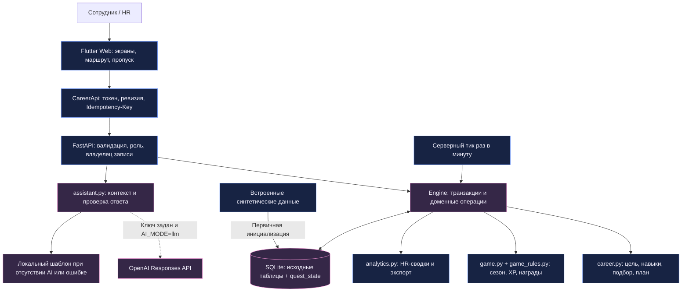
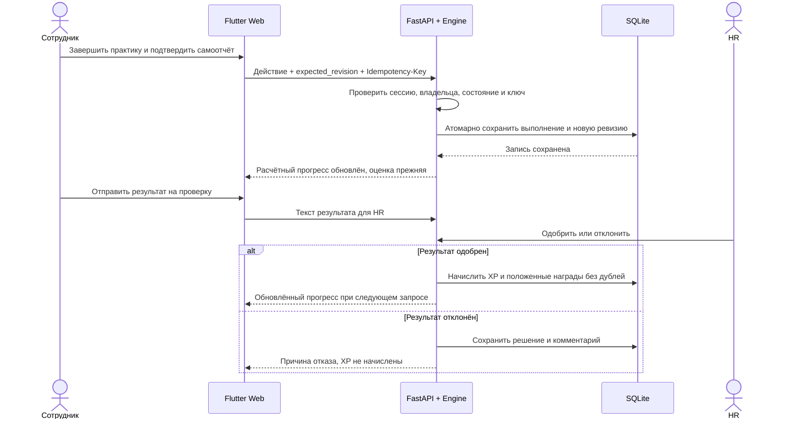
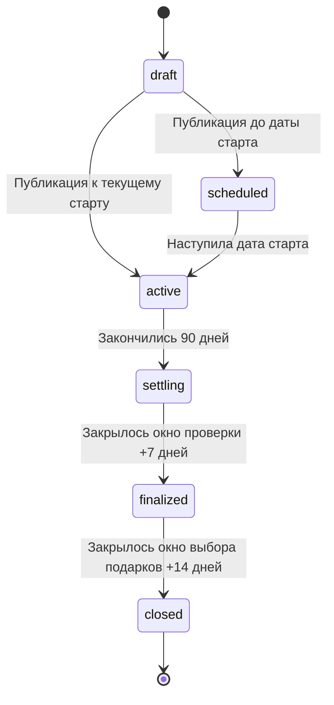
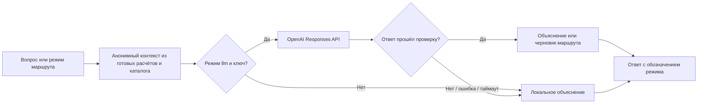

<p align="center">
  
</p>

# Career Quest

**Карьерный навигатор, который связывает навыки сотрудника, его цель и ежедневные действия в понятный маршрут развития.**

Проект для кейса **«Career Quest — платформа геймификации жизненного цикла сотрудника»**, владелец задачи — **Halyk Bank**. Сотрудник получает объяснимые рекомендации и видит результат своих шагов; HR отслеживает дефициты навыков, проверяет результаты и управляет программой мотивации.

<p align="center">
  <strong>Flutter Web · FastAPI · SQLite · OpenAI по ключу</strong><br>
  Интерфейс на русском · Два сценария доступа · 100 уровней карьерного пропуска
</p>

> **Быстрый старт:** из корня проекта выполните `python run.py` на Linux или `py run.py` в Windows. После сборки откройте **http://127.0.0.1:8000**. Нужны Python 3.11+ и Flutter с Dart 3.13.4+. Ключ OpenAI для первого запуска не требуется.

> **Тестовые данные уже в репозитории.** При первом запуске сервер автоматически загрузит JSON/CSV из `data/sample` в новую SQLite, создаст демонстрационные аккаунты и сезон. Скачивать архив или вручную импортировать файлы не нужно. [Быстрая загрузка тестового набора](#sample-data).

**[Инструкция для AI-оценки](EVALUATION.md) · [Запуск](#start) · [Android / APK](#android) · [Архитектура](#architecture) · [Демо для жюри](#demo) · [Проверка решения](#verification) · [Подключение AI](#ai)**

## Содержание

1. [Проблема, цель и актуальность](#problem)
2. [Решение и возможности](#solution)
3. [Сценарий демонстрации](#demo)
4. [Технологический стек](#stack)
5. [Архитектура и схемы](#architecture)
6. [Алгоритмы: рекомендации, прогресс и награды](#algorithms)
7. [Данные и хранение](#data)
8. [Как запустить](#start)
9. [Как подключить OpenAI](#ai)
10. [Разработка и API](#development)
11. [Как проверить решение](#verification)
12. [Структура репозитория](#structure)
13. [Ограничения и развитие](#roadmap)
14. [Документы проекта](#docs)

<a id="problem"></a>

## 1. Проблема, цель и актуальность

### Какую проблему решаем

Обучение, аттестации, мероприятия и карьерные возможности приходят сотруднику разрозненно. Список доступных курсов сам по себе не отвечает на вопросы: **что выбрать сейчас, почему это полезно именно мне и как это связано с моей следующей ролью?**

| Ситуация | Что нужно человеку | Как отвечает Career Quest |
| --- | --- | --- |
| Много активностей, трудно выбрать | Понятный следующий шаг | До трёх рекомендаций с учётом цели, навыков и времени |
| Обучение воспринимается отдельно от карьеры | Связь действия с желаемой ролью | Требования цели, дефициты и прогноз результата |
| Прогресс не виден между аттестациями | Обратная связь и повод продолжать | История действий, расчётный прогресс и карьерный пропуск |
| HR видит участие, но не всегда контекст развития | Общая картина и проверяемые результаты | Сводка, дефициты, проверка практик и учёт наград |

### Цель продукта

Помочь сотруднику **выбрать одно полезное действие, выполнить его и понять, что изменилось относительно карьерной цели**. Для HR — дать единый рабочий сценарий сопровождения такого развития.

Основной пользователь — сотрудник, который хочет перейти к следующему грейду или другой роли. Конкретная ситуация: после оценки он видит дефициты навыков, но не знает, какой из доступных материалов пройти первым при ограниченном времени.

### Почему это актуально для кейса

Развитие требует регулярных действий, а карьерные решения и оценки происходят отдельными событиями. Между ними нужен понятный маршрут: цель → действие → результат → следующий шаг. Без этой связи сотрудник может участвовать в активностях, не понимая их пользы для своей цели.

Career Quest делает эту связь видимой и объяснимой. При этом участие в программе и профессиональная квалификация учитываются раздельно: активность сама по себе не доказывает готовность к повышению.

**Ожидаемый эффект** — более осознанный выбор активностей и регулярное развитие. Это гипотеза для будущего пилота, а не уже измеренный результат. В репозитории нет подтверждённых данных о росте удержания, производительности или окупаемости. Проверить пользу можно по времени выбора первого шага, способности сотрудника объяснить его связь с целью и доле завершённых шагов.

<a id="solution"></a>

## 2. Решение и возможности

### Один маршрут вместо разрозненных уведомлений


### Для сотрудника

| Возможность | Пользовательский результат |
| --- | --- |
| **Профиль и цель** | Видны роль, грейд, история и требования направления. Если цели нет, следующая ступень показывается как предложение |
| **Рекомендации** | Подбор учитывает дефициты, время, формат, доступность, предварительные требования и уже выполненные действия |
| **Личный маршрут** | До трёх активных шагов: добавить, упорядочить, заменить, начать, завершить или отправить в архив |
| **Каталог** | Самостоятельный выбор с поиском и фильтрами, если предложенный вариант не подходит |
| **Симулятор «Что если»** | Можно посмотреть другую цель или набор действий до изменения своего плана |
| **Прогресс и паспорт развития** | Раздельное отображение оценённых и расчётных навыков; выгрузка паспорта в Markdown |
| **OpenAI Career Copilot** | Объясняет рекомендации и собирает проверяемый черновик маршрута из реальных мероприятий. Работает и без внешней модели |
| **Карьерный пропуск** | Игровая дорога из 100 уровней, текущая позиция, награды, переходы по десяткам и возврат к своему уровню |
| **Регулярность** | Ежедневные задания, серия активных дней, недельные миссии, достижения и рейтинг участия |
| **Награды** | Кошелёк CQ, выбор подарков пропуска, магазин и история заявок |

### Для HR

- Сводка по сотрудникам, карьерным целям, активностям и дефицитам навыков.
- Фильтры по подразделению, роли, грейду и периоду; просмотр профиля, плана и истории сотрудника.
- CSV-отчёт о дефицитах с защитой экспортируемых ячеек от интерпретации как формул.
- Проверка результата практики: принять или отклонить, оставить комментарий.
- Управление сезонами, участниками черновика, виртуальным бюджетом, товарами и вариантами подарков.
- Работа с заявками: согласование, подготовка, выдача, отклонение и отмена по допустимым переходам.

### Что отличает подход

1. **Рекомендации можно проверить.** Сервер считает пользу шага по требованиям цели; объяснение опирается на эти расчёты.
2. **Прогноз отделён от оценки.** Самоотчёт обновляет расчётную модель, сохраняя результат последней аттестации.
3. **Геймификация связана с подтверждёнными действиями.** XP за практику появляются после проверки HR; просмотр страницы и нажатие на подарок не дают опыт.
4. **OpenAI помогает, но не управляет данными.** Модель объясняет расчёты и предлагает маршрут, а сервер проверяет факты, лимиты и конфликты; без ключа остаётся локальный сценарий.

> Это особенности реализации, которые можно показать на демонстрации. Исследование рынка, доказывающее уникальность относительно всех существующих решений, не проводилось.

<a id="demo"></a>

## 3. Сценарий демонстрации

### Основной рассказ на 60–90 секунд

Перед показом запустите приложение, проверьте вход сотрудника и HR, подготовьте отдельную витринную базу, если хотите показать открытые подарки и итоги сезона. Витрина явно обозначается в интерфейсе.

| Время | Что показать | Что это доказывает |
| --- | --- | --- |
| 0–15 сек. | Профиль сотрудника, его цель и дефицит одного навыка | Проблема привязана к конкретному человеку и направлению |
| 15–35 сек. | Рекомендацию, объяснение пользы и добавление в маршрут | Выбор опирается на цель, а не только на общий каталог |
| 35–55 сек. | Прогноз плана или заранее завершённую учебную практику | Видна связь действия с расчётным прогрессом; последняя оценка остаётся отдельной |
| 55–75 сек. | В витрине — подтверждённые XP, отметку «Ты здесь» и награду пропуска | Механика мотивации связана с учтёнными действиями |
| 75–90 сек. | Подготовленный результат в HR-сценарии или HR-сводку | У продукта есть второй участник процесса и проверяемый результат |

**Не нужно имитировать прохождение курса за секунду.** Для короткого показа используйте подготовленную учебную историю; для полной проверки пройдите сценарии из [раздела приёмки](#verification).

Демонстрация подтверждает работоспособность маршрута и прозрачность вычислений. Она не доказывает повышение квалификации человека или бизнес-эффект для банка: такие выводы требуют реальных оценок и пилота.

<a id="stack"></a>

## 4. Технологический стек

| Уровень | Технология | Роль в проекте |
| --- | --- | --- |
| Клиент | **Flutter Web / Dart** | Адаптивный интерфейс сотрудника и HR, единая визуальная система |
| HTTP-клиент | **Dart `http`** | Авторизация, запросы, обработка ошибок, сохранение параметров повторной операции |
| Сервер | **Python / FastAPI** | API, права доступа, бизнес-операции и выдача веб-сборки |
| Валидация | **Pydantic 2** | Схемы входных данных, ограничения и понятные ошибки |
| Запуск сервера | **Uvicorn** | Локальный ASGI-процесс |
| Хранение | **SQLite / Python `sqlite3`** | Исходные записи, аккаунты, сессии и транзакционное доменное состояние |
| AI с fallback | **OpenAI Responses API через `httpx`** | Структурированные объяснения и черновики маршрутов; локальный алгоритм при сбое |
| Время | **`zoneinfo` + `tzdata`** | Серверные даты и игровые дни в `Asia/Almaty` |
| Проверки | **pytest, FastAPI TestClient, HTTP mocks, Flutter Test** | Бизнес-инварианты, API, права, состояния и навигация |
| Воспроизводимость | **Lock-файлы и `run.py`** | Закреплённые зависимости и общий запуск для Linux/Windows |

Точные Python-зависимости: [`requirements.lock`](requirements.lock). Клиентские: [`frontend/pubspec.yaml`](frontend/pubspec.yaml) и [`frontend/pubspec.lock`](frontend/pubspec.lock).

Текущая локальная среда сборки: **Python 3.14.7, Flutter 3.47.5, Dart 3.13.4**. Заявленный минимум Python — 3.11; ограничение Dart в проекте — `^3.13.4`. Выбирайте Flutter, который включает совместимую версию Dart.

Основная поставка — **веб-приложение**. Преимущество Flutter — возможность использовать общую базу интерфейса и API-клиента для Android: после подготовки платформы APK собирается командой Flutter. Порядок описан в [разделе Android / APK](#android). Android-сборка и настольный установщик пока не входят в проверенную поставку. Docker, Node.js, отдельный PostgreSQL и OpenAI SDK для обычного веб-запуска не нужны.

<a id="architecture"></a>

## 5. Архитектура и схемы

### Общая архитектура

Приложение — модульный монолит: один Python-сервер обслуживает API и собранный Flutter Web. В стандартном запуске браузер обращается к тому же адресу, с которого загружен интерфейс.



Внешняя модель получает только подготовленный контекст объяснения. Она не имеет доступа к SQLite или инструментам изменения профиля, XP, наград и решений HR.

### Границы ответственности

| Компонент | За что отвечает |
| --- | --- |
| [`backend/main.py`](backend/main.py) | Инициализация, вход/выход, зависимости доступа, формат ошибок, CORS и веб-сборка |
| [`backend/quest_api.py`](backend/quest_api.py) | HTTP-маршруты, входные схемы и вызовы доменных функций |
| [`backend/engine.py`](backend/engine.py) | Версионированное состояние, ревизии, транзакции, идемпотентность и аудит |
| [`backend/career.py`](backend/career.py) | Цель, оценки и прогноз, рекомендации, план, история и симуляция |
| [`backend/game.py`](backend/game.py) | Участники сезона, начисления, задания, права на награды, заявки и экономика |
| [`backend/game_rules.py`](backend/game_rules.py) | Правила уровней, наград, календаря и вариантов заданий |
| [`backend/analytics.py`](backend/analytics.py) | Срезы HR и CSV-отчёт |
| [`backend/assistant.py`](backend/assistant.py) | Локальное объяснение, запрос OpenAI, верификация ответа и кеш |
| [`frontend/lib/core/api.dart`](frontend/lib/core/api.dart) | HTTP-связь, сессия в памяти и безопасный повтор бизнес-запроса |
| [`frontend/lib/widgets/career_pass.dart`](frontend/lib/widgets/career_pass.dart) | Визуализация серверных XP, уровней и состояний наград |

### От выполненного шага до подтверждённых XP



### Почему повторный запрос не должен удваивать награду

Бизнес-операции проверяют **владельца**, **текущую ревизию** и **UUID `Idempotency-Key`**. При повторе той же операции с тем же ключом и содержимым возвращается сохранённый ответ. Если ключ использован с другим содержимым, сервер отклоняет запрос. Устаревшая ревизия требует обновления данных.

Изменения выполняются внутри SQLite `BEGIN IMMEDIATE`; ошибка откатывает транзакцию. Для начислений действуют дополнительные бизнес-ключи. Клиент сохраняет исходные параметры операции после сетевого сбоя, чтобы повтор не превратился в новое списание или начисление.

### Жизненный цикл сезона



Окна `+7` и `+14` отсчитываются от окончания активной части сезона. Переходы выполняются серверным таймером и при обращении к состоянию: перезапуск приложения не должен требовать ручного переключения сезона. Источник времени — сервер; игровые сутки считаются в `Asia/Almaty`.

<a id="algorithms"></a>

## 6. Алгоритмы: рекомендации, прогресс и награды

### Четыре независимых показателя

| Показатель | Что означает | Как меняется |
| --- | --- | --- |
| **Последняя оценка навыка** | Исходная оценка квалификации | Не повышается от самоотчёта или игровых заданий |
| **Расчётный уровень** | Оценка плюс модельный эффект завершённых после неё шагов | Пересчитывается по истории выполнений; ограничен 100 |
| **XP** | Подтверждённое участие в программе сезона | За принятые задания, одобренные практики и предусмотренные бонусы |
| **CQ-монеты** | Внутренний баланс программы наград | Начисления, покупки и возвраты учитываются отдельным журналом |

**100% соответствия расчётной модели не означает автоматическое повышение.** Рейтинг XP также не является рейтингом профессиональной результативности сотрудников.

### Соответствие карьерной цели

Для требований выбранной роли и грейда используется взвешенный показатель:

```text
R = 100 × Σ [wᵢ × min(sᵢ, rᵢ) / rᵢ] / Σ wᵢ

sᵢ — оценённый или расчётный уровень навыка;
rᵢ — требуемый уровень навыка для цели;
wᵢ — вес требования: 3 для critical, 1 для остальных.
```

Показатель считается отдельно для последней оценки и расчётных уровней. Если обязательные оценки отсутствуют, процент не подменяется нулём: интерфейс показывает недостаток данных. Предварительные требования активностей проверяются по последней оценке, поэтому расчётный прирост не позволяет обойти допуск.

### Как выбираются рекомендации

1. Определить выбранную цель, требования и дефициты.
2. Учесть действующий план: в нём может быть до трёх активных шагов.
3. Исключить недоступные, выполненные, уже запланированные и скрытые сотрудником варианты; проверить предварительные требования и временные ограничения.
4. Рассчитать пользу каждого кандидата для текущего прогнозируемого состояния.
5. Проверить бюджет четырёх недель: недельное время × 4 минус время текущего плана.
6. Выбрать лучший шаг, пересчитать будущие навыки и оставшийся бюджет, затем выбрать следующий.

Оценка кандидата в текущей реализации:

```text
score = 100 × (0.75 × ΔR / (100 − R)
             + 0.15 × min(1, 60 / duration_minutes)
             + 0.10 × preferred_format)
```

`ΔR` — прирост соответствия цели после кандидата; `preferred_format` равен 1, если формат входит в предпочтения, иначе 0. При равенстве учитываются больший прирост, меньшая длительность и ID. Подбор детерминирован: одинаковое состояние даёт одинаковый результат.

Это последовательный жадный подбор, а не доказанный глобальный оптимум всех сочетаний. Если подходящих вариантов нет, сервер возвращает причину: например, план заполнен, цель уже покрыта или не хватает времени.

### Игровая экономика

| Правило | Текущее значение |
| --- | --- |
| Активная часть сезона | 90 дней |
| Уровни | `min(100, floor(confirmed_xp / 200))` |
| Ежедневные задания | «Ежедневный шаг» — 100 XP; «Кейс дня» — 150 XP |
| Попытки | До трёх на задание |
| Недельная миссия | Пять подтверждённых активных дней — 250 XP |
| Защита серии | Два пропущенных дня; защита сама не даёт XP |
| Практика после одобрения HR | `min(300, max(100, 2 × duration_minutes))` XP |
| Подарки пропуска | Основные — каждые пять уровней; мини-награды и косметика — по сетке |
| CQ за полную сетку уровней | 4 800 CQ; другие источники баланса учитываются отдельно |
| Материальные лимиты полного пропуска | 670 000 ₸ основных подарков + 50 000 ₸ мини-наград |

Материальные суммы — **виртуальные лимиты учебной экономики**, а не фактические выплаты. Подарки пропуска выбираются по заработанному праву, без списания CQ. Покупка в магазине использует CQ. Сервер отдельно учитывает остатки, резерв, выдачу и возврат.

Карьерный пропуск отображает эти данные как игровую дорогу. Заполнение линии берётся из подтверждённых XP; карточки различают закрытую награду, доступный выбор, резерв, получение и истечение срока.

<a id="data"></a>

## 7. Данные и хранение

<a id="sample-data"></a>

### Быстрая загрузка тестового набора

Файлы набора хранятся прямо в Git: [`data/sample`](data/sample) и [`data/gamification/shop.json`](data/gamification/shop.json). Они приходят вместе с клонированием репозитория и используются сервером для автоматической инициализации.

**Одна команда из корня проекта запускает приложение с тестовыми данными:**

```bash
# Linux
python3 run.py
```

```powershell
# Windows
py run.py
```

После запуска откройте `http://127.0.0.1:8000` и войдите как `employee.demo` / `Employee123!` или `hr.demo` / `Hr123!`. Это стандартные пароли новых аккаунтов без переопределений окружения. Готовность набора проверяется по `dataset_ready: true` в `/api/health`.

Если зависимости и веб-сборка уже готовы, используйте `python run.py --skip-build` (Windows: `py run.py --skip-build`): данные подключаются при старте сервера без повторной сборки Flutter. Первая установка зависимостей и сборка занимают дополнительное время; запуск всего проекта за одну секунду не гарантируется.

**Существующая база сохраняется.** Чтобы повторить проверку с исходными данными, укажите в `.env` новый путь `CAREER_DB=data/local/check-01.sqlite3` и перезапустите сервер. Если такой файл уже существует, выберите следующее имя. Не удаляйте рабочую базу: повторный запуск не сбрасывает планы, историю и награды. Для демонстрации уже накопленного прогресса используйте [отдельную витрину](#showcase).

Исходные JSON/CSV остаются в репозитории; созданные SQLite, сессии и ключи в Git не попадают. Пользовательская загрузка ZIP/датасетов через интерфейс или API по-прежнему не требуется.

### Что входит в репозиторий

Используется синтетический набор кейса, а не реальные персональные данные сотрудников банка.

| Файл | Содержимое |
| --- | --- |
| [`data/sample/employees.json`](data/sample/employees.json) | 200 профилей сотрудников |
| [`data/sample/events.json`](data/sample/events.json) | 40 исходных активностей |
| [`data/sample/skills.json`](data/sample/skills.json) | 60 навыков и 32 профиля требований «роль + грейд» |
| [`data/sample/activity_history.csv`](data/sample/activity_history.csv) | 2 743 записи истории |
| [`data/gamification/shop.json`](data/gamification/shop.json) | Исходный каталог из 32 учебных SKU |

Количество профилей в наборе не равно числу пользователей пилота. Первый локальный сезон создаётся для четырёх первых по ID сотрудников; аккаунты сотрудника и коллеги привязаны к двум разным профилям. HR управляет составом новых сезонов через черновик.

### Как исходные данные адаптированы

- Шкала навыков **0–5 → 0–100**: оценки, требования и предварительные условия умножаются на 20.
- Модельный прирост одной активности по навыку ограничен 20; исходные поля сохраняются.
- В источнике нет точного расписания с часами и материалов LMS. Активности представлены как локальные самостоятельные практики с инструкциями и учебным результатом.
- Исходная история сохраняется отдельно. Она не превращается задним числом в новые игровые начисления.
- Загрузка ZIP и импорт пользовательских датасетов исключены из интерфейса и публичного API по решению команды. Служебные модули старой проверки исходников не означают доступную функцию импорта.

### Что лежит в SQLite

```text
data/local/career.sqlite3
├── dataset_context, employee_records, history_records
│   └── исходный набор и сохранённые исходные значения
├── personal_goals
│   └── совместимость с сохранёнными целями предыдущего этапа
├── accounts, sessions
│   └── локальные аккаунты и отзываемые сессии
└── quest_state
    └── одна версионированная JSON-запись:
        цели, предпочтения, план, выполнения, сезоны,
        XP, CQ-журнал, награды, заявки, проверки и аудит
```

Это описание фактического хранения. Логические сущности домена пока не разнесены по отдельным SQL-таблицам. Такой подход позволяет сохранить атомарность и быстро развивать локальный прототип; большой поток пользователей потребует другой организации хранения.

Первый запуск создаёт базу из встроенного набора. Повторный запуск использует существующую SQLite и не сбрасывает изменения пользователя. Правка JSON в `data/sample` не обновляет уже созданную базу. Файлы `.env`, SQLite, сессии, зависимости и сборки исключены из Git.

<a id="start"></a>

## 8. Как запустить

### Требования

- Python **3.11+**, доступный как `python`, `python3` или `py`.
- Flutter в `PATH`, включающий **Dart 3.13.4 или совместимый Dart 3.x новее**.
- Браузер для веб-приложения. Для `flutter run -d chrome` — установленный Chrome.
- Интернет для первоначальной установки Python- и Dart-зависимостей. Режим помощника `template` не требует внешнего AI-сервиса.
- Доступ к приватному репозиторию, если вы клонируете его самостоятельно.

### Быстрый запуск на Linux

```bash
git clone https://github.com/BAITC-Hacks/hack-c6826b6b-peep.git
cd hack-c6826b6b-peep
python3 run.py
```

Если команда Python у вас называется `python`, используйте `python run.py`. Если проект уже скачан, начните с его корневой папки.

### Быстрый запуск на Windows

В PowerShell:

```powershell
git clone https://github.com/BAITC-Hacks/hack-c6826b6b-peep.git
cd hack-c6826b6b-peep
py run.py
```

Можно использовать `python run.py`, если Python установлен под этим именем. Активировать виртуальное окружение вручную не требуется.

### Что делает `run.py`

1. Проверяет, свободен ли выбранный локальный порт.
2. Создаёт `.venv`, если окружение ещё не создано.
3. Устанавливает зависимости из `requirements.lock`; повторяет установку при изменении lock-файла.
4. Выполняет `flutter pub get` и собирает Flutter Web.
5. Запускает Uvicorn на `127.0.0.1`; сервер открывает существующую SQLite или создаёт новую.

После сообщения об успешном запуске:

| Адрес | Назначение |
| --- | --- |
| [http://127.0.0.1:8000](http://127.0.0.1:8000) | Приложение |
| [http://127.0.0.1:8000/docs](http://127.0.0.1:8000/docs) | Swagger UI |
| [http://127.0.0.1:8000/api/health](http://127.0.0.1:8000/api/health) | Состояние сервиса |

Терминал должен оставаться открытым. Остановка — `Ctrl+C`.

Повторный запуск без пересборки интерфейса:

```bash
python run.py --skip-build
```

Другой порт:

```bash
python run.py --port 8001
```

В Windows заменяйте `python` на `py`, если используете Python Launcher. `--skip-build` работает только при наличии ранее собранного `frontend/build/web/index.html`. После изменения Dart-кода запускайте без этого флага.

### Демонстрационные аккаунты

| Роль | Логин | Стандартный пароль |
| --- | --- | --- |
| Сотрудник | `employee.demo` | `Employee123!` |
| Другой сотрудник | `colleague.demo` | `Colleague123!` |
| HR | `hr.demo` | `Hr123!` |

На лендинге можно выбрать профиль для заполнения стандартных данных входа. Это открытые учётные данные локального прототипа на синтетических данных.

Сессия действует восемь часов и отзывается сервером при выходе. Токен хранится в памяти клиента: после обновления страницы нужно войти снова. Сотрудник не получает доступ к чужому личному профилю или HR-операциям через изменение адреса.

### Настройки окружения

Создайте `.env` в корне, скопировав [`.env.example`](.env.example). Если `.env` уже существует, отредактируйте его, сохранив свои значения.

Linux:

```bash
cp .env.example .env
```

Windows PowerShell:

```powershell
Copy-Item .env.example .env
```

| Переменная | По умолчанию | Назначение |
| --- | --- | --- |
| `AI_MODE` | `template` | Локальное объяснение; `llm` включает попытку обращения к OpenAI |
| `OPENAI_API_KEY` | Пусто | Серверный ключ OpenAI |
| `OPENAI_MODEL` | `gpt-4o-mini` | Модель в адаптере; можно указать доступную модель с поддержкой нужной схемы ответа |
| `CAREER_DB` | `data/local/career.sqlite3` | Путь к рабочей или отдельной витринной SQLite |
| `CAREER_DATA_DIR` | `data/sample` | Источник первичной инициализации новой базы; не HTTP-импорт |
| `ALLOWED_ORIGINS` | `http://localhost:8080,http://127.0.0.1:8080` | Разрешённые адреса отдельного dev-фронтенда |
| `DEMO_EMPLOYEE_PASSWORD` | `Employee123!`, если пусто | Пароль сотрудника при создании нового аккаунта |
| `DEMO_COLLEAGUE_PASSWORD` | `Colleague123!`, если пусто | Пароль коллеги при создании нового аккаунта |
| `DEMO_HR_PASSWORD` | `Hr123!`, если пусто | Пароль HR при создании нового аккаунта |

Сервер читает `.env` при запуске; заданные переменные процесса имеют приоритет. Изменение `DEMO_*_PASSWORD` **не меняет пароль уже существующего аккаунта**. Если вы задали свой пароль для новой базы, вводите его вручную вместо значения, подставляемого кнопкой профиля.

<a id="showcase"></a>

### Отдельная витрина с накопленным прогрессом

Обычная база подходит для проверки действий с нуля. Для показа поздних уровней, магазина, очереди HR и завершённого сезона есть воспроизводимый сценарий в **отдельном новом файле**.

После первого запуска, из корня проекта:

```bash
# Linux
.venv/bin/python -m backend.showcase --db data/local/showcase.sqlite3
```

```powershell
# Windows PowerShell
.\.venv\Scripts\python.exe -m backend.showcase --db data/local/showcase.sqlite3
```

Команда откажется перезаписывать существующий файл или использовать настроенную рабочую базу. Для нового прогона укажите другое имя, например `showcase-2.sqlite3`.

После создания файла добавьте в `.env`:

```dotenv
CAREER_DB=data/local/showcase.sqlite3
```

Перезапустите сервер. Витрина содержит историю заданий, созданную через игровые правила, первый профиль на 100-м уровне, предыдущий завершённый сезон, два результата практик и две заявки на награды. Уровень и баланс получаются из начислений, а не ручной установки чисел. В интерфейсе есть пометка **«Витринный сценарий»**.

Учётные записи создаются с настройками `DEMO_*_PASSWORD`, действовавшими в момент генерации. При пустых настройках используются стандартные пароли из таблицы. Для возврата к основной базе удалите строку `CAREER_DB` из `.env` и перезапустите приложение.

<a id="android"></a>

### Android: сборка приложения в APK

**Flutter упрощает переход от веб-прототипа к мобильному приложению.** Основную часть интерфейса на Dart, визуальные компоненты и клиент запросов можно использовать повторно. Android-клиент обращается к тому же FastAPI, поэтому правила рекомендаций, прогресса и наград остаются общими для обеих платформ.

**Текущий статус:** в репозитории пока нет каталога `frontend/android/`; APK не собран и не проверен на устройстве. Ниже — инструкция для следующего этапа. После однократной подготовки выпуск APK сводится к команде сборки и проверке результата.

#### 1. Подготовить инструменты

На Linux или Windows установите Android Studio и Android SDK с необходимыми инструментами по [официальной инструкции Flutter](https://docs.flutter.dev/platform-integration/android/setup). Затем проверьте окружение и примите необходимые лицензии SDK:

```bash
flutter doctor --android-licenses
flutter doctor
```

Перед сборкой устраните ошибки в разделе Android toolchain. Для проверки приложения понадобится эмулятор или Android-телефон с включённой USB-отладкой.

#### 2. Добавить Android-платформу

Из корня репозитория:

```bash
cd frontend
flutter create --platforms=android --project-name=career_quest .
flutter pub get
```

Команда создаст недостающие файлы Android-проекта. После неё проверьте изменения в Git; существующий код приложения находится в `lib/`.

В созданном `android/app/src/main/AndroidManifest.xml` добавьте разрешение доступа к сети внутрь `<manifest>`, вне `<application>`:

```xml
<uses-permission android:name="android.permission.INTERNET" />
```

Это разрешение нужно клиенту для обращения к FastAPI; оно описано в [документации по сети Flutter](https://docs.flutter.dev/data-and-backend/networking).

#### 3. Указать сервер и собрать APK

Клиент уже принимает адрес через `API_BASE_URL`. В примере **замените `https://api.example.com` на адрес работающего FastAPI, доступного телефону**, без завершающего `/`. Это пример адреса, а не опубликованный сервер проекта.

Из каталога `frontend`:

```bash
flutter build apk --debug --dart-define=API_BASE_URL=https://api.example.com
```

Ожидаемый файл после успешной сборки: `frontend/build/app/outputs/flutter-apk/app-debug.apk` относительно корня репозитория. Это отладочная сборка для проверки на устройстве.

Для release-варианта настройте идентификатор приложения и собственную подпись по [инструкции Flutter по выпуску Android-приложений](https://docs.flutter.dev/deployment/android), затем выполните:

```bash
flutter build apk --release --dart-define=API_BASE_URL=https://api.example.com
```

Ожидаемый файл: `frontend/build/app/outputs/flutter-apk/app-release.apk`. Для публикации через Google Play используется формат AAB: `flutter build appbundle --release` с тем же `--dart-define` и настроенной подписью.

**Сервер запускается отдельно.** FastAPI, SQLite и ключ OpenAI не включаются в APK; приложение требует соединения с сервером. Параметр `API_BASE_URL` содержит только его адрес.

Для локального Android Emulator сервер на компьютере доступен через `http://10.0.2.2:8000`; адрес `127.0.0.1` внутри устройства указывает на само устройство. Такое отображение адресов описано в [документации Android Emulator](https://developer.android.com/studio/run/emulator-networking-address). При локальной проверке по HTTP настройте разрешение незашифрованного трафика только для отладочного варианта по [инструкции Flutter](https://docs.flutter.dev/release/breaking-changes/network-policy-ios-android); для распространяемой сборки используйте HTTPS.

#### 4. Проверить мобильный сценарий

Установите APK на устройство и пройдите вход, профиль, маршрут, карьерный пропуск и выход. Отдельно проверьте системную кнопку «Назад», экранную клавиатуру, прокрутку на небольшом экране, сохранение паспорта/отчётов и поведение при потере сети. Эти проверки нужны перед заявлением о готовности Android-версии.

<a id="ai"></a>

## 9. Как подключить OpenAI

Приложение содержит серверный OpenAI Career Copilot: он объясняет расчёты и собирает черновик плана из доступных мероприятий. Для включения внешней модели достаточно ключа и настройки режима — менять Flutter-код не нужно.

В корневом `.env`:

```dotenv
AI_MODE=llm
OPENAI_API_KEY=ваш_ключ
OPENAI_MODEL=gpt-4o-mini
```

Перезапустите сервер, войдите сотрудником и откройте **OpenAI-помощника**. Можно задать один из контекстных вопросов или собрать маршрут в режиме «Сбалансированный», «Быстрый старт» или «Максимум эффекта». В результате явно показано, использован OpenAI или проверенный локальный алгоритм.



### Что передаётся и как проверяется ответ

- В контекст входят цель, названия и уровни навыков, рассчитанные показатели, время и только допустимые активности каталога.
- ФИО, ID сотрудника, подразделение, зарплата, свободные заметки и данные других сотрудников в этот контекст не включаются.
- Адаптер вызывает Responses API со **Structured Outputs**: `text.format.type=json_schema`, строгая схема, `store=false` и ограничение ответа. Формат соответствует [официальной документации OpenAI](https://developers.openai.com/api/docs/guides/structured-outputs).
- Общий таймаут — шестнадцать секунд. Автоматических повторных запросов к провайдеру нет.
- Сервер проверяет структуру, допустимые ID активностей и числовые утверждения; цифры и ссылки в свободном тексте ответа отклоняются. Эти проверки ограничивают ответ, но не являются доказательством безошибочности любого текста модели.
- Объяснения и черновики кешируются на 30 минут с учётом пользователя, ревизии состояния, вопроса или режима и модели.
- Модель не записывает план: пользователь добавляет каждый предложенный шаг отдельно, после повторной серверной проверки.
- При недоступном ключе, сетевой ошибке, таймауте или неприемлемом ответе сохраняется рабочий локальный сценарий.

Ключ должен оставаться **только на сервере**. Не добавляйте его в Git, Dart-код или `--dart-define`: веб-сборка доступна браузеру. Параметр `store=false` относится к запросу API и не является обещанием отсутствия любых журналов у внешнего провайдера.

`ai_enabled=true` в `/api/health` показывает наличие конфигурации, а не успешность платного запроса. Фактическую работу проверяйте по ответу помощника. Тесты адаптера используют HTTP mock; реальный вызов требует вашего ключа, доступа к модели и доступной квоты. Для полностью локальных объяснений верните `AI_MODE=template`.

<a id="development"></a>

## 10. Разработка и API

### Раздельный запуск сервера и Flutter

Используйте два терминала после установки зависимостей через `run.py`. Если полный локальный сервер уже запущен, сначала остановите его, чтобы освободить порт.

**Терминал 1 — сервер, из корня проекта:**

```bash
# Linux
.venv/bin/python -m uvicorn backend.main:app --reload --host 127.0.0.1 --port 8000
```

```powershell
# Windows PowerShell
.\.venv\Scripts\python.exe -m uvicorn backend.main:app --reload --host 127.0.0.1 --port 8000
```

**Терминал 2 — интерфейс:**

```bash
cd frontend
flutter run -d chrome --web-port 8080
```

В debug-режиме клиент использует `http://127.0.0.1:8000`. В обычной веб-сборке — адрес, с которого загружено приложение. Для другого API-адреса есть публичная клиентская настройка:

```bash
flutter run -d chrome --web-port 8080 --dart-define=API_BASE_URL=http://127.0.0.1:8001
```

`API_BASE_URL` — адрес сервера, а не секрет. При смене порта или хоста dev-фронтенда добавьте его origin в `ALLOWED_ORIGINS` и перезапустите сервер.

### Основные группы API

Полный актуальный контракт с телами запросов находится в [Swagger UI](http://127.0.0.1:8000/docs). Старые документы этапов могут отличаться от текущих маршрутов.

| Сценарий | Примеры маршрутов |
| --- | --- |
| Состояние и доступ | `GET /api/health`, `POST /api/auth/login`, `POST /api/auth/logout` |
| Профиль и цель | `GET /api/me/profile`, `GET /api/me/goal`, `PUT /api/me/goal` |
| Прогресс и подбор | `GET /api/me/progress`, `GET /api/me/recommendations`, `GET /api/activities` |
| План | `GET /api/me/plan`, `POST /api/me/plan/items`, `POST /api/me/plan/items/{id}/complete` |
| Симуляция и OpenAI-помощник | `POST /api/me/simulations`, `GET /api/me/assistant/status`, `POST /api/me/assistant/explain`, `POST /api/me/assistant/plan` |
| Сезон | `GET /api/me/season`, `GET /api/me/season/pass`, `GET /api/me/season/tasks` |
| Награды | `GET /api/me/wallet`, `GET /api/me/rewards`, `POST /api/me/rewards/{id}/claim` |
| HR | `GET /api/hr/overview`, `GET /api/hr/employees`, `GET /api/hr/reward-reviews` |

Пример оболочки доменного ответа — значения условные:

```json
{
  "data": {"items": []},
  "meta": {
    "state_revision": 12,
    "server_time": "2026-09-23T10:00:00Z"
  }
}
```

Вход и health имеют собственные простые ответы. Защищённые маршруты принимают `Authorization: Bearer <token>`. Для бизнес-изменений нужны текущая `expected_revision` и UUID-заголовок `Idempotency-Key`; для `DELETE` ревизия передаётся в query. Вход, объяснение AI и предварительная симуляция не используют этот контракт мутации.

Ошибки возвращают код, понятное сообщение, детали и `request_id`. Например: `UNAUTHORIZED` — нет действующей сессии, `FORBIDDEN` — неподходящая роль, `STALE_STATE` — данные изменились с момента чтения. При `STALE_STATE` обновите данные и повторно подтвердите актуальное действие.

<a id="verification"></a>

## 11. Как проверить решение

### Быстрая приёмка через интерфейс

Для проверок, меняющих состояние, лучше использовать отдельную базу или витрину. Не удаляйте рабочую SQLite ради повторного демо.

| № | Шаги проверки | Ожидаемый результат |
| --- | --- | --- |
| 1 | Запустить приложение; открыть `/api/health` | `status: ok`, `dataset_ready: true`; лендинг доступен |
| 2 | Войти как `employee.demo`; открыть профиль и цель | Видны собственные данные, оценка и выбранное/предложенное направление |
| 3 | Открыть рекомендацию и её объяснение | Видны активность, время, польза и условия доступности |
| 4 | Добавить подходящий шаг в «Мой маршрут» | Шаг появился в плане; обновился прогноз. Если подбор пуст, показана причина и доступен каталог |
| 5 | Начать и завершить локальную практику | Появилось выполнение; расчётный прогресс пересчитан, последняя оценка не переписана |
| 6 | В истории нажать «Отправить результат на проверку» и описать работу в 80–2000 символах | Результат ожидает HR; самоотчёт не даёт подтверждённые XP за практику |
| 7 | Войти HR; одобрить подготовленный учебный результат | Записано решение; соответствующие XP начислены один раз |
| 8 | Вернуться сотрудником в «Карьерный пропуск» | Показаны актуальные XP, уровень и состояния наград; работают стрелки, десятки и «К моему уровню» |
| 9 | В витрине выбрать доступный подарок или оформить покупку за CQ | Создана тестовая заявка; для подарка пропуска CQ не списаны, для покупки баланс и резерв обновлены |
| 10 | Войти HR и провести заявку по допустимым этапам выдачи | Состояния заявки, остатки и виртуальный бюджет согласованы |
| 11 | Перезапустить сервер, войти снова | План, история, решения и баланс сохранились |
| 12 | Открыть узкий экран; повторить переходы и пролистывание пропуска | Элементы доступны, горизонтально прокручивается дорога, а не вся страница |

При нехватке CQ или отсутствии открытого подарка используйте [отдельную витрину](#start). Не требуется менять XP и баланс вручную.

### Проверка прав через Swagger

1. Откройте `/docs`, выполните `POST /api/auth/login` с демонстрационным логином и паролем.
2. Скопируйте значение `token` в окно **Authorize** для HTTP Bearer.
3. У сотрудника `GET /api/me/profile` должен работать, а `GET /api/hr/employees` — вернуть **403**.
4. Для проверки чужого профиля возьмите другой существующий ID из синтетического набора и вызовите `GET /api/employees/{id}` под сотрудником. Ожидается **404**.
5. После `POST /api/auth/logout` повторный запрос с тем же токеном должен вернуть **401**.

### Автоматизированные проверки

Из корня проекта на Linux:

```bash
.venv/bin/python -m pytest -q
```

В Windows PowerShell:

```powershell
.\.venv\Scripts\python.exe -m pytest -q
```

Проверки фронтенда — на обеих ОС:

```bash
cd frontend
flutter analyze
flutter test
flutter build web --release
```

Ожидается успешное завершение команд. Серверные тесты работают на временных синтетических SQLite и управляемых часах; тесты AI подменяют HTTP-вызов и не требуют платного ключа.

| Область | Что проверяется | Где смотреть |
| --- | --- | --- |
| Доступ | Сессии, выход, разграничение ролей и собственных записей | [`tests/test_access_profiles.py`](tests/test_access_profiles.py) |
| Карьерная модель | Формулы, пропущенные оценки, план, симуляция, ограничения и атомарность | [`tests/test_career.py`](tests/test_career.py) |
| Игровая модель | 90 дней, уровни, повторные операции, серия, награды, stock, возвраты, бюджет и итоги | [`tests/test_gamification.py`](tests/test_gamification.py) |
| AI-адаптер | Состав контекста, схема запроса, проверка ответа, кеш и fallback | [`tests/test_assistant.py`](tests/test_assistant.py) |
| Исходные данные | Проверка схем и сохранность исходного набора; исключение публичного импорта | [`tests/test_foundation.py`](tests/test_foundation.py), [`tests/test_imports.py`](tests/test_imports.py) |
| Интерфейс | Вход, навигация, роли и завершение сессии | [`frontend/test/widget_test.dart`](frontend/test/widget_test.dart) |
| Повтор HTTP-операции | Сохранение ключа, тела и ревизии после сетевого сбоя | [`frontend/test/api_test.dart`](frontend/test/api_test.dart) |
| Пропуск | Переходы, состояния наград, границы XP и увеличенный текст на 320 px | [`frontend/test/career_pass_test.dart`](frontend/test/career_pass_test.dart) |

Контрольные значения из тестовых фикстур:

- Соответствие цели: `73.6111% → 79.8611% → 85.4167%`; исходная оценка остаётся `73.6111%`.
- Полная сетка пропуска: `4 800 CQ`, `670 000 ₸ + 50 000 ₸` лимитов подарков.
- Обе ежедневные задачи без пропусков в контрольном сезоне: `27 790 XP` за 90 дней; 100-й уровень достигается на 67-й день с учётом предусмотренных бонусов.

Эти значения проверяют реализацию правил. Они не описывают эффективность обучения реального сотрудника и не обязаны совпадать с процентами конкретного демонстрационного профиля.

### Частые вопросы при запуске

| Симптом | Что проверить |
| --- | --- |
| `Flutter is not on PATH` | Доступна ли команда `flutter --version`; после настройки PATH откройте новый терминал |
| Ошибка ограничения Dart SDK | Версию Dart внутри Flutter: проект требует `^3.13.4` |
| Python не может создать `.venv` | Установлены ли компоненты `venv` и `pip` для выбранного Python |
| Порт 8000 занят | Остановите свой предыдущий сервер или укажите `--port 8001` |
| Нет веб-сборки / корневая страница не открывается | Выполните `python run.py` без `--skip-build`; при ручном Uvicorn сборка должна существовать до его старта |
| Изменения интерфейса не видны | Пересоберите Flutter Web и обновите страницу; при необходимости выполните жёсткое обновление браузера |
| Dev-фронтенд не получает API | Сервер запущен, `API_BASE_URL` верен, origin фронтенда включён в `ALLOWED_ORIGINS` |
| Стандартный пароль не подходит | Для существующего аккаунта мог быть установлен свой `DEMO_*_PASSWORD`; изменение `.env` его не сбрасывает |
| После обновления страницы требуется вход | Так задумано: токен хранится в памяти, не в постоянном браузерном хранилище |
| Помощник показывает «Шаблон» | Проверьте режим, ключ, доступность модели и перезапуск сервера; fallback также включается при ошибке или отклонённом ответе |
| В профиле нет рекомендаций | Проверьте наличие цели, полноту оценок, бюджет времени, действующий план и причину пустого подбора |
| В новом пропуске нет открытых наград | Подтверждённые XP начинаются с нуля; для подготовленного показа существует отдельная витрина |

<a id="structure"></a>

## 12. Структура репозитория

```text
career-quest/
├── README.md                    # Обзор, архитектура, запуск и проверка
├── run.py                       # Общий локальный запуск Linux / Windows
├── .env.example                 # Шаблон серверных настроек
├── requirements.lock            # Закреплённые Python-зависимости
├── backend/
│   ├── main.py                  # Приложение, доступ и статическая веб-сборка
│   ├── quest_api.py             # Карьерный и игровой API
│   ├── database.py              # SQLite, исходные записи и сессии
│   ├── engine.py                # Версия состояния, транзакции и аудит
│   ├── career.py                # Цель, рекомендации, план и прогресс
│   ├── game.py                  # Сезоны, XP, заявки и экономика
│   ├── game_rules.py            # Детерминированные правила игры
│   ├── analytics.py             # HR-аналитика и экспорт
│   ├── assistant.py             # OpenAI и локальное объяснение
│   └── showcase.py              # Генератор отдельной витрины
├── frontend/
│   ├── lib/core/api.dart        # HTTP и управление клиентской сессией
│   ├── lib/pages/               # Экраны сотрудника и HR
│   ├── lib/widgets/             # Дизайн-система, лендинг и пропуск
│   ├── assets/                  # Иллюстрации и шрифты
│   ├── test/                    # Проверки клиента
│   └── pubspec.yaml             # Flutter / Dart-зависимости
├── data/
│   ├── sample/                  # Синтетический набор кейса
│   ├── gamification/shop.json   # Каталог учебных наград
│   └── local/                   # Локальные базы; не включаются в Git
├── tests/                       # Серверные тесты и фикстуры
└── docs/                        # Спецификация, дизайн и решения реализации
```

<a id="roadmap"></a>

## 13. Ограничения и развитие

### Границы текущей версии

- Это локальный хакатонный прототип на синтетических данных, а не развёрнутая банковская HR-система.
- Нет интеграции с корпоративной авторизацией, кадровой системой или LMS. Кнопки не записывают человека на реальные мероприятия банка.
- Награды, заявки и бюджет — виртуальные. Приложение не выполняет оплату, закупку, бронирование или доставку.
- Расчётный прирост навыков — модель для объяснения маршрута. Для подтверждения квалификации нужна отдельная оценка.
- Домен хранится в одной JSON-записи SQLite и подходит для локального сценария. Здесь не заявлена проверенная промышленная нагрузка.
- Внешний AI необязателен; его доступность зависит от сети и настройки аккаунта провайдера. Успешные HTTP mocks не заменяют проверку реального ключа.
- Загрузка архивов и пользовательских датасетов исключена из текущей поставки. Для Android описан [путь сборки APK](#android), но сама мобильная версия ещё не собрана и не проверена; desktop-сборка также не поставляется.

### Как расширять применение

| Следующий пользователь / заказчик | Что потребуется | Основное препятствие |
| --- | --- | --- |
| Пилот одного подразделения | Требования ролей, согласованные правила оценки, ответственный HR и программа активностей | Качество исходных оценок и время проверяющих |
| Несколько подразделений банка | Корпоративный SSO, область доступа руководителей, интеграции с HRIS/LMS, согласование бюджета | Различающиеся модели компетенций и процессы согласования |
| Более крупная организация | Нормализованная БД, отдельные фоновые задачи, наблюдаемость, резервное копирование и нагрузочные проверки | Общая запись состояния и сериализация операций прототипа |
| Другие компании и отрасли | Настраиваемые матрицы ролей, каталог, правила подтверждения и разделение данных организаций | Переносимость модели навыков и изоляция данных |

Следующий шаг после хакатона — небольшой пилот с измерением понятности рекомендаций и завершения выбранных действий. Для масштабирования важны воспроизводимость процесса, качество данных и стоимость сопровождения; добавление новых экранов само по себе этого не доказывает.

<a id="docs"></a>

## 14. Документы проекта

| Документ | Когда читать |
| --- | --- |
| [Полная спецификация](docs/09-full-spec.md) | Продуктовые правила, сценарии и приёмка |
| [Решения реализации](docs/10-implementation.md) | Адаптация данных, выполненные блоки и технические ограничения |
| [Визуальная система](docs/08-design-system.md) | Палитра, компоненты и стиль новых экранов |
| [Игровая дорога пропуска](docs/11-career-pass-ui.md) | Навигация, состояния наград и правила отображения XP |
| [Описание исходного набора](data/sample/README.ru.md) | Поля и устройство синтетических данных |
| [Правила команды](AGENTS.md) | Контекст хакатона, границы задачи и принципы работы |

Документы этапов 1–2 в `docs/` сохранены как история проектирования. Текущий объём определяется полной спецификацией, решениями реализации и исключением загрузки ZIP/датасетов. Этот README описывает фактическое устройство проекта; живой контракт HTTP — в Swagger запущенного сервера.

---

<p align="center"><strong>Career Quest</strong><br>Видеть цель. Понимать следующий шаг. Замечать свой прогресс.</p>
