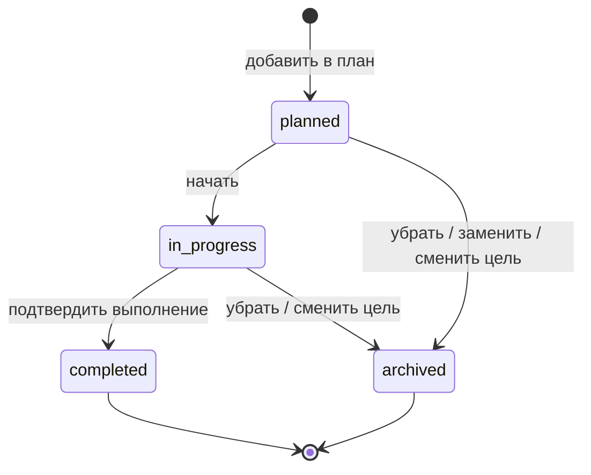

# Career Quest — полная спецификация приложения

Версия: 2.0 · Дата: 23.09.2026 · Первый релиз: полное локальное демо для хакатона HackAlem AI.

**Назначение:** этот документ задаёт продуктовую логику, экраны, модель данных, API, алгоритмы, структуру проекта и критерии приёмки. По нему нужно реализовать законченное Flutter Web + FastAPI приложение.

**Главный сценарий:** сотрудник выбирает карьерную цель → получает объяснимый план → выполняет активности и ежедневные задания → видит расчётное развитие навыков → за подтверждённые действия получает сезонный опыт → проходит карьерный пропуск, получает монеты и подарки → выбирает дорогие награды в магазине и участвует в рейтинге сезона. HR видит развитие, проверяет задания и управляет наградами.

**Обязательное ядро геймификации (P0):** опыт, внутренняя валюта, карьерный пропуск на 100 уровней, магазин, ежедневные серии, лидерборд и звание «Сотрудник сезона». Это центральная часть продукта по прямому требованию пользователя. Подробная экономика и контракты — раздел 21; выпуск без этих механик не считается готовым.

**Навигация по документу:** 0–2 — объём и доступ; 3 — все экраны; 4–7 — цель, формулы, рекомендации и план; 8–10 — дополнительные функции, HR и импорт; 11–12 — БД и API; 13 — архитектура и UI; 14 — готовые данные; 15–17 — приёмка, реализация и показ; 18–20 — дальнейшее развитие, задание разработчику и источники; **21 — обязательная геймификация, таблица всех 100 уровней, магазин и соревнование**.

## 0. Статус решений и порядок чтения

### 0.1. Что взято из исходного роадмапа

Исходный материал — `roadmap md.md`, предоставленный пользователем. Из него сохраняются:

- кейс Career Quest для Halyk Bank / HackAlem AI;
- Flutter Web / Dart, Python / FastAPI / Pydantic, SQLite, HTTP/JSON и OpenAPI;
- две роли: сотрудник и HR; три демонстрационные учётные записи;
- серверная проверка сессии и доступа к каждому защищённому запросу;
- токен только в памяти Flutter, повторный вход после обновления страницы;
- собственные профиль, история, последняя оценка навыков и цель у сотрудника;
- каталог сотрудников, просмотр профилей и импорт у HR;
- личная цель отдельно от исходного профиля; предложение следующего грейда не становится целью автоматически;
- неизменяемые исходные записи и отдельно актуальные записи после импорта;
- сохранность изменений после перезапуска;
- отсутствие технических страниц «Обзор»/«Данные» в пользовательской навигации;
- локальный запуск через loopback, одна команда `python run.py` после установки зависимостей.

Описание этапа 2 в роадмапе считается заявленным состоянием проекта, а не результатом проверки кода. Репозиторий и четыре исходных файла данных при подготовке этой спецификации не предоставлены.

### 0.2. Что добавлено этой спецификацией

Все формулы, контракты, названия таблиц, маршруты, дизайн, ограничения, фикстуры и дополнительные функции ниже — **предлагаемые решения для реализации**, а не сведения о существующем коде или официальном ТЗ организаторов. Пользователь выбрал полный демо-релиз для хакатона.

Для нового приложения использовать эти решения как единую спецификацию. При продолжении существующего проекта сначала сопоставить их с кодом; сохранить уже работающие гарантии доступа и импорта. Новые функции снимают временные ограничения этапа 2 на рекомендации и расчётный прогресс.

**Единственная внешняя неопределённость для совместимости:** точные поля и шкалы судейских файлов неизвестны. Раздел 14 задаёт полноценный собственный формат для сборки и адаптер для исходной схемы. Нельзя объявлять совместимость с неизвестными файлами без проверки на самих файлах. Это не мешает собрать и продемонстрировать всё приложение на включённых примерах.

### 0.3. Объём релиза

| Приоритет | Что включено | Условие готовности |
|---|---|---|
| P0 — основной продукт | Вход, доступ, профиль, цель, навыки, рекомендации, каталог, план, выполнение, история, HR-аналитика, импорт; **XP, монеты, 100 уровней пропуска, подарки, магазин, достижения, ежедневные задания/серии, лидерборд и сотрудник сезона** | Весь путь от подтверждённого задания до выдачи демо-награды работает и сохраняется в SQLite |
| P1 — обязательные отличия полного демо | Симулятор «Что если», объяснение рекомендаций, замена шага, паспорт развития, текстовый карьерный помощник с локальным fallback | Работает без внешнего AI; все кнопки выполняют реальное действие |
| P2 — после хакатона | Корпоративный SSO, LMS, подтверждение навыков, уведомления вовне, согласование руководителем, реальный AI-провайдер при отсутствии настройки | Не блокирует демо; не показывать неработающие кнопки |

Реальный LLM-адаптер можно подключить в демо, если уже есть провайдер и ключ. Детерминированные рекомендации и локальные объяснения обязательны в любом случае.

### 0.4. Термины

- **Оценка навыка** — последнее значение из профиля, полученное из данных; сотрудник не меняет его кнопкой выполнения.
- **Расчётный уровень** — оценка плюс условный прирост за действия внутри приложения после даты оценки.
- **Соответствие цели** — покрытие требований выбранной роли и грейда по формуле раздела 5; не вероятность повышения.
- **Активность / шаг** — курс, самостоятельная практика, вебинар или встреча из каталога.
- **План** — до трёх незавершённых шагов сотрудника, сохранённых вручную.
- **Рекомендации** — до трёх рассчитанных предложений; их просмотр не создаёт план.
- **Импорт** — проверяемое обновление текущих данных из файлов; оригиналы остаются неизменными.
- **Ревизия** — счётчик изменений данных, позволяющий не применить действие к устаревшему экрану.
- **Сезонный XP** — подтверждённый опыт текущего сезона; открывает уровни пропуска и определяет сезонный рейтинг.
- **CQ-монеты** — внутренняя валюта магазина, сохраняется между сезонами; не является тенге и не выводится деньгами.
- **Карьерный пропуск** — бесплатная для участника сезонная дорожка из 100 уровней, без покупки опыта или премиум-дорожки.
- **Подарочный лимит** — максимальная стоимость одного выбора награды в тенге, а не денежный перевод сотруднику.

## 1. Продукт, аудитория и границы

### 1.1. Для сотрудника

Приложение отвечает на четыре вопроса: «Куда я хочу расти?», «Чего мне не хватает?», «Что конкретно сделать следующим?», «Что изменилось после выполнения?».

Один главный CTA на главной: без цели — «Выбрать цель»; с целью без плана — «Собрать план»; с планом — «Продолжить шаг». Приложение не предлагает бесконечную ленту курсов.

### 1.2. Для HR

HR понимает, какие компетенции требуют внимания, у скольких сотрудников есть цели, кто начал и завершил активности, где недостаточно оценок и каким дефицитам не соответствует ни одна доступная активность.

HR получает отдельный игровой рейтинг подтверждённой активности и определяемого по его правилам «Сотрудника сезона». Рейтинг не заменяет оценку профессиональной результативности или решение о повышении; показатели дефицитов и игровой XP отображаются раздельно.

### 1.3. Демонстрационные ограничения

- Один локальный экземпляр, одна организация, без регистрации новых аккаунтов через интерфейс.
- Нет APK, push, email, чатов с коллегами и реальных платежей. Магазин за внутренние монеты и процесс выдачи подарков обязательны; в локальном демо операции помечены «Демо», без заказа у продавца.
- «Добавить в план» и «Начать» фиксируют намерение и работу внутри Career Quest; запись в LMS не подразумевается.
- Для внешнего курса открывается проверенная ссылка; для самостоятельного задания показывается встроенная инструкция.
- Самоотчёт сразу сохраняется в истории и расчётном прогрессе навыков. Опыт, награды, серия и место в рейтинге начисляются только после автоматической проверки задания либо подтверждения результата HR по разделу 21.
- Рост завершений и посещаемости — гипотезы для пилота. На синтетике показывать демонстрационные значения, без заявления об эффекте на бизнес.

## 2. Роли, доступ и сессии

### 2.1. Матрица прав

| Действие | Гость | Сотрудник | HR |
|---|---:|---:|---:|
| Войти, проверить `/api/health` | Да | Да | Да |
| Читать справочники и каталог активностей | Нет | Да | Да |
| Читать собственные профиль, историю, цель, план | Нет | Да | Через каталог, только чтение |
| Читать чужой профиль | Нет | Нет | Да |
| Изменить собственную цель и предпочтения | Нет | Да | Нет |
| Добавить, заменить, начать, завершить собственный шаг | Нет | Да | Нет |
| Получить личные рекомендации и симуляцию | Нет | Да | Читать расчёт сотрудника, без изменения |
| Скачать собственный паспорт развития | Нет | Да | Нет |
| Читать каталог сотрудников и аналитику | Нет | Нет | Да |
| Импортировать профили и историю | Нет | Нет | Да |
| Скачать агрегированную HR-выгрузку | Нет | Нет | Да |
| Смотреть сезонный лидерборд и публичную карточку участника | Нет | Да, ограниченный набор полей | Да |
| Проходить ежедневные задания, получать награды пропуска | Нет | Только свои | Нет |
| Покупать за CQ-монеты, читать кошелёк и заявки | Нет | Только свои | Обрабатывать заявки без покупки от имени сотрудника |
| Проверять результаты, публиковать сезон, управлять магазином и выдавать подарки | Нет | Нет | Да, с аудитом и пределами бюджета |
| Изменить карьерные справочники навыков, ролей и активностей через интерфейс | Нет | Нет | Нет |

Проверка прав выполняется в зависимости FastAPI и в сервисе ресурса. Скрытая кнопка во Flutter не является защитой. `/api/me/*` получает `employee_id` из сессии, не из тела запроса. HR использует отдельные read-only маршруты `/api/hr/employees/{id}/*`.

### 2.2. Демонстрационные аккаунты

| Логин | Роль | Связь |
|---|---|---|
| `employee.demo` | `employee` | `emp_001`, основной сценарий |
| `colleague.demo` | `employee` | `emp_002`, проверка изоляции |
| `hr.demo` | `hr` | `employee_id = null` |

В локальном демо вход разрешён только в эти заранее заведённые аккаунты. Для стандартного запуска используются публичные демонстрационные пароли; кнопки-пресеты заполняют логин и пароль. При необходимости пароли новых аккаунтов переопределяются через `.env`, после чего их вводят вручную. В БД хранится только хеш с солью, пароли не включаются в HTTP-логи. Эти аккаунты не считаются SSO или промышленной банковской системой доступа.

### 2.3. Жизненный цикл сессии

1. `POST /api/auth/login` принимает JSON с логином и паролем.
2. При успехе сервер генерирует непрозрачный случайный токен из 32 случайных байтов; в SQLite хранится SHA-256 токена, пользователь, время истечения и отзыва.
3. Срок действия — 8 часов без продления. Клиент хранит токен только в памяти.
4. Все защищённые запросы передают `Authorization: Bearer <token>`. Использовать `HTTPBearer`, не объявлять этот JSON-вход OAuth2 password flow.
5. Неверный, истёкший, отозванный токен → `401` и `WWW-Authenticate: Bearer`; клиент очищает состояние, возвращает на вход.
6. Валидная сессия без нужной роли → `403`. Неизвестный либо недоступный объект сотрудника → `404` там, где идентификатор входит в путь.
7. Выход отзывает текущий токен и очищает весь пользовательский кэш. Новый вход под другим аккаунтом не показывает данные предыдущего.
8. Обновление страницы требует входа. После входа разрешённый исходный маршрут можно восстановить; произвольный внешний redirect запрещён.

Локальный лимит входа: 10 неудачных попыток на пару IP + нормализованный логин за 5 минут, затем `429` с `Retry-After`. Ошибка входа одинаковая для неизвестного логина и неверного пароля.

## 3. Навигация и структура экранов

### 3.1. Карта маршрутов Flutter

Использовать hash URLs для простого локального хостинга: `/#/employee/home`.

```text
/login
/employee/home                 Мой путь
/employee/goal                 Карьерная цель
/employee/skills               Навыки
/employee/plan                 Мой план
/employee/catalog              Каталог
/employee/activities/:id       Активность
/employee/history              История
/employee/profile              Профиль и предпочтения
/employee/simulator            Что если
/employee/passport             Паспорт развития
/employee/season               Карьерный пропуск и задания
/employee/season/leaderboard   Рейтинг сезона
/employee/season/participants/:id  Публичная игровая карточка
/employee/season/calendar      Ежедневная серия
/employee/shop                 Магазин наград
/employee/shop/:id             Товар
/employee/wallet               Кошелёк и начисления
/employee/rewards              Мои подарки и заказы
/employee/rewards/:id          Статус получения
/hr/overview                   Сводка
/hr/skills                     Дефициты навыков
/hr/employees                  Сотрудники
/hr/employees/:id              Профиль сотрудника
/hr/import                     Импорт
/hr/import/:id                 Результат проверки/импорта
/hr/gamification               Сезон, экономика и бюджет
/hr/reviews                    Проверка результатов заданий
/hr/rewards                    Заявки и выдача подарков
/hr/shop                       Каталог и остатки наград
/not-found
```

На широком экране сотруднику доступны «Мой путь», «План», «Сезон», «Магазин», «Каталог», «История», «Профиль». Рейтинг и задания — вкладки сезона; кошелёк доступен из постоянного счётчика монет. У HR — «Сводка», «Навыки», «Сотрудники», «Сезон», «Проверки», «Награды», «Магазин», «Импорт».

На мобильном у сотрудника нижняя навигация: «Путь», «План», «Сезон», «Магазин», «Ещё». В «Ещё» — каталог, история, профиль, паспорт и кошелёк. У HR нижние пункты «Сводка», «Сезон», «Проверки», «Награды», «Ещё». Заголовок, возврат назад и активный пункт не зависят от ширины.

### 3.2. Экран входа

**Содержимое:** название Career Quest, фраза «Понятный следующий шаг в вашей карьере», логин, пароль, кнопка «Войти», пресеты трёх аккаунтов, подпись «Локальная демонстрация на синтетических данных».

**Поведение:** Enter отправляет форму; пустые поля подсвечиваются локально; повторная отправка во время запроса запрещена; ошибка отображается у формы; при недоступном API есть «Повторить». После успешного входа маршрутизация по серверной роли.

### 3.3. Мой путь

Порядок блоков:

1. Приветствие, текущая роль и грейд.
2. Цель: роль/грейд, источник «Личная» или «Из профиля», действие «Изменить».
3. Карточка соответствия: значение по последней оценке, расчётное значение после действий, отдельная подпись даты оценки.
4. Три важнейших дефицита: текущая оценка, расчётный уровень, требование цели.
5. Следующий незавершённый шаг плана либо до трёх рекомендаций.
6. Ссылки «Что если», «Паспорт развития», последнее достижение.
7. Обязательная заметная карточка сезона: уровень/100, XP до следующего уровня, CQ-баланс, серия, место в рейтинге и ближайший подарок; CTA «Открыть пропуск». При компоновке поставить её сразу после цели и прогресса.

**Если цели нет:** предложение следующего грейда с кнопкой «Выбрать эту цель» и ссылкой «Другая роль». До сохранения не показывать персональные рекомендации к предложенной цели и процент как уже выбранную цель.

**Если оценок недостаточно:** показать покрытие данных и список отсутствующих навыков; не выводить фиктивный процент. Каталог и история остаются доступны.

**Если расчётное соответствие 100%:** «Расчётные требования цели покрыты. Следующий шаг — обсудить оценку с руководителем». Не писать «Повышение гарантировано».

### 3.4. Карьерная цель

**Поля:** роль и грейд из справочника. Отдельно отображаются текущая позиция, требования выбранной цели, прогнозируемые дефициты. Выбор цели не меняет должность сотрудника.

**Действия:** «Сохранить цель», «Сбросить личную цель», «Отмена». Если сохранённый план содержит незавершённые шаги, перед изменением цели показать конкретный список шагов, которые будут архивированы. Подтверждение входит в форму.

**Правила:** можно выбрать любую существующую пару роль/грейд, включая текущую; переход в другую роль разрешён без выдуманных корпоративных ограничений. Для текущей пары подпись «Развитие в текущей роли». Пары без требований недоступны. Если выбрана текущая эффективная цель, сохранить override при его отсутствии, но план не архивировать, поскольку требования не изменились.

### 3.5. Навыки

Таблица/мобильные карточки: навык, последняя оценка, расчётный уровень, требование цели, остаточный дефицит, значимость. Порядок — по взвешенному относительному дефициту; навыки без оценки наверху отдельной группой.

У каждого навыка раскрывается объяснение: источник оценки, какие выполненные активности добавили условные баллы, какая дата является границей начисления. Кнопка «Найти активности» открывает каталог с `skill_id`. Цвет дополняет числовую подпись, не заменяет её.

### 3.6. Мой план

До трёх активных карточек в заданном порядке. Карточка: название, формат, время, навыки, статус, ожидаемый вклад, причина выбора. Для `planned` доступны «Начать», «Заменить», «Убрать»; для `in_progress` — «Открыть материал», «Завершить», «Убрать».

Сверху — суммарная оставшаяся длительность и ориентир по неделям. Завершённые шаги вынесены ниже и доступны в истории; они не занимают лимит трёх. Перестановка через кнопки вверх/вниз; drag-and-drop может быть дополнительным удобством.

Если шаг стал недоступен или просрочен, показать причину и «Заменить». Если весь план завершён, показать результат и «Подобрать следующие шаги».

### 3.7. Каталог и страница активности

Каталог: строка поиска по названию/описанию, фильтры навыка, формата, максимальной длительности, доступности. Пагинация по 20 элементов. Рекомендованные элементы получают бейдж «Подходит цели»; каталог не скрывает остальные доступные материалы.

Страница активности содержит описание, конкретный результат, формат, длительность, навыки и условные баллы, предварительные требования, дату для scheduled-активности, материал/инструкцию, статус пользователя, объяснение пользы для цели.

Главная кнопка зависит от состояния: «Добавить в план» → «Начать» → «Завершить» → «Посмотреть результат». При полном плане кнопка объясняет лимит и ведёт к плану. Активность без вклада в цель можно добавить вручную; перед сохранением показать «Не влияет на текущую цель».

### 3.8. Завершение шага

Модальное окно: название, чекбокс «Я выполнил(а) активность», необязательное поле «Что удалось применить?» до 500 символов. Кнопка «Подтвердить выполнение».

Успех: старое/новое расчётное соответствие, прирост в процентных пунктах, изменившиеся навыки и отметка «Самоотчёт; последняя оценка не изменена». Если вклад нулевой, объяснить причину вместо праздничного прироста. Запись должна появиться в истории до отображения успешного результата.

### 3.9. История

Объединённая хронология исходных/импортированных записей и действий Career Quest. Фильтры: период, формат, статус, источник. Карточка содержит активность, даты, статус, источник, отметку самоотчёта, заметку и расчётный вклад, если он начислен.

Одна активность у сотрудника отображается одной объединённой карточкой; при совпадении импортированной и локальной записи доступны обе линии происхождения. Повторные попытки прохождения одной активности в первом релизе не поддерживаются.

### 3.10. Профиль

Неизменяемые поля: имя, подразделение, текущая роль/грейд, дата последней оценки. Изменяемые: доступное время в неделю (30–600 минут, шаг 30), предпочитаемые форматы (множество), локальная зона времени из разрешённого списка. По умолчанию 120 минут, все форматы, `Asia/Almaty` как настройка демо.

Предпочтения сохраняются на сервере и влияют на следующий расчёт рекомендаций; сохранённый план сам не меняется. Здесь же ссылки на историю, навыки, паспорт и выход.

### 3.11. Симулятор «Что если»

Сотрудник выбирает альтернативную цель и до трёх активностей, видит «сейчас → после выбранных шагов», длительность и остаточные дефициты. Переключатель включает текущие незавершённые шаги плана в выбранный список; итоговый список всё равно не более трёх и без дублей.

Каждое изменение вызывает расчёт на сервере после debounce 300 мс. Никакие баллы, цели и шаги не сохраняются. Кнопка «Сохранить этот план» атомарно сохраняет цель и список только после явного подтверждения; описание заменяемых шагов видно до подтверждения.

### 3.12. Паспорт развития

Одностраничное представление: сотрудник, цель, дата оценки, соответствие по оценке/расчёту, навыки, три последних завершения, следующий шаг, достижения. Кнопка «Скачать Markdown» получает серверный `.md` файл. PDF и публичная ссылка не входят в демо.

### 3.13. HR — сводка, навыки, сотрудники

**Сводка:** численность выбранной группы, доля сотрудников с целью, доля участников периода, доля завершений среди участников периода, число отсутствующих оценок; под каждым показателем числитель/знаменатель. Ниже — основные дефициты, востребованные активности, дефициты без обучающего покрытия.

**Навыки:** матрица «подразделение × навык», переключатель базы «Текущая роль» / «Карьерная цель», переключатель «Последняя оценка» / «Расчёт после действий». В ячейке средний относительный дефицит и число оценённых сотрудников; drill-down открывает отфильтрованный список.

**Сотрудники:** поиск, подразделение, роль, грейд, наличие цели, наличие активности в периоде. Колонки: имя, подразделение, текущая позиция, цель, покрытие оценок, соответствие, завершения. Строка открывает read-only профиль с вкладками «Навыки», «План», «История».

### 3.14. HR — импорт

Четыре шага: выбрать файлы и формат → проверить → посмотреть добавления/изменения/ошибки → применить. Можно загрузить профили, историю или оба файла. При ошибках кнопка применения недоступна. После успеха — число изменений, ссылка на сотрудников и сохранённый отчёт импорта.

Технические подробности файлов находятся только в этом рабочем инструменте HR и API диагностики, а не на главном экране сотрудника.

## 4. Логика цели и оценок

### 4.1. Приоритет цели

Эффективная цель определяется в следующем порядке:

1. Сохранённая личная цель из `goal_overrides`.
2. Цель актуального импортированного профиля `source_goal`.
3. Цели нет; отдельно рассчитывается предложение.

Предложение — следующий грейд в упорядоченном списке **той же роли**. Порядок хранится в справочнике, не вычисляется сравнением строк. Для последнего грейда, включая Lead, следующего нет: показать выбор другой роли или развития в текущей. Предложение не сохранять автоматически и не учитывать в HR-доле целей.

Сброс удаляет override, после чего действует цель актуального профиля; если её нет — предложение. Сброс не восстанавливает цель из первоначального seed, если профиль уже обновлялся импортом.

### 4.2. Изменение цели

- Сравнивать пару `(role_id, grade_id)`, а не подпись и не источник цели.
- Если эффективная пара изменилась, архивировать все `planned`/`in_progress` шаги с причиной `goal_changed`. Завершения и их начисления сохраняются.
- Новая цель меняет требования и процент соответствия. Это не изменение навыков.
- Если пара та же, план остаётся; источник цели может измениться.
- Пустое поле в форме не сбрасывает цель автоматически. Сброс — отдельное действие.
- При импорте смена source-цели архивирует план только если нет override и действительно изменилась эффективная пара.

### 4.3. Данные оценки

Внутренняя шкала навыка: **0–100 баллов**, целые значения. Внутренний прирост активности: целое число 0–20 на навык. Требование роли: 1–100; значимость: целое 1–5. Это проектные параметры демо, не заявленная шкала исходного датасета.

Пропущенная оценка = `null`/отсутствующая запись, не 0. Настоящий 0 допускается. Если исходная шкала другая, адаптер явно описывает преобразование, хранит исходное значение и исходную шкалу; угадывать шкалу по максимальному числу запрещено.

Для сотрудника хранится `assessment_at` — единая дата актуальной оценки. Если источник содержит только `as_of_date`, адаптер ставит конец этого дня в UTC и помечает `assessment_date_source = dataset_date`. При наличии явного timestamp используется он. Старые оценки не складываются с новыми.

Все данные времени в API — timezone-aware ISO 8601 в UTC с `Z`. Для UI дата преобразуется в часовой пояс профиля. Разрешённые зоны демо: `Asia/Almaty`, `Asia/Qyzylorda`, `UTC`. На Windows backend использует пакет `tzdata`. `as_of_date` остаётся датой без времени.

## 5. Прогресс: формулы и проверочный пример

### 5.1. Два уровня одного навыка

Для навыка `s`:

```text
B[s] = последнее значение оценки, либо null
C[s] = сумма зафиксированных gain_snapshot[s] у активных локальных завершений,
       где completed_at > assessment_at
E[s] = min(100, B[s] + C[s]), если B[s] известно; иначе null
```

`gain_snapshot` фиксируется при завершении, чтобы будущая правка справочника не меняла прошедший расчёт. Оно включает все навыки активности, не только навыки текущей цели. Применение ограничивается 100 баллами; вклад сверх потолка не переносится на другую активность или навык.

Исходная и импортированная история сама по себе не начисляет баллы. Она показывает факты участия и исключает уже пройденное из рекомендаций. Если та же активность существует и в локальном завершении, и в импорте, расчёт использует единственную локальную запись начисления, без второго прироста.

Если новая оценка датирована позже локального завершения, этот прирост перестаёт входить в `E`: считается, что более поздняя оценка уже заменяет старую базу. История при этом остаётся. Импорт с более старой датой оценки, чем актуальная, отклоняется. Оценка с той же датой может корректировать значения и пересчитывает результат поверх новой базы.

### 5.2. Соответствие цели

Для требований выбранной цели `T[s]` и весов `W[s]`:

```text
coverage = число требований с известной оценкой / число всех требований × 100
R(L) = 100 × SUM(W[s] × min(L[s], T[s]) / T[s]) / SUM(W[s])
gap[s] = max(0, T[s] - L[s])
relative_gap[s] = gap[s] / T[s]
weighted_gap[s] = W[s] × relative_gap[s]
```

- `assessed_readiness = R(B)`; `estimated_readiness = R(E)`.
- Формула применяется, только если цель есть, требования непустые и `coverage = 100%`.
- При неполном покрытии оба процента = `null`, статус `needs_assessment`; отдельные известные дефициты всё равно отображаются.
- Без цели статус `no_goal`, оба процента = `null`.
- Ни бонусы достижений, ни самоотчёт не меняют `B`.
- В API проценты и изменения округляются до 4 знаков; в UI — до 1 знака. Считать на неокруглённых числах; не вычитать округлённые подписи.
- 100% означает покрытие численных требований этой модели, а не подтверждённое владение ролью.

### 5.3. Проверочный пример

Цель: аналитик Middle. Требования и оценки:

| Навык | B | T | W | Исходный вклад в числитель |
|---|---:|---:|---:|---:|
| SQL | 60 | 80 | 3 | 2.25 |
| Аналитика | 40 | 60 | 2 | 1.333333… |
| Коммуникация | 50 | 60 | 1 | 0.833333… |

`R(B) = 73.6111%`, в интерфейсе **73,6%**.

Самостоятельная SQL-практика даёт условные `+10 SQL`: `E[SQL] = 70`, `R(E) = 79.8611%`, прирост **6,25 п.п.**, в UI `+6,3 п.п.`. Последняя оценка SQL остаётся 60.

После дополнительной аналитической практики `+10 Аналитика` расчётное соответствие становится `85.4167%`, в UI **85,4%**. Общая прибавка — `11.8056` п.п. Прирост курса в баллах навыка и прирост соответствия в п.п. — разные величины.

### 5.4. Неполные данные и корректировки

Если оценка нужного навыка отсутствует, не подставлять ноль и не выдавать персональный список рекомендаций по цели. Ответ `needs_assessment` содержит список навыков; пользователь может изучать каталог и сохранять план вручную. Завершение сохраняет snapshot, но неизвестный уровень остаётся неизвестным. При последующем появлении оценки действует обычная граница `assessment_at`.

Если изменился профиль или цель, экран объясняет причину нового процента: «Требования цели изменились» или «Обновлена последняя оценка». Сравнивать проценты до/после смены разных целей как рост запрещено.

## 6. Рекомендации: детерминированное ядро

### 6.1. Вход и результат

Вход: актуальный профиль, эффективная цель, последние оценки, локальные начисления, объединённая история, активный план, предпочтения, каталог, текущее время, `state_revision`.

Результат: от 0 до 3 карточек, причины выбора, ожидаемые изменения навыков, длительность, причины отсутствия рекомендаций и служебный контекст расчёта. При занятом плане вернуть не более `3 - active_plan_count` новых предложений.

### 6.2. Фильтрация кандидатов

Активность подходит для персональной рекомендации, если одновременно:

1. Активна в каталоге и не закончился `available_until`, если задан.
2. Не завершена сотрудником в исходной/импортированной истории или локально.
3. Не находится в его активном плане и не исключена для текущей цели.
4. Выполнены prerequisites по **последней оценке B**, не по условному E. Отсутствующая оценка prerequisite означает недопуск.
5. Для `scheduled`: `starts_at > now` и `starts_at <= now + 28 days`.
6. Для `self_paced`: `available_from` отсутствует или уже наступило.
7. Её длительность укладывается в оставшийся бюджет четырёх недель: `4 × weekly_minutes - сумма duration_minutes активного плана`.
8. Нет пересечения времени с уже запланированными scheduled-активностями. Интервалы полуоткрытые `[starts_at, ends_at)`, поэтому стык разрешён.
9. Есть положительный дополнительный вклад в требования цели.

Дата `available_from` для scheduled означает открытие добавления в план; добавление допускается только после неё. Непересекающийся будущий вебинар можно предложить, даже если его нельзя начать сейчас.

Архивированные шаги можно предложить снова. Записи со статусом `registered`, `in_progress`, `attended` во внешней истории считаются уже начатой внешней активностью: не рекомендовать дублирующее начало, отображать их в истории. `cancelled`/`no_show` не запрещают будущую подходящую попытку, если активность ещё доступна. `completed` запрещает.

### 6.3. Ранжирование и сборка последовательности

Прогнозная база `L` — расчётные уровни E плюс условные приросты текущих незавершённых шагов плана. Это прогноз **при выполнении плана**, отдельный от текущего E. Заблокированные шаги без допустимого выполнения не добавлять в эту базу и возвращать предупреждение.

Для каждого подходящего кандидата:

```text
delta = R(min(100, L + activity.gains)) - R(L)
remaining = 100 - R(L)
gap_share = delta / remaining                  # если remaining > 0
time_fit = min(1, 60 / duration_minutes)
format_match = 1, если формат есть в предпочтениях, иначе 0
score = 100 × (0.75 × gap_share + 0.15 × time_fit + 0.10 × format_match)
```

Это прозрачная эвристика демо, а не обученная ML-модель. Предпочтения мягко влияют на порядок, не исключают формат. Если выбран пустой набор форматов, нормализовать в «все».

Жадный выбор:

```text
result = []
L = levels_after_eligible_current_plan
budget = 4 * weekly_minutes - active_plan_duration
while len(result) < free_slots and R(L) < 100:
    candidates = filter_against(L, budget, selected_intervals, exclusions)
    keep candidates with delta > 0
    if none: break
    choose max score; tie-break: larger delta, shorter duration, activity_id ASC
    append chosen with contribution relative to this L
    L = apply_gains(L, chosen)
    budget -= chosen.duration_minutes
    reserve scheduled interval if any
```

Для сравнения score используется неокруглённое значение с допуском `1e-9`; только затем tie-break. Порядок при одинаковом состоянии воспроизводим. Каждый новый шаг оценивается после ранее выбранного, поэтому перекрывающиеся приросты не суммируются сверх требований.

Ответ содержит два вклада: `standalone_delta_pp` от текущего E и `sequence_delta_pp` после текущего плана и предыдущих рекомендаций. На карточке писать «Если выполнить сейчас: +… п.п.»; в итогах набора — один пересчитанный суммарный прогноз. Складывать standalone-прибавки для итогового прогноза нельзя.

### 6.4. Объяснение карточки

Детерминированный шаблон:

> Для цели «Аналитик Middle» требуется SQL 80. Последняя оценка — 60, расчётный уровень — 60. Практика добавляет условные 10 баллов SQL и повышает расчётное соответствие с 73,6% до 79,9%. Время — 60 минут. Это помещается в ваш бюджет обучения.

Подробности по кнопке «Почему этот шаг»: какие требования закрывает, какие prerequisites проверены, какой вклад остаётся после текущего плана, как повлиял формат. Выводить не более двух основных причин в свёрнутой карточке.

### 6.5. Замена рекомендации

«Не подходит» открывает причину: мало времени / неинтересный формат / уже знакомо / другое. `POST /api/me/recommendation-exclusions` сохраняет активность, причину и пару текущей цели. Исключение действует до ручного сброса для этой пары; при переходе на другую цель не применяется.

«Уже знакомо» не меняет оценку и не создаёт completion. После исключения сервер возвращает новый список. Если замены нет, показать конкретную причину. Внизу рекомендаций есть «Вернуть скрытые варианты»; это удаляет исключения только для текущей цели.

Замена сохранённого шага делается отдельной атомарной операцией: новый шаг проходит все проверки, старый становится `archived` с причиной `replaced`, новый получает его порядок. При ошибке старый остаётся в плане. Выбор замены открывает каталог, даже если план заполнен и endpoint рекомендаций возвращает plan_full. При проверке лимита, бюджета и конфликтов времени старый заменяемый шаг исключается из предполагаемого состояния.

### 6.6. Коды пустого результата

| Код | Сообщение и действие |
|---|---|
| `no_goal` | «Выберите карьерную цель» |
| `needs_assessment` | «Не хватает оценки навыков: …»; перейти к навыкам |
| `goal_covered` | «Расчётные требования цели уже покрыты» |
| `plan_full` | «В плане уже три шага»; открыть план |
| `plan_covers_goal` | «Текущего плана достаточно для расчётного покрытия» |
| `no_time_fit` | «Нет шагов в текущем бюджете»; изменить время |
| `no_available_activities` | «В каталоге пока нет подходящих активностей» |
| `all_candidates_hidden` | «Подходящие варианты скрыты»; сброс исключений |

Порядок выбора основного кода — порядок таблицы, кроме `all_candidates_hidden`: он используется вместо последнего кода, если без исключений были кандидаты. В `diagnostics` возвращать счётчики причин отсева, без данных других сотрудников.

## 7. План и жизненный цикл активности

### 7.1. Локальные статусы



`completed` необратим в демо. Исправление ошибочного самоотчёта — развитие для пилота, не скрытая кнопка удаления. После архивации незавершённой активности её можно добавить заново, создав новую запись; завершённую нельзя.

### 7.2. Правила переходов

- Добавление разрешено при менее чем трёх активных шагах, отсутствии активного дубля и выполнении доступности/prerequisites. Нулевая польза для цели допустима только при ручном добавлении и `accept_no_goal_gain=true`.
- Если внешняя история содержит registered/in_progress/attended, повторно добавлять эту активность в локальный план нельзя: `EXTERNAL_ACTIVITY_IN_PROGRESS`. Её статус обновляется импортом; просмотр материала остаётся доступен. Внешнее completed запрещает новое добавление с `ALREADY_IMPORTED_COMPLETE`.
- Для ручного добавления бюджет — предупреждение с явным `accept_over_budget=true`, не запрет. При автосборке бюджет соблюдается строго.
- «Начать» у self-paced доступно сразу после добавления. У scheduled — только при `now >= starts_at` и `now < ends_at`.
- Завершить self-paced можно только из `in_progress`; минимальное реальное время не навязывается, это самоотчёт.
- Scheduled можно завершить только из `in_progress`, после `ends_at` и не позднее `ends_at + 7 days`. Пропуск старта внутри окна не позволяет задним числом заявить завершение в приложении; импорт истории остаётся отдельным механизмом.
- Для self-paced `available_until` ограничивает добавление и начало. Уже начатый self-paced можно завершить после этой даты, если активность не отключена администратором seed-справочника. Для scheduled `available_until` — только срок добавления в план; уже сохранённый шаг можно начать внутри `[starts_at, ends_at)`.
- Просроченный незавершённый шаг не удалять автоматически; пометить `blocked_reason`, дать убрать/заменить.
- Повторный `start` для `in_progress` возвращает существующий статус без изменения ревизии. Остальные недопустимые переходы → `409 INVALID_TRANSITION`.

### 7.3. Атомарное завершение

В одной транзакции:

1. Проверить сессию, принадлежность шага и idempotency key.
2. Проверить `expected_revision`, состояние и временные ограничения.
3. Прочитать текущую цель и рассчитать значения «до».
4. Создать `completion` с уникальным `(employee_id, activity_id)`, источником `self_report`, timestamp, заметкой, snapshot всех gains.
5. Перевести plan item в `completed`; создать историю/аудит и, при подаче результата на награду, reward-review. XP и достижения здесь ещё не выдавать: они начисляются после проверки по разделу 21.
6. Пересчитать прогресс, увеличить `state_revision` один раз.
7. Сохранить ответ для idempotency key, зафиксировать транзакцию.

При ошибке ни один пункт не остаётся применённым отдельно. Если другая операция уже завершила ту же активность, вернуть существующий completion и `already_completed=true` без повторного начисления.

### 7.4. Конкурентность и повтор запросов

Все бизнес-изменения отправляют `expected_revision` — ревизию последнего прочитанного состояния. Сервер сравнивает её внутри write-транзакции; несовпадение → `409 STALE_STATE`. Клиент обновляет данные и предлагает повторить действие, не повторяет изменение автоматически.

Для completion, сохранения симуляции и commit импорта обязателен `Idempotency-Key` (UUID). Ключ хранится с user_id, route, хешем тела и ответом не менее 24 часов. Повтор того же запроса возвращает прежний результат до проверки устаревшей ревизии; тот же ключ с другим телом → `409 IDEMPOTENCY_CONFLICT`. Проверка действующей сессии обязательна даже для повтора.

Ревизия глобальна для демо: изменения другого пользователя могут вызвать обновление экрана, зато все зависимые расчёты согласованы. В пилоте допустимо перейти на ревизии отдельных сотрудников.

## 8. Функции развития и достижения

### 8.1. Симуляция и сохранение результата

`POST /api/me/simulations` принимает целевую пару и упорядоченный список 0–3 активностей. Использует текущий E и ту же функцию расчёта, что завершение и рекомендации. Проверяет дубли, доступность, prerequisites, конфликты дат и уже завершённые активности.

Активности текущего плана допускаются в симуляции, но их gains добавляются **один раз**, через переданный список. Сервер не добавляет текущий план автоматически. Просмотр с превышением бюджета допускается с предупреждением; сохранение требует `accept_over_budget=true`.

Результат: `simulation_id`, выбранные ID, цель, исходные/прогнозные уровни и проценты, суммарная длительность, `estimated_weeks = ceil(total_minutes / weekly_minutes)`, ревизия и `expires_at = now + 15 minutes`. При нуле минут недель 0. Это оценка нагрузки, а не обещание расписания; даты вебинаров выводятся отдельно.

Сохранение симуляции повторно проверяет доступность и ревизию. В одной транзакции сохраняет личную цель, сохраняет активные шаги из списка, архивирует не вошедшие, добавляет новые, задаёт порядок. Это специальный сценарий явного выбора нового плана: в отличие от отдельной смены цели, совпадающие выбранные шаги сохраняются, а их goal_role_id/goal_grade_id обновляются. Если активность уже `in_progress` и осталась в списке, статус и `started_at` не сбрасываются; для сохранённого шага проверяется допустимость продолжения, а не повторного начала/регистрации. Истёкший preview → `410 PREVIEW_EXPIRED`; изменившиеся данные → `409 STALE_STATE`. Пустой список разрешён и очищает активный план после подтверждения.

### 8.2. Достижения как источник сезонного XP

Три базовых бейджа входят в P0; полный сезонный набор и XP указаны в разделе 21:

| Код | Условие | Подпись |
|---|---|---|
| `first_step` | Первая подтверждённая HR локальная активность сезона | «Первый шаг сделан», +100 XP |
| `three_steps` | Три уникальные подтверждённые активности сезона | «Устойчивое движение», +200 XP |
| `skill_explorer` | Подтверждённые активности сезона охватывают три разных навыка | «Разностороннее развитие», +300 XP |

Сезонные достижения выдавать один раз по ключу `(season_id, employee_id, badge_code)`. Они добавляют XP по правилам раздела 21 и участвуют в рейтинге. Импорт старой истории не создаёт наград. Есть ежедневная серия с двумя защитами пропуска за сезон: пропуск может сбросить длину серии, но не отнимает уже заработанные XP, монеты и подарки. Небольшая анимация успеха выключается при reduced motion.

### 8.3. Паспорт развития

Сервер создаёт Markdown из текущего авторизованного профиля. Секции: дата формирования, цель, основание оценок, таблица навыков, соответствие по двум базам, последние три завершения, текущий план, достижения, пояснение расчётной модели. Пустые разделы содержат короткий текст, а не `null`.

Имя файла: `career-passport-emp_001-2026-09-23.md`. Заголовки HTTP: `Content-Type: text/markdown; charset=utf-8`, `Content-Disposition: attachment`. Сохранять публичный файл на сервере или создавать публичную ссылку не требуется. Заметки сотрудника не включать в паспорт по умолчанию.

### 8.4. Карьерный помощник

В интерфейсе это панель с готовыми вопросами, а не безграничный чат:

- «Почему предложены эти шаги?»
- «Как уложиться в моё время?»
- «Что изменится после плана?»
- «Каких навыков пока не хватает?»

Клиент отправляет enum вопроса, а не произвольный системный промпт. Ответ — 2–5 предложений, максимум 1200 символов, только по текущему серверному контексту. Без сохранения переписки в первом релизе.

**Режим по умолчанию `template`:** сервер составляет текст из структурированных расчётов. Подпись «Объяснение на основе данных профиля». Называть такой ответ генерацией нейросети нельзя.

**Режим `llm`:** через `LanguageProvider` сервер отправляет минимальный обезличенный контекст: цель, требования, уровни навыков, ID/названия предложенных активностей, длительности и уже рассчитанные числа. Имя, подразделение, аккаунт, заметки и история других людей не передаются.

```python
class LanguageProvider(Protocol):
    async def explain(self, context: ExplanationContext) -> ExplanationDraft: ...

# ExplanationDraft: summary: str, activity_ids: list[str], claims: list[Claim]
# Claim: metric_key: str, value: float
# Верификатор сверяет activity_ids и числовые claims с исходным контекстом.
```

LLM не ранжирует сотрудников, не меняет БД и не придумывает курсы. Для сборки черновика маршрута модель выбирает только из заранее отфильтрованных сервером кандидатов; лимит времени, конфликты, допустимые ID и окончательное добавление снова проверяет сервер. Числовые карточки всегда рендерятся из серверных полей. Свободный текст проходит ограничение длины и проверку упомянутых ID; если модель добавила непроверяемые численные утверждения, использовать шаблон целиком.

Таймаут 16 секунд, без повторного запроса в рамках одного действия. Ошибка, пустой ответ, неподходящий JSON или несовпадение claims → template fallback с `mode=template`. UI остаётся рабочим. На 30 минут кэшировать по сотруднику, типу вопроса или режиму маршрута, ревизии и версии промпта.

В текущей реализации используется OpenAI Responses API со Structured Outputs и `store=false`, без клиентского SDK. В интерфейсе режим OpenAI показывается только после фактически успешного и проверенного ответа; иначе явно показывается локальный алгоритм. Ключи — только в серверных переменных окружения.

### 8.5. Дефициты, которым нечем учиться

На HR-сводке показывать навыки, по которым есть оценённые сотрудники с дефицитом, но нет активной доступной активности с положительным gain по этому навыку в ближайшие 28 дней. Это сигнал о пробеле **каталога**, а не о нежелании сотрудников учиться.

Для этого отчёта не учитывать индивидуальные prerequisites и предпочтения; подпись должна это объяснять. Нажатие открывает соответствующую строку навыков, а не создаёт выдуманный курс.

## 9. HR-аналитика: единые определения

### 9.1. Фильтры и периоды

Общие фильтры: подразделение, роль, грейд, `date_from`, `date_to`, `reference=current_role|goal`, `basis=assessed|estimated`. Период по умолчанию — текущий день и предыдущие 29 дней в зоне HR-интерфейса `Asia/Almaty`; сервер переводит даты в полуоткрытый UTC-интервал `[начало date_from, начало дня после date_to)`.

Фильтры роли/подразделения используют **текущее** состояние профиля, не исторический состав. Карточки дефицитов описывают текущий срез и не ограничиваются датами участия. В UI это подписано: «Навыки — текущий срез; участие — выбранный период».

### 9.2. Формулы KPI

Пусть `N` — число сотрудников, попавших в фильтр. Активный аккаунт не обязателен: импортированные сотрудники тоже входят в N.

| Метрика | Определение |
|---|---|
| Сотрудники | `N` |
| Есть цель | Число сотрудников с effective goal / N; предложение не считается |
| Участники периода | Уникальные сотрудники с `started_at`, `attended_at` или `completed_at` внутри периода / N |
| Завершили среди участников | Сотрудники с хотя бы одним `completed_at` внутри периода / участники периода |
| Завершённые активности | Уникальные пары `(employee_id, activity_id)` с `completed_at` внутри периода |
| Не хватает оценок | Сотрудники без хотя бы одной оценки, требуемой выбранной базой сравнения |
| Среднее соответствие | Среднее индивидуальных R среди сотрудников с полным покрытием; рядом число включённых |

Добавление в план и открытие карточки не являются участием. Регистрация во внешней истории без начала/посещения также не является участием. Нулевой знаменатель даёт `null`, UI «Нет данных», а не 0%.

Объединять timestamps исходной/импортированной и локальной истории по паре сотрудник + активность. Для одноимённых полей при наличии импортированного значения использовать его как авторитетное; иначе локальное. Это может менять принадлежность завершения периоду после импорта, но не создаёт второе завершение. Источники сохранять в деталях. Для расчётного gain дата остаётся датой локального completion.

### 9.3. Дефициты по навыкам

Для каждой ячейки «группа × навык»:

- `required_count` — число сотрудников, у которых выбранная роль/цель требует этот навык;
- `assessed_count` — сколько из них имеют оценку этого навыка;
- `missing_count = required_count - assessed_count`;
- `gap_count` — сколько из оценённых имеют `L[s] < T[s]`;
- `gap_share = gap_count / assessed_count`;
- `mean_relative_gap = mean(max(0, T[s]-L[s]) / T[s])` по оценённым;
- `mean_points_gap` — средний дефицит в баллах по той же группе.

Среднее включает и сотрудников с нулевым дефицитом. Отсутствующие оценки не превращаются в максимальный дефицит. Если `reference=goal`, сотрудники без цели не входят в требования и показываются отдельным счётчиком. Матрица цвета использует `mean_relative_gap`, tooltip выводит числитель, знаменатель и пропуски.

Сортировка основных дефицитов: `gap_count DESC`, затем `mean_relative_gap DESC`, затем `skill_id ASC`. Не использовать индивидуальные проценты как рейтинг людей.

### 9.4. Активности и экспорт

Для каждой активности: число начавших, посетивших, завершивших в периоде, источники `imported` и `self_report`, число уникальных участников. Одна пара в одном показателе считается один раз. Явку считать только для scheduled-активностей с известными `registered_at` и `attended_at`; без этих данных писать «Явка не измеряется».

Явка: среди пар с `registered_at <= starts_at`, где `ends_at` попадает в период и `ends_at <= now`, доля пар с `attended_at` внутри интервала активности. Самоотчёт completion не подставляет `attended_at`. Числитель и знаменатель показывать рядом.

CSV-выгрузка содержит агрегированные строки навыков по текущим фильтрам: `department,skill_id,reference,basis,required_count,assessed_count,missing_count,gap_count,mean_relative_gap`. Кодировка UTF-8 с BOM, разделитель запятая, корректное quoting; текстовые ячейки, начинающиеся на `=`, `+`, `-`, `@`, табуляцию или CR, экранировать префиксом `'` для открытия в табличном редакторе.

## 10. Импорт, качество и сохранность данных

### 10.1. Два формата входа

- `canonical_v1` — полностью описан в разделе 14, работает из коробки.
- `source_v1` — адаптер фактической исходной схемы организаторов. Должен повторять её поля, статусы и правила после получения файлов; не подменять требование к судейским файлам новым форматом.

До реализации `source_v1` UI честно показывает «Исходный формат ещё не подключён», выбор недоступен; canonical-вариант позволяет собрать все сценарии демо. После подключения обе схемы преобразуются в одну внутреннюю модель и проходят одинаковые проверки.

JSON профилей принимает массив либо `{ "employees": [...], "meta": {...} }`. Если `meta.as_of_date` передан, он обязан совпадать с неизменной датой исходного набора. Если отсутствует — использовать эту дату, не менять её на день импорта.

Справочники навыков, ролей, грейдов и активностей этим импортом не расширяются. Новый сотрудник с известной ролью допускается; аккаунт ему автоматически не создаётся.

### 10.2. Ограничения и проверки

Максимум 5 MiB на файл, 10 000 профилей, 100 000 строк истории; UTF-8, допускается BOM. JSON и CSV разбираются потоково или с контролем размера до полной загрузки. Имя файла не используется как путь сохранения. CSV имеет заголовок; использовать стандартный parser, не `split(',')`.

Ошибки, блокирующие весь импорт:

- неверный формат, обязательное поле, тип, enum, диапазон или timestamp;
- дубли employee_id в JSON либо пары employee_id/activity_id в одном CSV;
- неизвестный skill/role/grade/activity;
- неизвестный сотрудник в истории, отсутствующий и в текущей БД, и в том же импортируемом JSON;
- роль и грейд не образуют допустимую пару;
- несовпадение `meta.as_of_date`;
- более старая `assessment_at`, чем у текущего профиля;
- будущая оценка или будущие факты выполнения/посещения относительно `now`;
- перепутанный порядок известных дат: registered ≤ started ≤ completed, registered ≤ attended; проверять только присутствующие поля;
- для scheduled `attended_at` вне `[starts_at, ends_at]` или `completed_at < ends_at`;
- `status=completed` без completed_at, `attended` без attended_at, `in_progress` без started_at, `registered` без registered_at.

Предупреждения, не блокирующие импорт: пустое подразделение (показывать «Не указано»), неполная оценка навыков, отсутствие цели, лишние поля source-схемы только если адаптер явно допускает их. В canonical-схеме неизвестные поля запрещены.

### 10.3. Проверка без применения

`POST /api/hr/imports/preview` принимает multipart `profiles_file?`, `history_file?`, `schema=canonical_v1|source_v1`. Хотя бы один файл обязателен. Создаёт `import_batch` и неизменяемое сырое содержимое с SHA-256; текущие профили и история не изменяются.

Результат: `batch_id`, статус `ready|invalid`, ревизия проверки, число add/update/unchanged по каждому типу, список ошибок с файлом/строкой/полем/кодом, warnings, список затрагиваемых сотрудников и планов. Отображать первые 100 ошибок, возвращать `error_count` полностью; полный JSON-отчёт доступен отдельным download.

Preview действует 30 минут. `invalid` нельзя применить; пользователь исправляет файл и создаёт новый preview. При загрузке двух файлов ссылки валидировать на объединённом предполагаемом состоянии.

### 10.4. Применение

`POST /api/hr/imports/{id}/commit` доступен HR-создателю preview, требует `expected_revision` и idempotency key. Внутри одной транзакции проверить срок и ревизию, повторно выполнить критические проверки, затем:

1. Upsert указанных профилей по employee_id. Профиль в файле — полная замена его source-полей и набора оценок; пропущенные навыки становятся неизвестными. Не затронутые файлом сотрудники остаются.
2. Upsert истории по `(employee_id, activity_id)` как полную замену исходной записи этой пары. Отсутствующие в файле пары остаются.
3. Сохранить overrides целей, предпочтения, локальные завершения, achievements, аккаунты и исходный seed.
4. Если эффективная цель изменилась, архивировать активный план по правилам раздела 4.
5. Если новая imported-история имеет `completed` для активного шага и локального completion ещё нет, архивировать шаг с причиной `completed_in_import`. Условные gains не начислять. При локальном completion сохранять его как отдельный источник.
6. Обновить актуальный срез, пометить batch `applied`, записать аудит; увеличить ревизию один раз, если бизнес-данные действительно изменились.

Если данные идентичны, batch считается `applied` с `changed=false`, ревизия не растёт. Повтор того же batch возвращает исходный результат. Любая ошибка записи откатывает весь набор. Частичное применение файла не допускается.

### 10.5. Оригиналы, перезапуск и миграция

Seed-файлы читать только при первой инициализации пустой БД. Хранить их неизменяемые сырые копии и checksum; текущие таблицы после этого не наполнять заново при старте.

Все успешные импорты сохраняют происхождение и raw payload. Текущая запись ссылается на batch, который её установил. Неизменяемость поддерживается сервисом и SQLite-триггерами, запрещающими UPDATE/DELETE сырого источника; очистка локальной базы выполняется только отдельной явно вызванной командой.

При переносе уже существующего этапа 2 сначала сделать резервную копию БД и выполнить версионированную миграцию без reseed. Не заменять существующую БД новой ради запуска демо.

## 11. Модель данных SQLite

### 11.1. Общие соглашения

ID справочников и сотрудников — непустые строки `[A-Za-z0-9_-]{1,64}`. ID транзакционных сущностей — UUID. Boolean хранить INTEGER 0/1; timestamp — UTC TEXT; decimal-показатели вычислять, а не использовать как источник истины. JSON-поля валидировать Pydantic при записи и чтении. Все внешние ключи включены.

Обязательные служебные поля изменяемых сущностей: `created_at`, `updated_at`. Карьерные справочники имеют `reference_version` и меняются только через контролируемый seed/миграцию. Магазин и игровые пулы управляются HR по разделу 21, с сохранением опубликованных обязательств. Удалять справочные записи с зависимостями нельзя; использовать `active=false`.

### 11.2. Таблицы и ключи

| Таблица | Поля помимо служебных | Ограничения / смысл |
|---|---|---|
| `app_state` | singleton_id=1, state_revision, dataset_as_of_date, reference_version, schema_version | Одна строка; дата исходного набора неизменна |
| `users` | id, username, password_hash, role, employee_id nullable, active | username UNIQUE; employee_id UNIQUE; employee требует связь, hr не требует |
| `sessions` | id, user_id, token_hash, expires_at, revoked_at nullable | token_hash UNIQUE; сессии не содержат паролей/токенов в открытом виде |
| `skills` | id, name, description, active | id PK |
| `roles` | id, name, active | id PK |
| `role_grades` | role_id, grade_id, grade_name, rank, active | PK(role_id, grade_id); UNIQUE(role_id, rank) |
| `role_requirements` | role_id, grade_id, skill_id, required_level, weight | PK(role_id, grade_id, skill_id); FK к паре грейда; level 1–100, weight 1–5 |
| `employees` | id, full_name, department, role_id, grade_id, source_goal_role_id nullable, source_goal_grade_id nullable, assessment_at, assessment_date_source, current_source_id | FK текущей и целевой пары; обе части source_goal null либо обе заданы |
| `employee_skill_assessments` | employee_id, skill_id, level, original_value_json, original_scale | PK(employee_id, skill_id); level 0–100; отсутствие строки означает unknown |
| `goal_overrides` | employee_id, role_id, grade_id | employee_id PK; FK к допустимой паре |
| `preferences` | employee_id, weekly_minutes, preferred_formats_json, timezone | employee_id PK; 30–600 минут, кратно 30 |
| `activities` | id, title, description, outcome, format, delivery, duration_minutes, content_markdown nullable, external_url nullable, starts_at nullable, ends_at nullable, available_from nullable, available_until nullable, active | format=course/practice/webinar/mentoring; delivery=self_paced/scheduled; duration 5–4800 |
| `activity_gains` | activity_id, skill_id, gain | PK(activity_id, skill_id); gain 0–20 |
| `activity_prerequisites` | activity_id, skill_id, minimum_level | PK(activity_id, skill_id); minimum 0–100 |
| `plan_items` | id, employee_id, activity_id, status, position, goal_role_id nullable, goal_grade_id nullable, started_at nullable, completed_at nullable, archived_at nullable, archive_reason nullable | Не более одного active item на employee/activity через partial UNIQUE; лимит 3 проверяется в транзакции |
| `completions` | id, employee_id, activity_id, plan_item_id, completed_at, gain_snapshot_json, note nullable, origin=self_report, reference_version, goal_at_completion_json, progress_before_json, progress_after_json | UNIQUE(employee_id, activity_id); note ≤500; snapshot неизменяем |
| `imported_history` | employee_id, activity_id, status, registered_at nullable, started_at nullable, attended_at nullable, completed_at nullable, current_source_id | PK(employee_id, activity_id); это актуальная source-запись, не локальное начисление |
| `recommendation_exclusions` | employee_id, role_id, grade_id, activity_id, reason | PK по четырём ID; reason=time/format/familiar/other |
| `employee_badges` | season_id, employee_id, badge_code, awarded_at, source_event_id | PK(season_id, employee_id, badge_code); подробности в разделе 21 |
| `source_files` | id, batch_id nullable, kind, schema_name, filename, sha256, raw_bytes, is_initial_seed | Неизменяемая запись; kind=reference/activities/profiles/history |
| `import_batches` | id, actor_user_id, status, checked_revision, expires_at, summary_json, report_json, applied_at nullable, applied_revision nullable | status=ready/invalid/applied/expired; raw data в source_files |
| `simulation_previews` | id, employee_id, input_json, output_json, checked_revision, expires_at | Можно удалить после TTL; не бизнес-история |
| `idempotency_records` | user_id, route_key, key, request_hash, response_status, response_json, expires_at | PK(user_id, route_key, key) |
| `audit_events` | id, actor_user_id nullable, employee_id nullable, event_type, entity_id, before_json nullable, after_json nullable, occurred_at | Append-only; без токенов/паролей, не копировать личные заметки |
| `product_events` | id, actor_user_id, employee_id nullable, event_name, entity_id nullable, occurred_at, state_revision | Минимальная продуктовая телеметрия без свободного текста |
| `schema_migrations` | version, applied_at, checksum | Запускать последовательные миграции |

`source_files` для seed также хранит исходные профили/историю: это обеспечивает сохранность первоначального набора. `current_source_id` ссылается на конкретный файл, не только на имя загруженного документа.

### 11.3. Важные инварианты

```sql
CREATE UNIQUE INDEX uq_active_employee_activity
ON plan_items(employee_id, activity_id)
WHERE status IN ('planned', 'in_progress');

CREATE UNIQUE INDEX uq_completion_employee_activity
ON completions(employee_id, activity_id);

CREATE INDEX ix_employees_department_role ON employees(department, role_id, grade_id);
CREATE INDEX ix_plan_employee_status ON plan_items(employee_id, status, position);
CREATE INDEX ix_history_completed ON imported_history(completed_at, employee_id);
CREATE INDEX ix_completion_date ON completions(completed_at, employee_id);
CREATE INDEX ix_activity_schedule ON activities(active, delivery, starts_at);
```

При перестановке активных шагов сервис назначает позиции 1..N в одной транзакции. Единственность позиции проверяется сервисом при commit; не создавать немедленный UNIQUE, мешающий обмену позиций в SQLite.

Настройки соединения: `PRAGMA foreign_keys=ON`, `PRAGMA journal_mode=WAL`, `PRAGMA busy_timeout=5000`. SQLite оставляет одного писателя; все изменения бизнес-состояния выполняются через короткую `BEGIN IMMEDIATE` транзакцию. Не вызывать LLM и не читать медленные внешние ресурсы внутри транзакции. `SQLITE_BUSY` после таймаута → `503 STORAGE_BUSY`.

Расчёт endpoint читает все входы в одной read-транзакции и возвращает ревизию того же среза. Версия БД, импорт, план и прогресс не должны смешиваться в одном ответе.

### 11.4. Объединённая история

Сервис `HistoryService` строит DTO из imported_history и plan_items/completions по employee/activity. Источники хранятся отдельно. Приоритет итогового статуса: локальное или imported `completed` → активный локальный `in_progress` → imported `attended` → imported `in_progress` → активный `planned` → imported `registered` → imported `cancelled/no_show` → локальный `archived`.

Для поля времени используется imported timestamp, если присутствует, иначе локальный. Сохранять отдельные `local_completed_at` и `imported_completed_at` в деталях, если они различаются. `calculated_gain` всегда связан с локальным completion. Статус `archived` не означает завершение или участие.

Для сортировки истории вычислять `occurred_at` как первый известный timestamp в порядке completed → attended → started → registered → archived → created. Сортировка: occurred_at DESC, activity_id ASC. Фильтр периода истории применяется к этому полю; HR-метрики используют собственные timestamps из раздела 9, а не дату карточки.

## 12. HTTP API и DTO

### 12.1. Общий контракт

Префикс `/api`. JSON в UTF-8, имена `snake_case`. Успех JSON:

```json
{
  "data": {},
  "meta": {
    "state_revision": 12,
    "server_time": "2026-09-23T10:00:00Z"
  }
}
```

Списки дополнительно содержат `meta.page`, `page_size`, `total`. `page` ≥1, `page_size` 1–100, default 20; параметры неизвестного имени и недопустимые enum → `422`. Сортировку принимать только из whitelist, не подставлять SQL из запроса. Стабильный последний ключ — ID.

Ошибки имеют одинаковый envelope, включая Pydantic validation:

```json
{
  "error": {
    "code": "STALE_STATE",
    "message": "Данные изменились. Обновите страницу и повторите действие.",
    "details": {"current_revision": 13},
    "request_id": "80d56c9d-979a-441e-8610-66f11bb2ddaa"
  }
}
```

`400` — некорректный запрос; `401/403/404` — доступ; `409` — конфликт состояния; `410` — истёкший preview; `413` — размер; `415` — неподдерживаемый формат; `422` — валидация; `429` — лимит; `500/503` — ошибка сервиса. UI показывает понятный message и кнопку повтора, stacktrace уходит только в локальный журнал.

Все mutation-body модели имеют `expected_revision: int >= 0`, кроме login/logout, preview импорта, симуляции и текстового помощника. Эти read-like POST не меняют бизнес-состояние. Auth, preview и технический аудит не увеличивают ревизию. Все остальные изменения увеличивают её ровно один раз на транзакцию; no-op не увеличивает.

### 12.2. Маршруты

| Метод и путь | Доступ | Вход | Результат `data` |
|---|---|---|---|
| GET `/health` | public | — | `{status:"ok"}`; readiness БД проверяется без раскрытия путей |
| POST `/auth/login` | public | LoginInput | SessionDTO |
| POST `/auth/logout` | any session | — | `{logged_out:true}` |
| GET `/auth/me` | any session | — | UserDTO |
| GET `/reference` | any session | — | ReferenceDTO: skills, roles, allowed_formats, timezones |
| GET `/activities` | any session | search, skill_id, format, max_minutes, available, page | ActivitySummary[] |
| GET `/activities/{id}` | any session | — | ActivityDetail, личное состояние только для employee |
| GET `/me/dashboard` | employee | — | DashboardDTO |
| GET `/me/profile` | employee | — | EmployeeDTO + PreferencesDTO |
| PATCH `/me/preferences` | employee | PreferencesInput | PreferencesDTO |
| GET `/me/goal` | employee | — | GoalStateDTO |
| PUT `/me/goal` | employee | GoalInput + confirm_archive_plan | GoalStateDTO + archived_item_ids |
| DELETE `/me/goal` | employee | expected_revision и confirm_archive_plan в query | GoalStateDTO + archived_item_ids |
| GET `/me/progress` | employee | — | ProgressDTO |
| GET `/me/recommendations` | employee | — | RecommendationsDTO |
| POST `/me/recommendation-exclusions` | employee | activity_id, reason, expected_revision | RecommendationsDTO |
| DELETE `/me/recommendation-exclusions` | employee | expected_revision в query | RecommendationsDTO; только текущая цель |
| GET `/me/plan` | employee | — | PlanDTO |
| POST `/me/plan/items` | employee | activity_id, accept_no_goal_gain, accept_over_budget, expected_revision | PlanDTO; 201 |
| PUT `/me/plan/order` | employee | item_ids всех активных шагов, expected_revision | PlanDTO |
| POST `/me/plan/items/{id}/replace` | employee | activity_id, accept_no_goal_gain, accept_over_budget, expected_revision | PlanDTO |
| POST `/me/plan/items/{id}/archive` | employee | expected_revision | PlanDTO |
| POST `/me/plan/items/{id}/start` | employee | expected_revision | PlanItemDTO |
| POST `/me/plan/items/{id}/complete` | employee | CompletionInput + Idempotency-Key | CompletionResultDTO; 201, повтор 200 |
| GET `/me/history` | employee | status, origin, format, date_from, date_to, page | HistoryItemDTO[] |
| GET `/me/achievements` | employee | — | BadgeDTO[] |
| POST `/me/simulations` | employee | SimulationInput | SimulationDTO; 200 |
| POST `/me/simulations/{id}/apply` | employee | expected_revision, confirm_replace_plan, accept_over_budget + Idempotency-Key | GoalStateDTO + PlanDTO |
| GET `/me/passport` | employee | — | PassportDTO |
| GET `/me/passport/download` | employee | — | Markdown attachment |
| GET `/me/assistant/status` | employee | — | `{configured,provider,model,features,fallback}` |
| POST `/me/assistant/explain` | employee | question enum | `{title,text,bullets,metrics,mode,context_revision}` |
| POST `/me/assistant/plan` | employee | focus: balanced/quick/impact | Проверенный черновик до 3 шагов; состояние не меняется |
| GET `/hr/overview` | hr | HrFilters | HrOverviewDTO |
| GET `/hr/skill-gaps` | hr | HrFilters | SkillGapDTO[] |
| GET `/hr/activities` | hr | HrFilters | HrActivityDTO[] |
| GET `/hr/employees` | hr | search, department, role_id, grade_id, has_goal, participated, date_from, date_to, skill_id, has_gap, reference, basis, page | EmployeeSummaryDTO[] |
| GET `/hr/employees/{id}` | hr | — | EmployeeDTO + GoalStateDTO + PreferencesDTO |
| GET `/hr/employees/{id}/progress` | hr | — | ProgressDTO |
| GET `/hr/employees/{id}/plan` | hr | — | PlanDTO |
| GET `/hr/employees/{id}/history` | hr | фильтры истории | HistoryItemDTO[] |
| GET `/hr/employees/{id}/recommendations` | hr | — | RecommendationsDTO, только чтение |
| GET `/hr/reports/skill-gaps.csv` | hr | HrFilters | CSV attachment |
| POST `/hr/imports/preview` | hr | multipart, раздел 10 | ImportPreviewDTO; 200 даже при status=invalid |
| GET `/hr/imports` | hr | page | ImportSummaryDTO[]; только свои batch |
| GET `/hr/imports/{id}` | hr creator | — | ImportPreviewDTO / ImportResultDTO |
| GET `/hr/imports/{id}/report` | hr creator | — | JSON attachment |
| POST `/hr/imports/{id}/commit` | hr creator | expected_revision + Idempotency-Key | ImportResultDTO |
| GET `/dataset/summary` | hr | — | Технические счётчики, исходная дата, качество; совместимость этапа 1 |

`/docs` и `/openapi.json` доступны на loopback для разработки. У перечисленных путей в таблице подразумевается префикс `/api`, кроме `/docs` и `/openapi.json`.

Поиск каталога без `available` возвращает все активные записи с персональными причинами недоступности; `available=true` — только допустимые для добавления/продолжения, `false` — недоступные. У HR availability отражает только состояние каталога и дат, не уровень конкретного сотрудника; кнопок изменения личного плана нет. Неактивная запись доступна по ID для отображения истории, но добавить/начать/завершить её нельзя.

Частые business-conflicts: `PLAN_LIMIT_REACHED`, `DUPLICATE_PLAN_ITEM`, `PREREQUISITE_NOT_MET`, `ACTIVITY_UNAVAILABLE`, `SCHEDULE_CONFLICT`, `ALREADY_IMPORTED_COMPLETE`, `CONFIRMATION_REQUIRED`, `OVER_BUDGET`, `NO_GOAL_GAIN`, `INVALID_TRANSITION`, `STALE_STATE`. Для них HTTP 409, детали содержат только относящиеся к пользователю ID. `CONFIRMATION_REQUIRED` сообщает список архивируемых шагов; `OVER_BUDGET` и `NO_GOAL_GAIN` разрешаются только явным соответствующим флагом при ручном действии. Недостаток оценки не маскировать этими флагами для prerequisite.

### 12.3. Типизированные входные модели

```text
LoginInput = { username: str[1..100], password: str[1..256] }
GoalInput = { role_id: ID, grade_id: ID, confirm_archive_plan: bool=false,
              expected_revision: int }
PreferencesInput = { weekly_minutes: int[30..600, multiple_of=30],
                     preferred_formats: Format[], timezone: AllowedTimezone,
                     expected_revision: int }
CompletionInput = { confirmed: literal(true), note: str[0..500]|null,
                    expected_revision: int }
SimulationInput = { role_id: ID, grade_id: ID, activity_ids: ID[0..3] }
HrFilters = { department?: str, role_id?: ID, grade_id?: ID,
              date_from?: date, date_to?: date,
              reference: current_role|goal = current_role,
              basis: assessed|estimated = assessed }
```

Пробелы trim для логина/ID, но не менять содержимое пароля. Поиск case-insensitive, длина ≤200. `date_from <= date_to`, максимальный период 366 дней. Свободные тексты не исполнять как HTML, Markdown-ссылки валидировать. Тела Pydantic `extra="forbid"`.

### 12.4. Основные выходные DTO

Во всех DTO `ID=str`, `Timestamp=str` в UTC, `Percent=number[0..100]`. `?` означает nullable; отсутствие поля не заменяет null.

```text
UserDTO:
  id, username, role, employee_id?

SessionDTO:
  access_token, token_type="bearer", expires_at, user: UserDTO

EmployeeDTO:
  id, full_name, department, role_id, grade_id, assessment_at,
  assessment_date_source, source_goal?: {role_id,grade_id},
  assessments: [{skill_id,level}], data_quality: [{code,skill_id?}]

GoalStateDTO:
  effective?: {role_id,grade_id,role_name,grade_name},
  source: override|profile|none,
  personal_override?: {role_id,grade_id},
  suggestion?: {role_id,grade_id,reason:"next_grade"}

ProgressDTO:
  status: ready|no_goal|needs_assessment,
  goal: GoalStateDTO, assessment_at,
  coverage_percent, assessed_readiness?, estimated_readiness?,
  skills: [{skill_id,name,assessed_level?,estimated_level?,required_level?,weight?,
            gap_points?,contributions:[{completion_id,activity_id,gain,effective_gain}]}]

ActivitySummary:
  id,title,format,delivery,duration_minutes,active,
  starts_at?,ends_at?,gains:[{skill_id,gain}],
  availability:{can_add,can_start,can_complete,reasons:string[]},
  user_state?: planned|in_progress|completed|external_in_progress|archived

ActivityDetail = ActivitySummary +
  description,outcome,content_markdown?,external_url?,
  prerequisites:[{skill_id,minimum_level}],available_from?,available_until?

RecommendationDTO:
  activity: ActivitySummary, rank, score, standalone_delta_pp,
  sequence_delta_pp, reasons:[{code,text,skill_ids:ID[]}],
  skill_changes:[{skill_id,before,after}], context_revision

RecommendationsDTO:
  items: RecommendationDTO[], empty_reason?,
  projected_readiness_with_existing_plan?, projected_readiness_with_all_steps?,
  diagnostics:{excluded_counts:object}, generated_at

PlanItemDTO:
  id,activity:ActivitySummary,status,position,started_at?,completed_at?,
  blocked_reason?,archive_reason?,standalone_delta_pp?

PlanDTO:
  active_items:PlanItemDTO[],recent_completed:PlanItemDTO[0..3],
  active_count,remaining_minutes,estimated_weeks,projected_readiness?,warnings:string[]

HistoryItemDTO:
  employee_id,activity:ActivitySummary,status,origins:string[],
  occurred_at,registered_at?,started_at?,attended_at?,completed_at?,
  local_completed_at?,imported_completed_at?,note?,
  gains:[{skill_id,gain,effective_gain}],self_report:bool

CompletionResultDTO:
  completion_id,already_completed,progress_before:ProgressDTO,
  progress_after:ProgressDTO,delta_pp?,new_badges:BadgeDTO[],plan:PlanDTO

BadgeDTO:
  code,title,description,awarded_at

SimulationDTO:
  simulation_id,role_id,grade_id,activity_ids,
  before:ProgressDTO,after:ProgressDTO,total_minutes,estimated_weeks,
  warnings:string[],checked_revision,expires_at

DashboardDTO:
  employee:EmployeeDTO,goal:GoalStateDTO,progress:ProgressDTO,
  plan:PlanDTO,recommendations:RecommendationsDTO,latest_badge?:BadgeDTO

PassportDTO:
  generated_at,employee:EmployeeDTO,goal:GoalStateDTO,progress:ProgressDTO,
  plan:PlanDTO,recent_completions:HistoryItemDTO[0..3],badges:BadgeDTO[]
  # Для паспорта recent_completions.note всегда null.
```

`effective_gain` — фактическое изменение E с учётом потолка и даты оценки; для нескольких завершений распределять потолок в порядке `(completed_at ASC, completion_id ASC)`. Прогресс в целом от этого порядка не зависит, но объяснение вкладов должно быть воспроизводимым.

```text
MetricDTO = {value:number|null,numerator:int,denominator:int|null}
HrOverviewDTO:
  employee_count,goal_adoption:MetricDTO,participation:MetricDTO,
  completion_among_participants:MetricDTO,completed_activity_count,
  missing_assessment_count,mean_readiness:{value:number|null,included_count:int,total_count:int},
  top_gaps:SkillGapDTO[],uncovered_skills:ID[],filters:HrFilters
  # mean_readiness.value — средний процент среди included_count оценённых сотрудников.

SkillGapDTO:
  department,skill_id,required_count,assessed_count,missing_count,gap_count,
  gap_share?,mean_relative_gap?,mean_points_gap?

HrActivityDTO:
  activity_id,participant_count,started_count,attended_count,completed_count,
  attendance:MetricDTO,imported_count,self_report_count

EmployeeSummaryDTO:
  id,full_name,department,role_id,grade_id,goal:GoalStateDTO,
  coverage_percent,readiness?,completed_count,participated

ImportIssue = {file,row?:int,field?:str,code,message}
ImportPreviewDTO:
  batch_id,status,checked_revision,expires_at,
  profiles:{added,updated,unchanged},history:{added,updated,unchanged},
  error_count,errors:ImportIssue[0..100],warnings:ImportIssue[],
  affected_employee_ids:ID[],archived_plan_item_ids:ID[]
ImportResultDTO:
  batch_id,status="applied",changed,applied_at,applied_revision,
  profiles:{added,updated,unchanged},history:{added,updated,unchanged}
```

### 12.5. Пример завершения

```http
POST /api/me/plan/items/7da0d9d0-a78a-4b4b-a5af-a94fbac80518/complete
Authorization: Bearer <opaque-token>
Idempotency-Key: db4fc165-3268-4db5-9d6d-600307331aad
Content-Type: application/json

{"confirmed":true,"note":"Решил SQL-задачи с оконными функциями","expected_revision":12}
```

Сервер возвращает полный `CompletionResultDTO`, ревизию 13 и единственную созданную запись. Повтор с тем же ключом возвращает тот же бизнес-результат, без повторной выдачи бейджа в БД. UI использует completion_id для подавления повторной анимации.

В версии 2.0 completion также возвращает `reward_status=not_submitted|pending|approved|rejected` и `pending_xp`; `new_badges` на этапе самоотчёта пуст. Награды появляются после проверки. Игровые endpoint/DTO и дополнения к таблицам обязательны и перечислены в разделе 21.

## 13. Архитектура, реализация и интерфейс

### 13.1. Стек и зависимости

Сохранить Flutter Web / Dart и Python 3.11+ / FastAPI / Pydantic 2 / SQLite. Значения Flutter 3.47.5, Dart 3.13.4 и локальный Python 3.14 взяты из роадмапа и не проверены здесь как доступные/совместимые релизы. При продолжении проекта использовать его рабочие lock-файлы, не обновлять SDK ради этой спецификации.

Для нового проекта выбрать реально установленный Flutter stable и Python 3.11+ после smoke-проверки; зафиксировать точные версии в `README`, `pubspec.lock` и Python lock-файле. Не считать диапазон версий доказательством совместимости с Python 3.14.

Минимальные зависимости backend: `fastapi`, `uvicorn`, `pydantic`, `pydantic-settings`, `python-multipart`, `pwdlib[argon2]`, `tzdata`; для тестов `pytest`, `httpx`. SQLite — стандартный `sqlite3`; миграции — нумерованные SQL-файлы. ORM и отдельный сервер БД не нужны.

Frontend: `http` для API, `provider` + `ChangeNotifier` для состояния, `go_router` для маршрутов, `intl` для формата чисел/дат, `flutter_localizations`. Не вычислять бизнес-прогресс повторно в Dart. Модели DTO можно писать вручную; генерировать их из OpenAPI допустимо при фиксации генератора.

### 13.2. Структура репозитория

```text
career_quest/
  README.md
  run.py
  .env.example
  .gitignore
  docs/
    CAREER_QUEST_FULL_SPEC.md
    source_mapping.md             # точная карта исходной схемы после получения файлов
    demo_script.md
  data/
    seed/
      reference.json
      activities.json
      employees.json
      history.csv
    fixtures/
      valid_profiles_update.json
      valid_history_update.csv
      invalid_unknown_skill.json
      invalid_duplicate_history.csv
  backend/
    pyproject.toml
    requirements.lock
    app/
      main.py                    # app, middleware, lifespan, routers
      config.py
      api/
        dependencies.py          # session, role, resource ownership, transaction
        auth.py
        reference.py
        activities.py
        employee.py
        plan.py
        recommendations.py
        simulations.py
        assistant.py
        hr.py
        imports.py
      schemas/
        common.py
        auth.py
        employee.py
        activity.py
        progress.py
        recommendation.py
        plan.py
        hr.py
        imports.py
      domain/
        enums.py
        goal_resolution.py
        progress_calculator.py
        recommendation_engine.py
        availability.py
        achievements.py
        history_merge.py
        hr_metrics.py
      services/
        auth_service.py
        employee_service.py
        plan_service.py
        completion_service.py
        simulation_service.py
        import_service.py
        passport_service.py
        explanation_service.py
      adapters/
        canonical_v1.py
        source_v1.py             # до подключения: явная UnsupportedSchemaError
        language_provider.py
        template_provider.py
      db/
        connection.py
        repositories.py
        migrations/
          001_initial.sql
        migrate.py
        seed.py
      observability/
        errors.py
        audit.py
        logging.py
    tests/
      unit/
      integration/
      fixtures/
  frontend/
    pubspec.yaml
    pubspec.lock
    lib/
      main.dart
      app/
        app.dart
        router.dart
        theme.dart
        session_controller.dart
      core/
        api_client.dart
        api_error.dart
        models/
        widgets/
          app_shell.dart
          loading_state.dart
          empty_state.dart
          error_state.dart
          skill_bar.dart
          readiness_card.dart
          activity_card.dart
      features/
        auth/
        dashboard/
        goal/
        skills/
        plan/
        catalog/
        history/
        profile/
        simulator/
        passport/
        hr_overview/
        hr_skills/
        hr_employees/
        hr_import/
    test/
    integration_test/
    web/
  runtime/                       # .gitignore, БД и журналы, не исходные данные
    career_quest.sqlite3
    logs/
```

В каждом feature: `*_page.dart`, `*_controller.dart`, `*_repository.dart` при необходимости. Страница собирает UI; controller управляет состоянием; repository обращается к API. Domain backend не импортирует FastAPI и не зависит от БД: функции принимают значения и возвращают расчётные DTO.

### 13.3. Состояние Flutter

У каждого controller: `idle | loading | data | empty | error`; во время mutation отдельно `isSaving`, чтобы не скрывать уже загруженную страницу. Данные и ошибка повторной загрузки могут отображаться одновременно, с подписью «Не удалось обновить».

- SessionController хранит токен и роль; ApiClient подставляет Authorization.
- После изменения цели обновить dashboard, progress, plan, recommendations.
- После completion обновить также history, badges, passport.
- После подтверждённой игровой награды обновить season, wallet, leaderboard, streak и reward entitlements; после покупки — wallet, shop stock и orders. XP и монеты никогда не начислять оптимистично на клиенте.
- После предпочтений обновить рекомендации/прогноз плана; сам план сохранить.
- После импорта HR обновляет список сотрудников и сводку; сотрудник получает свежие данные при следующем запросе или возврате фокуса.
- При возврате фокуса после ≥30 секунд запросить dashboard/актуальный экран; фонового непрерывного polling нет.
- `401` очищает все controllers. `409` обновляет данные и сохраняет несохранённый текст формы для повторного подтверждения.
- Отменять или игнорировать ответы старых поисковых запросов через request sequence number; не показывать результат для предыдущей цели.
- Не применять оптимистичное начисление баллов. Успех показывать после ответа транзакции.

### 13.4. Визуальный язык

Язык демо — русский, строковые ресурсы вынесены для будущей локализации. Названия из датасета сохраняются. Приложение выглядит как рабочий карьерный инструмент с лёгкими игровыми элементами.

Предлагаемые токены: фон `#F5F7F8`, поверхность `#FFFFFF`, основной текст `#172B25`, вторичный `#52645D`, primary `#087A54`, светлый акцент `#E3F4EC`, предупреждение `#8C5700`, ошибка `#B3261E`, границы `#D9E2DD`. Это собственное оформление демо, не утверждение об официальном брендбуке Halyk.

Отступы кратны 4; базовые 8/12/16/24/32. Радиус карточек 16, полей/кнопок 10. Основной размер текста 16, подписи ≥13, заголовок страницы 28. Использовать локально доступный шрифт с кириллицей; не зависеть от загрузки шрифта из сети при показе.

Breakpoints: `<600` mobile, `600–1023` tablet, `>=1024` desktop. Контент максимум 1280 px; на desktop две колонки главной 2:1, на мобильном одна. Минимальная ширина проверки 360 px. Таблицы HR на узком экране превращать в карточки, матрицу навыков можно скроллить внутри собственного контейнера.

Кнопки ≥44×44 px, видимый keyboard focus, подписи для screen reader, управление диалогом клавиатурой, контраст проверяется на итоговых сочетаниях. Прогресс не передаётся одним цветом; рядом число и текст. Анимация прогресса ≤400 мс, respect reduced motion. Никаких критически важных hover-only элементов.

### 13.5. Запуск и конфигурация

`.env.example`:

```dotenv
APP_ENV=demo
API_HOST=127.0.0.1
API_PORT=8000
WEB_HOST=127.0.0.1
WEB_PORT=8080
DATABASE_PATH=runtime/career_quest.sqlite3
ALLOWED_ORIGINS=http://127.0.0.1:8080,http://localhost:8080
SESSION_TTL_HOURS=8
AI_MODE=template
DEMO_EMPLOYEE_PASSWORD=
DEMO_COLLEAGUE_PASSWORD=
DEMO_HR_PASSWORD=
```

`python run.py`:

1. Проверяет доступность Python-зависимостей и Flutter; при отсутствии печатает конкретную команду установки и завершает запуск без изменения БД.
2. Создаёт `runtime/`, применяет миграции; seed только если база не инициализирована.
3. Запускает Uvicorn на `127.0.0.1:8000`, один worker.
4. Ждёт `/api/health` с пределом 15 секунд и выводит понятную ошибку при неуспехе.
5. Запускает Flutter Web на `127.0.0.1:8080` через `web-server`, передавая API base URL через dart-define; либо отдаёт готовую web-сборку при `--release`.
6. Печатает адрес приложения и останавливает оба дочерних процесса по Ctrl+C. На Windows не создавать отдельные видимые окна консоли для служебных процессов.

Флаги: `--release` обслуживает уже собранный `frontend/build/web`; `--reset-demo` требует интерактивного подтверждения удаления **только demo-БД** после проверки абсолютного пути внутри `runtime/`; этот флаг не вызывается обычным запуском. Подключённую существующую/пользовательскую БД не сбрасывать.

CORS допускает только два явно настроенных локальных origin; credentials cookies не используются. По умолчанию не слушать `0.0.0.0`. Для полностью офлайн-показа заранее собрать Flutter assets и держать зависимости локально; первая установка может требовать сеть.

### 13.6. Нефункциональные требования

- Не терять подтверждённые изменения после закрытия браузера, выхода или перезапуска backend.
- Все страницы работают без AI-ключа и без внешних материалов; у основной демонстрационной практики есть встроенная инструкция.
- Целевые, а не измеренные заранее времена: основные API p95 ≤500 мс на 1000 сотрудников/10 000 записей истории; рекомендации ≤1 секунды на 500 активностей; preview до 5 MiB ≤5 секунд на машине показа. Замеры приложить в README после реализации.
- 10 параллельных локальных пользователей не должны создавать дубли completion или превышать лимит плана; производительность на большем масштабе не обещается.
- Логи: request_id, endpoint, status, duration; исключить пароль, токен, полный файл профилей и заметки.
- Все строковые фильтры — параметризованный SQL. Внешние URL только `https://`, запрет `javascript:`, `data:` и встроенного HTML. Открытие материала не является выполнением.
- Личные данные не попадают в URL, localStorage, публичную ссылку или AI-контекст.

## 14. Готовый контракт данных и демонстрационные фикстуры

### 14.1. Назначение четырёх файлов

Это **новая каноническая схема** для самостоятельной сборки. Не утверждается, что так называются или устроены четыре исходных файла из роадмапа.

1. `reference.json` — метаданные, навыки, роли, грейды и требования.
2. `activities.json` — активности, сроки, prerequisites и условные gains.
3. `employees.json` — текущие профили, source-цели и оценки.
4. `history.csv` — история участия по паре сотрудник/активность.

Версия формата — canonical_v1; reference.json и activities.json содержат `schema_version=1`, а для профилей и CSV версия выбирается импортёром. Дата исходного набора — `2026-09-01`. Следующие блоки — валидные данные, которые можно непосредственно сохранить в эти файлы. Они синтетические; имена и подразделения придуманы для демонстрации.

### 14.2. reference.json

```json
{
  "schema_version": 1,
  "meta": {"as_of_date": "2026-09-01", "reference_version": "demo-v1", "skill_scale": {"min": 0, "max": 100}},
  "skills": [
    {"id": "sql", "name": "SQL", "description": "Запросы, агрегации и работа с данными", "active": true},
    {"id": "analytics", "name": "Аналитическое мышление", "description": "Проверка гипотез и интерпретация метрик", "active": true},
    {"id": "communication", "name": "Коммуникация", "description": "Объяснение выводов и работа с обратной связью", "active": true}
  ],
  "roles": [
    {
      "id": "data_analyst", "name": "Аналитик данных", "active": true,
      "grades": [
        {"id": "junior", "name": "Junior", "rank": 1, "active": true, "requirements": [
          {"skill_id": "sql", "required_level": 50, "weight": 3},
          {"skill_id": "analytics", "required_level": 40, "weight": 2},
          {"skill_id": "communication", "required_level": 40, "weight": 1}
        ]},
        {"id": "middle", "name": "Middle", "rank": 2, "active": true, "requirements": [
          {"skill_id": "sql", "required_level": 80, "weight": 3},
          {"skill_id": "analytics", "required_level": 60, "weight": 2},
          {"skill_id": "communication", "required_level": 60, "weight": 1}
        ]},
        {"id": "senior", "name": "Senior", "rank": 3, "active": true, "requirements": [
          {"skill_id": "sql", "required_level": 90, "weight": 3},
          {"skill_id": "analytics", "required_level": 80, "weight": 2},
          {"skill_id": "communication", "required_level": 80, "weight": 1}
        ]},
        {"id": "lead", "name": "Lead", "rank": 4, "active": true, "requirements": [
          {"skill_id": "sql", "required_level": 95, "weight": 3},
          {"skill_id": "analytics", "required_level": 90, "weight": 2},
          {"skill_id": "communication", "required_level": 90, "weight": 1}
        ]}
      ]
    },
    {
      "id": "business_analyst", "name": "Бизнес-аналитик", "active": true,
      "grades": [
        {"id": "junior", "name": "Junior", "rank": 1, "active": true, "requirements": [
          {"skill_id": "sql", "required_level": 30, "weight": 1},
          {"skill_id": "analytics", "required_level": 60, "weight": 3},
          {"skill_id": "communication", "required_level": 60, "weight": 3}
        ]},
        {"id": "middle", "name": "Middle", "rank": 2, "active": true, "requirements": [
          {"skill_id": "sql", "required_level": 50, "weight": 1},
          {"skill_id": "analytics", "required_level": 80, "weight": 3},
          {"skill_id": "communication", "required_level": 80, "weight": 3}
        ]},
        {"id": "senior", "name": "Senior", "rank": 3, "active": true, "requirements": [
          {"skill_id": "sql", "required_level": 60, "weight": 1},
          {"skill_id": "analytics", "required_level": 90, "weight": 3},
          {"skill_id": "communication", "required_level": 90, "weight": 3}
        ]},
        {"id": "lead", "name": "Lead", "rank": 4, "active": true, "requirements": [
          {"skill_id": "sql", "required_level": 70, "weight": 1},
          {"skill_id": "analytics", "required_level": 95, "weight": 3},
          {"skill_id": "communication", "required_level": 95, "weight": 3}
        ]}
      ]
    }
  ]
}
```

### 14.3. activities.json

```json
{
  "schema_version": 1,
  "activities": [
    {
      "id": "act_sql_practice", "title": "SQL: практика оконных функций",
      "description": "Самостоятельная работа на учебном наборе транзакций.",
      "outcome": "Написать запрос с ROW_NUMBER и объяснить результат.",
      "format": "practice", "delivery": "self_paced", "duration_minutes": 60,
      "content_markdown": "1. Создайте таблицу из 10 условных транзакций.\n2. Найдите последние операции клиентов через ROW_NUMBER.\n3. Объясните отличие от GROUP BY.",
      "external_url": null, "starts_at": null, "ends_at": null,
      "available_from": null, "available_until": null, "active": true,
      "gains": [{"skill_id": "sql", "gain": 10}],
      "prerequisites": [{"skill_id": "sql", "minimum_level": 40}]
    },
    {
      "id": "act_analytics_practice", "title": "Разобрать падение конверсии",
      "description": "Сформулировать и проверить гипотезы на синтетической воронке.",
      "outcome": "Составить дерево из трёх проверяемых гипотез.",
      "format": "practice", "delivery": "self_paced", "duration_minutes": 45,
      "content_markdown": "Воронка: 1000 визитов, 400 заявок, 160 завершений. В прошлом периоде: 1000, 500, 250. Найдите изменившиеся конверсии и предложите три проверки.",
      "external_url": null, "starts_at": null, "ends_at": null,
      "available_from": null, "available_until": null, "active": true,
      "gains": [{"skill_id": "analytics", "gain": 10}], "prerequisites": []
    },
    {
      "id": "act_communication", "title": "Объяснить выводы за три минуты",
      "description": "Короткая практика понятного представления аналитики.",
      "outcome": "Подготовить объяснение: наблюдение, значение, следующий шаг.",
      "format": "practice", "delivery": "self_paced", "duration_minutes": 30,
      "content_markdown": "Возьмите учебный вывод. Запишите объяснение на три минуты без технического жаргона. Проверьте, есть ли конкретный следующий шаг.",
      "external_url": null, "starts_at": null, "ends_at": null,
      "available_from": null, "available_until": null, "active": true,
      "gains": [{"skill_id": "communication", "gain": 10}], "prerequisites": []
    },
    {
      "id": "act_sql_advanced", "title": "SQL: оптимизация сложного запроса",
      "description": "Задание повышенной сложности с prerequisite по последней оценке.",
      "outcome": "Предложить два способа оптимизации запроса.",
      "format": "course", "delivery": "self_paced", "duration_minutes": 120,
      "content_markdown": "Сравните фильтрацию до и после JOIN. Объясните, какой индекс поможет выборке. Запишите предположения о плане выполнения.",
      "external_url": null, "starts_at": null, "ends_at": null,
      "available_from": null, "available_until": null, "active": true,
      "gains": [{"skill_id": "sql", "gain": 15}],
      "prerequisites": [{"skill_id": "sql", "minimum_level": 70}]
    },
    {
      "id": "act_mentor", "title": "Разбор аналитического кейса с наставником",
      "description": "Демонстрационная встреча с фиксированным временем; реальной записи нет.",
      "outcome": "Обсудить аргументы и улучшить объяснение решения.",
      "format": "mentoring", "delivery": "scheduled", "duration_minutes": 60,
      "content_markdown": "Подготовьте описание учебного кейса и три вопроса для обсуждения. В демо встреча не создаётся во внешнем календаре.",
      "external_url": null, "starts_at": "2026-09-24T10:00:00Z", "ends_at": "2026-09-24T11:00:00Z",
      "available_from": null, "available_until": "2026-09-24T10:00:00Z", "active": true,
      "gains": [{"skill_id": "communication", "gain": 10}], "prerequisites": []
    },
    {
      "id": "act_orientation", "title": "Введение в работу с данными",
      "description": "Ранее пройденная вводная активность для проверки истории.",
      "outcome": "Познакомиться с базовыми принципами работы с данными.",
      "format": "course", "delivery": "self_paced", "duration_minutes": 30,
      "content_markdown": "Ознакомьтесь с понятиями метрика, гипотеза и источник данных.",
      "external_url": null, "starts_at": null, "ends_at": null,
      "available_from": null, "available_until": null, "active": true,
      "gains": [{"skill_id": "analytics", "gain": 5}], "prerequisites": []
    }
  ]
}
```

Этих шести активностей хватает для основного сценария, проверки prerequisites и времени. Основной показ использует self-paced, поэтому не зависит от доступности встречи 24 сентября. Если нужен новый будущий scheduled-пример, генератор **новых синтетических** данных может создать дату `now + 1 day` перед первым seed; исходные файлы организаторов и уже загруженные записи он не меняет. В тестах часы фиксируются.

Правила схемы activities: хотя бы один материал `content_markdown` или `external_url`; у scheduled оба timestamp обязательны и `ends_at > starts_at`; у self-paced оба null. Для scheduled длительность равна разнице дат в целых минутах. Дубли gains/prerequisites по skill_id запрещены; сумма не используется вместо отдельных skills. Пустой gains допускается для информационной активности, но она не попадает в рекомендации.

### 14.4. employees.json

```json
{
  "meta": {"as_of_date": "2026-09-01"},
  "employees": [
    {
      "id": "emp_001", "full_name": "Алия Садыкова", "department": "Розничная аналитика",
      "role_id": "data_analyst", "grade_id": "junior", "source_goal": null,
      "assessment_at": "2026-09-01T23:59:59Z",
      "skills": [{"skill_id": "sql", "level": 60}, {"skill_id": "analytics", "level": 40}, {"skill_id": "communication", "level": 50}]
    },
    {
      "id": "emp_002", "full_name": "Данияр Омаров", "department": "Розничная аналитика",
      "role_id": "data_analyst", "grade_id": "middle",
      "source_goal": {"role_id": "data_analyst", "grade_id": "senior"},
      "assessment_at": "2026-09-01T23:59:59Z",
      "skills": [{"skill_id": "sql", "level": 70}, {"skill_id": "analytics", "level": 65}, {"skill_id": "communication", "level": 70}]
    },
    {
      "id": "emp_003", "full_name": "Ирина Волкова", "department": "Бизнес-анализ",
      "role_id": "business_analyst", "grade_id": "lead", "source_goal": null,
      "assessment_at": "2026-09-01T23:59:59Z",
      "skills": [{"skill_id": "sql", "level": 75}, {"skill_id": "analytics", "level": 95}, {"skill_id": "communication", "level": 95}]
    },
    {
      "id": "emp_004", "full_name": "Тимур Исаков", "department": "Бизнес-анализ",
      "role_id": "business_analyst", "grade_id": "junior",
      "source_goal": {"role_id": "business_analyst", "grade_id": "middle"},
      "assessment_at": "2026-09-01T23:59:59Z",
      "skills": [{"skill_id": "sql", "level": 40}, {"skill_id": "communication", "level": 55}]
    }
  ]
}
```

У профиля обязательны id, full_name (1–200), department (0–200), role_id, grade_id, source_goal (объект/null), skills (массив без дублей). `assessment_at` можно опустить: используется конец `as_of_date` и метка dataset_date. Пример emp_004 специально имеет неполные оценки и остаётся валидным с предупреждением. Здесь wrapper JSON не имеет schema_version: формат выбирается параметром импорта; seed loader назначает canonical_v1.

### 14.5. history.csv

```csv
employee_id,activity_id,status,registered_at,started_at,attended_at,completed_at
emp_001,act_orientation,completed,2026-08-25T08:00:00Z,2026-08-25T08:00:00Z,,2026-08-25T09:00:00Z
emp_002,act_analytics_practice,completed,2026-08-30T08:00:00Z,2026-08-30T08:00:00Z,,2026-08-30T09:00:00Z
emp_003,act_mentor,registered,2026-08-31T08:00:00Z,,,
```

Все перечисленные колонки обязательны, пустая ячейка времени означает null. Поддерживаемые source-статусы: `registered`, `in_progress`, `attended`, `completed`, `cancelled`, `no_show`. Для последних двух достаточно пары ID и статуса; предыдущие timestamps можно сохранить, completed_at должен отсутствовать. `completed_at` допускается только при completed; attended_at — только для scheduled. Прочие статусы адаптер обязан явно преобразовать или отклонить.

Дата `as_of_date` фиксирует исходный набор и fallback оценки, а не запрещает последующую загрузку более свежей истории. Первоначальные примеры истории датированы до среза. Более свежие импортированные факты ограничиваются текущим серверным временем.

### 14.6. Контрольные результаты фикстур

При `now=2026-09-23T10:00:00Z`, default-предпочтениях, пустом локальном плане и отсутствии локальных completions:

- emp_001: effective goal отсутствует; предложение data_analyst/middle; персональные рекомендации пусты до сохранения.
- После сохранения этой цели: assessed/estimated readiness `73.6111`; рекомендации по алгоритму — SQL-практика, аналитическая практика, коммуникация. При равном score коммуникация выигрывает у наставничества по меньшей длительности.
- SQL advanced не допускается, поскольку B[SQL]=60 <70. Выполнение обычной SQL-практики не открывает prerequisite, пока последняя оценка не обновлена.
- act_orientation исключён из рекомендаций emp_001 как уже завершённый; его прошлые +5 не прибавляются к аналитике.
- После трёх практик: E = SQL70 / analytics50 / communication60; estimated readiness `88.1944`, assessed остаётся `73.6111`.
- emp_002: effective goal senior из профиля, act_analytics_practice повторно не рекомендовать.
- emp_003: следующего грейда нет, suggestion=null.
- emp_004: goal middle есть, coverage `66.6667%`, readiness=null.
- HR до локальных действий: N=4; цели у 2/4; участие за 25.08–23.09 у 2/4; завершили среди участников 2/2; завершённых пар 2. Регистрация emp_003 участием не считается.

### 14.7. Подключение настоящей исходной схемы

После получения файлов создать `docs/source_mapping.md` с таблицей `исходный файл/поле → внутреннее поле → тип → шкала → null/default → проверка`. Сопоставить четыре реальные структуры, а не переименовать файлы наугад.

Обязательно выяснить: идентификаторы связей; где хранятся требования роли/грейда; шкала навыков и приростов; смысл даты оценки; статус прохождения; наличие времени/длительности; допустимость отсутствующих значений. Не выводить gain из названия курса с помощью LLM.

Если источник не содержит gains или длительности, хранить отдельный явно названный `demo_enrichment` по ID и помечать условные значения в UI/README. Нельзя приписывать их исходному набору. Если нет подтверждённого соответствия полей, адаптер возвращает диагностическую ошибку вместо молчаливого пропуска.

Приёмка source_v1: оригинальные файлы без ручного редактирования проходят импорт, все ID и количества согласованы, повторный импорт идемпотентен, неожиданные поля/статусы обрабатываются предсказуемо, исходники не изменены.

## 15. Проверки и критерии приёмки

### 15.1. Обязательные автоматизированные сценарии

Тестировать бизнес-инварианты и границы, а не каждую строку UI. Часы внедряются через `Clock`/передаваемый `now`; в тестах время фиксировано. Для интеграционных тестов — отдельная временная SQLite, не runtime-БД пользователя.

| ID | Сценарий | Ожидаемый результат |
|---|---|---|
| A01 | Вход сотрудником и HR | Правильная роль, маршруты и срок сессии |
| A02 | Нет/истёк/отозван токен | 401, без раскрытия данных |
| A03 | employee вызывает любой hr endpoint | 403; прямой запрос не обходит UI |
| A04 | Подмена ID чужого plan item/simulation | 404, никакой записи в чужих данных |
| A05 | Новый вход коллегой после выхода | Кэш и данные первого пользователя отсутствуют |
| G01 | emp_001 до сохранения цели | suggestion есть, effective=null, рекомендации пусты |
| G02 | Личная цель поверх source_goal; затем сброс | Override имеет приоритет; сброс возвращает актуальный source_goal |
| G03 | Lead без source_goal | Следующий грейд не выдумывается |
| G04 | Смена пары цели | Только активный план архивирован, completions и B сохранены |
| G05 | Изменение источника при той же паре | План сохраняется |
| P01 | Контрольный пример раздела 5 | 73.6111 → 79.8611 → 85.4167 |
| P02 | Уровень близок к 100, gain превышает остаток | E≤100; воспроизводимое распределение effective_gain |
| P03 | Неизвестная оценка | null, coverage<100, без подстановки нуля |
| P04 | Импортированная история после оценки | Никакого автоматического gain |
| P05 | Более поздняя оценка после local completion | Старый gain больше не прибавляется, история сохранена |
| P06 | Смена цели после completion | Gains сохраняются; пересчитываются требования, не навыки |
| R01 | Рекомендации на фикстурах | SQL → аналитика → коммуникация, повторяемый порядок |
| R02 | Пройденный/скрытый/недоступный кандидат | Исключён с корректным reason |
| R03 | Prerequisite по B не выполнен, E уже выше | Кандидат всё равно недопустим |
| R04 | Перекрывающиеся gains / пределы цели | Прогноз не складывает standalone_delta без пересчёта |
| R05 | Бюджет и даты | Сумма в бюджете, нет пересечений, 28-дневный горизонт |
| R06 | Нет кандидатов / план полон / цель покрыта | Правильный empty_reason, нет выдуманных курсов |
| L01 | Два одновременных добавления четвёртого шага | Максимум 3 active; один запрос получает conflict |
| L02 | Повтор complete с тем же key | Один completion и один набор расчётных gains; сезонные награды ждут проверки |
| L02b | Самоотчёт без проверки | Completion и расчётный gain есть, подтверждённого XP и сезонного бейджа ещё нет |
| L03 | Два разных key для одной completion | Один completion по UNIQUE, без повторного начисления |
| L04 | Тот же key с другим телом | 409 IDEMPOTENCY_CONFLICT |
| L05 | Scheduled start/complete на границе дат | Начало до starts запрещено; completion после ends в разрешённом окне |
| L06 | Замена шага не прошла validation | Исходный шаг остаётся активным |
| S01 | Открыть и менять симуляцию | Цель, план, E и ревизия бизнес-состояния не меняются |
| S02 | Применить симуляцию на старой ревизии | 409, без частичного сохранения |
| S03 | Apply симуляции содержит текущий in_progress | Статус/started_at сохранены, gains не удваиваются |
| I01 | Ошибка во второй части импорта | Ни профиль, ни история не применены |
| I02 | Новый сотрудник и его история одним batch | Ссылки разрешаются в предполагаемом состоянии |
| I03 | Несовпадающий as_of_date / неизвестный ID / duplicate | Весь batch invalid с точной строкой/полем |
| I04 | Старая оценка | Импорт отклонён, текущие значения целы |
| I05 | Идентичный повторный импорт | No-op, без роста бизнес-ревизии |
| I06 | Импорт при личной цели | Override сохранён, цель профиля обновлена отдельно |
| I07 | Imported completed совпал с local completed | Одна карточка истории и один gain |
| I08 | Commit просроченного/чужого preview | 410/404, данные не применяются |
| H01 | Исходные HR-числа раздела 14 | N=4, goal=2/4, participation=2/4, completion=2/2 |
| H02 | Пустая группа и неполные оценки | Нулевые знаменатели=null; пропуски не считаются провалом |
| H03 | Нет attended_at | Completion не увеличивает явку |
| H04 | Разные источники одной пары | Дедупликация и корректная дата метрики |
| AI01 | AI отключён/timeout/невалидный ответ | Понятный template-ответ, приложение работает |
| AI02 | Fake-provider вернул неизвестные activity_id/числа | Fallback, отсутствуют выдуманные назначения |
| X01 | Рестарт backend после import/goal/complete | Все изменения сохранены, seed не переигран |

### 15.2. Ручная проверка интерфейса

Проверить 1440×900 и 390×844, ширину 360, keyboard-only основной путь, loading/error/empty, длинные имя/роль/название активности, отсутствие внешней сети. У каждого действия есть конечный результат; disabled-кнопка объясняет причину.

Особенно проверить: back из активности возвращает фильтры каталога; reload требует входа; выход меняет роль без старого кэша; пропавший API не стирает уже загруженные данные; при импорте с ошибкой понятно, какой файл исправлять.

Минимум два сквозных UI-сценария: «вход → цель → план → старт → выполнение → история» и «HR → preview → commit → обновлённый профиль». Остальные бизнес-границы покрываются unit/integration backend, без дублирования всей логики в UI-тестах.

### 15.3. Definition of Done

- [ ] Все P0 и P1 из раздела 0 реализованы; нет заглушек, имитирующих успешное изменение.
- [ ] Весь раздел 21 работает: 100 уровней, XP, кошелёк, магазин, подарки, ежедневные серии, лидерборд, финализация и сотрудник сезона. Отсутствие любой из этих механик блокирует релиз.
- [ ] Работают три аккаунта с серверной изоляцией.
- [ ] Сценарий emp_001 даёт контрольные цифры, а baseline остаётся неизменным.
- [ ] Все mutation endpoints сохраняют результат и обрабатывают устаревшую ревизию.
- [ ] Импорт canonical_v1, atomic rollback и повторный запуск проверены.
- [ ] Source_v1 либо проверен на оригиналах, либо явно отмечен неподключённым, без заявления о совместимости.
- [ ] AI-режим подписан честно; без провайдера доступен template.
- [ ] `python run.py` запускает проект из README после установки зависимостей.
- [ ] `flutter analyze`, backend tests, `flutter test`, smoke release web build проходят.
- [ ] Демо работает на узком экране, без внешних шрифтов и без обязательного интернета.
- [ ] Результаты проверок и фактически использованные версии записаны в README.
- [ ] Публичных ссылок на личные профили и секретов в frontend/репозитории нет.

## 16. Порядок реализации

Каждый этап заканчивается работающим вертикальным сценарием; следующие этапы используют уже принятые контракты.

| Этап | Работы | Проверяемый выход |
|---|---|---|
| 1. Основа | Репозиторий, config, SQLite migrations, canonical seed, health, общие DTO/errors, run.py | Приложение открывается, данные живут после рестарта |
| 2. Доступ | users/sessions, login/logout, guards, app shell, профиль и история | Два сотрудника изолированы, HR открывает каталог |
| 3. Цель и навыки | GoalService, override/reset, ProgressCalculator, навыки и главная | Правильные 73,6%, unknown/null, Lead-сценарий |
| 4. Рекомендации | AvailabilityService, engine, explanations, каталог, исключения | 1–3 воспроизводимых шага с понятными причинами |
| 5. План и выполнение | State machine, ограничения, completion transaction, история, подача результата на проверку | Сценарий с изменением прогресса и pending-наградой |
| 6. HR | KPI, матрица навыков, фильтры, read-only профиль, CSV | HR-числа согласованы с действиями сотрудника |
| 7. Импорт | preview/commit, raw источники, проверка ссылок, reconciliation | Данные применяются целиком; ошибки не портят БД |
| 7.1. Экономика — P0 | Сезон, review, XP-ledger, достижения, 100 уровней, монеты, подарок каждого пятого уровня | Подтверждение → level-up → начисление → право на подарок |
| 7.2. Магазин — P0 | Товары, остатки, бюджет, coin-ledger, покупка, отмена, выдача | Полный путь покупки и получения демо-награды |
| 7.3. Соревнование — P0 | Daily tasks, серии, недельные задания, лидерборд, финализация сезона | Детерминированный рейтинг, защиты серии и сотрудник сезона |
| 8. Отличия демо | Симулятор/apply, паспорт/download, помощник/template, optional provider | Завершённые P1 без зависимости от внешнего AI |
| 9. Финал | Адаптивность, пограничные случаи, проверки, release build, репетиция | Повторяемый полный показ за 9–10 минут |

Если этап 2 уже реализован в существующем проекте, сначала сверить его с контрактом и написать только недостающие миграции/сервисы. Не переписывать работающие auth/import ради совпадения имён файлов; внешнее поведение и инварианты важнее внутреннего переименования.

**Правило ограничения объёма:** если времени мало, сначала закончить весь P0, включая всю геймификацию; затем P1 в порядке «Что если → паспорт → помощник». Опыт, магазин, 100 уровней, подарки, серии и лидерборд нельзя переносить «на потом» или заменять статичными макетами. Полная приёмка включает P0+P1.

## 17. Сценарий демонстрации

Подготовка: чистая отдельная demo-БД, аккаунты доступны локально, первичные файлы загружены, действующий backend. Проверить, что emp_001 ещё не завершал три демонстрационные практики. Для репетиций использовать отдельный disposable runtime, не сбрасывать рабочие данные.

| Время | Действие | Что доказываем |
|---|---|---|
| 0:00–0:30 | Коротко назвать проблему разрозненного обучения, войти employee.demo | Пользовательская задача понятна |
| 0:30–1:10 | Сохранить предложенную цель Middle, показать 73,6% и три дефицита | Цель связана с конкретными требованиями |
| 1:10–2:00 | Открыть рекомендации и «Почему этот шаг» | Выбор объясним, привязан к данным |
| 2:00–2:45 | В «Что если» выбрать SQL и аналитику: 85,4%, 105 минут; сохранить план | Можно сравнить результат до действия |
| 2:45–3:45 | Начать SQL-практику, показать задание, отметить самоотчёт и подать результат | Реальная транзакция: 79,9%, история и pending XP |
| 3:45–4:20 | Показать baseline SQL60 и расчётный SQL70; скачать паспорт | Прогресс прозрачен и переносим |
| 4:20–5:10 | Войти hr.demo, показать навыки и участие | У HR есть полезный срез, числа связаны с действиями |
| 5:10–6:00 | Preview некорректного файла, затем корректного обновления | Импорт проверяет качество и не ломает данные |
| 6:00–6:30 | Показать помощник и честно назвать mode | Тексты объясняют рекомендации; наличие LLM не имитируется |
| 6:30–7:30 | HR подтверждает результат; сотрудник видит XP, новый уровень и монеты | Награды опираются на подтверждённое действие |
| 7:30–8:30 | Пройти daily-задание, показать серию, рейтинг и пропуск с подарками | Обязательная игровая петля работает |
| 8:30–9:30 | На маркированной витринной фикстуре выбрать подарок уровня 100 и товар магазина | Право на подарок, списание монет и заявка на выдачу сохраняются |

Не изображать прохождение часового курса за секунду как реальное обучение: прямо сказать, что на показе демонстрируется механика самоотчёта. Для проверки прав переключиться на colleague.demo: чужая цель и план недоступны.

Финальная демонстрационная мысль: «Каждый шаг связан с конкретным дефицитом; сотрудник понимает ожидаемый результат, а HR видит участие и потребности в обучении». Эффект на реальные завершения проверяется в пилоте.

## 18. Развитие после хакатона

Эти пункты не добавляют скрытых зависимостей в текущий релиз.

| Направление | Что меняется в продукте |
|---|---|
| Корпоративный доступ | SSO/OIDC, управляемые роли и увольнение/отключение аккаунта |
| LMS и календарь | Реальные записи, статусы курса, ограничения мест, подтверждение посещения |
| Оценка компетенций | Проверка результата наставником/руководителем; отдельная подтверждённая оценка вместо доверия самоотчёту |
| Руководитель | Командный scope, обсуждение цели и плана без доступа ко всей организации |
| Реальный AI | Выбранный провайдер, набор оценочных примеров, качество объяснений, политика данных |
| Нагрузка и хранение | PostgreSQL, фоновые задания, отдельные ревизии, наблюдаемость и резервное восстановление |
| Мотивация | Развитие уже работающих сезонов, рейтингов и серий: командные задания и добровольные напоминания |
| Измерение эффекта | Заранее определить когорты, базовый период, сроки, completion/attendance и качество оценок |

Для пилота сравнивать наблюдаемые метрики с заранее выбранной базой, учитывать различия групп и не интерпретировать корреляцию как доказанное влияние приложения.

## 19. Инструкция для передачи разработчику или кодинг-агенту

Следующий текст — готовое задание для **будущей реализации**, а не заявление, что приложение уже создано:

Обязательное дополнение к заданию: реализовать **весь раздел 21 как P0**. У продукта есть сезонный XP, сохраняемые монеты, карьерный пропуск со 100 уровнями, подарки на каждом пятом уровне, магазин дорогих наград, ежедневные серии, рейтинг и сотрудник сезона. Начисления, покупки, выдача и завершение сезона должны быть реальными операциями БД с указанными проверками и аудитом.

> Реализуй Career Quest по этой спецификации. Сначала проверь существующий репозиторий и сохрани уже работающие части. Если репозитория нет, создай структуру раздела 13. Используй Flutter Web, FastAPI, Pydantic и SQLite. Последовательно реализуй этапы раздела 16 и весь объём P0+P1. Источник истины бизнес-расчётов — backend. Для нового демо возьми четыре canonical-фикстуры раздела 14; не заявляй совместимость с судейскими файлами без проверки адаптера source_v1 на оригиналах. Реализуй template-помощник и интерфейс внешнего AI, но не изображай шаблон нейросетевым ответом. Все доступные пользователю действия должны реально сохраняться и быть проверены. Соблюдай изоляцию профилей, транзакционный импорт и единственность начисления за completion. Заверши README, однокомандный запуск, проверки раздела 15 и release web-сборку. В итоговом отчёте перечисли работающие сценарии, выполненные проверки и конкретные оставшиеся интеграционные ограничения.

## 20. Источники технических решений

Продуктовые сценарии, формулы и UI в документе разработаны для этого проекта. Технические основания сверены с официальной документацией:

- FastAPI предоставляет `HTTPBearer` для извлечения bearer credentials; проверка сессии остаётся логикой приложения: [FastAPI Security Tools](https://fastapi.tiangolo.com/reference/security/#fastapi.security.HTTPBearer).
- Подход `provider`/`ChangeNotifier` описан в официальной документации Flutter: [Simple app state management](https://docs.flutter.dev/data-and-backend/state-mgmt/simple).
- Hash- и path-стратегии URL поддерживаются Flutter Web; для локального демо здесь выбрана hash-стратегия: [Configuring the URL strategy](https://docs.flutter.dev/ui/navigation/url-strategies).
- Проверку внешних ключей SQLite следует включать для соединений явно: [SQLite Foreign Key Support](https://www.sqlite.org/foreignkeys.html).
- WAL позволяет читателям и писателю работать с меньшими взаимными блокировками, но не превращает SQLite в систему с несколькими одновременными писателями: [SQLite Write-Ahead Logging](https://www.sqlite.org/wal.html).

Эти ссылки объясняют технические механизмы. Они не являются подтверждением эффективности карьерных рекомендаций или совместимости неизвестных исходных файлов.

## 21. ОБЯЗАТЕЛЬНАЯ ГЕЙМИФИКАЦИЯ: сезоны, опыт, деньги игры и награды

**Приоритет: P0, центральная механика приложения.** Этот раздел добавлен по прямому требованию пользователя. Он расширяет разделы 2, 3, 7, 11–17 и обязателен целиком. Продукт должен давать ощущение карьерной игры: ежедневное действие → подтверждённый результат → опыт → уровень → монеты/подарок → новая цель → участие в соревновании.

### 21.1. Четыре независимых показателя

| Показатель | Зачем нужен | Можно потратить? | Что происходит в новом сезоне |
|---|---|---|---|
| Оценка/расчёт навыка | Показывает профессиональное развитие по разделу 5 | Нет | Сохраняется |
| Сезонный XP | Открывает уровни пропуска и определяет рейтинг | Нет | Новый счётчик начинается с 0, старый остаётся в архиве |
| CQ-монеты | Покупка вещей и впечатлений в магазине | Да | Весь остаток переносится |
| Серия активных дней | Мотивирует возвращаться к полезным заданиям | Нет | Новая серия начинается с 0; рекорд хранится в профиле |

Пользователь не покупает XP, уровень, место в рейтинге или защиту серии за реальные деньги. Один бесплатный пропуск для всех участников. Монеты не дают преимуществ при начислении XP. Повышение навыка на 10 баллов, 100 XP и 10 монет — разные операции с отдельными журналами.

В интерфейсе: `XP` — синий акцент; `CQ` — золотая монета; навыки — основной зелёный цвет. Подпись к балансу «CQ-монеты», к стоимости подарка — `₸`. Никогда не показывать баланс CQ как банковский счёт в тенге.

### 21.2. Сезон и карьерный пропуск

Длительность стандартного сезона — **90 календарных дней** в фиксированной зоне сезона `Asia/Almaty`. Начало в 00:00 местного времени, конец — начало 91-го дня, интервал `[starts_at, ends_at)`. Личная настройка часового пояса не влияет на игровой день и серию.

Пример названия: «Сезон 1. Новый уровень». Тематические последующие сезоны: «Данные решают», «Лидеры изменений», «Мастерство в действии». Тема меняет оформление и задания, но не опубликованные правила экономики.

```text
level = min(100, floor(confirmed_season_xp / 200))
required_total_xp(level) = 200 × level
xp_to_next = 200 - (confirmed_season_xp mod 200), если level < 100; иначе 0
pass_progress = min(1, confirmed_season_xp / 20000)
```

Уровень 0 — старт; первая награда доступна при 200 XP, уровень 100 — при **20 000 XP**. На уровне 100 пропуск заполнен, но подтверждённый XP продолжает увеличиваться для рейтинга. После 100-го уровня дополнительных бесконечных наград нет.

У одного сотрудника в сезоне один пропуск. При пересечении нескольких порогов одной наградой открыть **все** промежуточные уровни. Монеты за открытые уровни начисляются автоматически; подарки создают отдельные права выбора. Открытие анимации или нажатие «Забрать» не должно повторно создавать награду.

Смена цели, подразделения в текущем профиле или перезагрузка страницы не сбрасывает пропуск. Подразделение для сезонного рейтинга фиксируется при включении участника в сезон; профессиональная HR-аналитика продолжает использовать текущий профиль.

### 21.3. Откуда берётся XP

| Событие | XP | Ограничение | Подтверждение |
|---|---:|---|---|
| Основное ежедневное задание, 5–10 минут | 100 | 1 за игровой день | Проверка сервером |
| Дополнительный ежедневный кейс, 10–15 минут | 150 | 1 за игровой день | Проверка сервером |
| Завершённая активность карьерного плана | `min(300, max(100, 2 × duration_minutes))` | Не более 2 поданных на награду активностей за день выполнения; каждая activity один раз за всю историю | HR проверяет результат |
| «Первый шаг сделан» | 100 | 1 раз за сезон, первая подтверждённая активность | Производное от HR-проверки |
| «Устойчивое движение» | 200 | 1 раз за сезон, 3 разные подтверждённые активности | Автоматически |
| «Разностороннее развитие» | 300 | 1 раз за сезон, активности охватили 3 навыка с gain >0 | Автоматически |
| Недельная миссия «Пять дней развития» | 250 | 1 за неделю сезона, 5 разных активных дней | Автоматически |
| Достижение ежедневной серии | По таблице 21.8 | Каждый порог только 1 раз за сезон | Автоматически |
| «Пропуск завершён» | 0 | 1 при уровне 100 | Косметическая медаль, без цикла нового XP |
| «Сотрудник сезона» / топ-3 | 0 | После финализации рейтинга | Титул и монеты, не меняют итоговый XP |

Неделя сезона — окно 7 дней от starts_at; последняя, 13-я, содержит 6 дней. Для неё условие также 5 активных дней. Активным считается день хотя бы одного принятого ежедневного задания либо одобренной активности. Открытие приложения, карточки, симуляция и добавление курса в план не дают XP.

Повторная отправка одного ответа, пересохранение цели, замена шага, повторный импорт, просмотр паспорта и получение подарка не дают опыта. Достижения серии/недели не создают новые активные дни и не запускают сами себя повторно.

Прямых монет за каждый клик, задачу или самоотчёт нет: монеты приходят **из пропуска и финальных наград топ-3**, а затем расходуются в магазине. Так максимум эмиссии известен заранее.

### 21.4. Подтверждение результата и защита от накрутки

Для карьерной активности исходный самоотчёт по разделу 7 остаётся доступен. Для получения XP сотрудник нажимает «Отправить результат на проверку» и заполняет `evidence_text` длиной 80–2000 символов: решение/вывод/результат практики. Прикрепление файлов и внешних ссылок не нужно для демо.

`reward_review`: `pending → approved | rejected`. HR видит задание, критерий результата, текст сотрудника, дату и размер XP. Решение требует комментарий при отказе, при одобрении комментарий необязателен. Нельзя подтвердить своё задание; HR-аккаунт не участвует в рейтинге.

Отправка допускается до `min(completed_at + 7 days, season.ends_at + 3 days)` для выполнения, попавшего в сезон. При создании review резервируется один из двух слотов даты выполнения; отклонённая заявка освобождает слот. Если два других review этой даты уже pending/approved, новая заявка отклоняется с `DAILY_REVIEW_LIMIT`; сам completion при этом остаётся.

Отказ окончателен для данного completion в демо; повторная выдача XP за него запрещена. Текст отказа виден сотруднику, его монеты и ранее полученные награды не уменьшаются. Проверка XP не является новой оценкой навыка B; расчётный E самоотчёта остаётся помечен как расчётный.

При одобрении в одной транзакции: закрыть review → создать XP-event → пересчитать подтверждённые достижения, дни/серию/неделю → открыть уровни → начислить монеты → создать права на подарки → обновить рейтинг → записать аудит → увеличить state_revision один раз. Уникальные source keys предотвращают двойное начисление.

Для ежедневных заданий сервер хранит правильный ответ и проверяет численный/структурированный ответ. Клиент не получает поле correct_answer. На каждый вариант — максимум 3 попытки; при неуспехе показать разбор, сегодня XP за этот вариант не выдаётся. Разбор после верного ответа также доступен. Счётчик попыток, один приз и игровая дата проверяются в БД, не в Flutter.

### 21.5. Экономика пропуска и стоимость программы

**Каждый пятый уровень даёт реальный по типу награды подарок: в демо выдача имитируется через полноценную заявку.** Лимиты следуют запросу пользователя:

- уровни **5, 15, 25, 35, 45, 55, 65, 75, 85, 95** — один подарок **до 10 000 ₸**;
- уровни **10, 20, 30, 40, 50, 60, 70, 80, 90** — один подарок **до 30 000 ₸**;
- уровень **100** — один подарок **до 300 000 ₸**;
- на всех остальных уровнях — CQ-монеты; на выбранных уровнях дополнительно мини-подарок.

Награды накопительные: сотрудник, прошедший все 100 уровней, получает права на все 20 крупных подарков, не только последний. Неиспользованный остаток одного подарочного лимита не конвертируется в монеты и не суммируется с другими подарками.

Формула монет для уровня `L`, который не делится на 5:

```text
block = floor((L - 1) / 5) + 1       # 1..20
position = (L - 1) mod 5            # 0..3 для монетных уровней
coins(L) = 5 × (block + position)
```

Начало пропуска: уровни 1/2/3/4 дают 5/10/15/20 CQ; 6/7/8/9 — 10/15/20/25 CQ; конец 96/97/98/99 — 100/105/110/115 CQ. На уровнях подарков монет нет. Всего за пропуск — **4 800 CQ**.

Для внутренних расчётов закупочного бюджета установить `coin_budget_kzt = 100`: товар на 100 CQ имеет потолок обеспечения 10 000 ₸. Это параметр экономики, **не обменный курс и не обещание вывода монет в деньги**. Цены ниже — проектные внутренние цены/лимиты, не проверенные рыночные предложения магазинов.

Максимальное обязательство на одного участника, прошедшего весь пропуск:

| Компонент | Расчёт | Резерв |
|---|---|---:|
| Подарки до 10 000 ₸ | 10 × 10 000 | 100 000 ₸ |
| Подарки до 30 000 ₸ | 9 × 30 000 | 270 000 ₸ |
| Подарок уровня 100 | 1 × 300 000 | 300 000 ₸ |
| Мини-подарки | 11 предметов по таблице | 50 000 ₸ |
| Монеты пропуска | 4 800 × 100 | 480 000 ₸ |
| **Всего на участника** | Максимум при полном прохождении и расходовании монет | **1 200 000 ₸** |

Это дорогая программа, соответствующая заданным наградам. HR видит эту сумму до публикации сезона. Для N допущенных участников стартовый резерв равен `N × 1 200 000 + 50 000 ₸` на топ-3. Для четырёх участников демо — **4 850 000 ₸** виртуального бюджета. Реальную выплату или закупку публикация локального сезона не выполняет.

Резерв под монеты, перешедшие из прошлого сезона, сохраняется отдельно и не исчезает при открытии нового. Нельзя публиковать новый сезон, считая обязательства по старым монетам уже потраченными. После выдачи реальные затраты отражаются отдельно от максимальных лимитов; разница не возвращается сотруднику.

### 21.6. Все 100 уровней карьерного пропуска

Порог XP — общий накопленный опыт сезона. «До» означает выбор одного предмета из набора подходящего лимита. Мини-подарок дополняет монеты той же строки.

| Уровень | Всего XP | Монеты CQ | Основной подарок | Дополнительный мини-подарок |
|---:|---:|---:|---|---|
| 1 | 200 | 5 | — | — |
| 2 | 400 | 10 | — | Набор чая — до 1 000 ₸ |
| 3 | 600 | 15 | — | — |
| 4 | 800 | 20 | — | — |
| 5 | 1 000 | — | Подарок до 10 000 ₸ | — |
| 6 | 1 200 | 10 | — | — |
| 7 | 1 400 | 15 | — | — |
| 8 | 1 600 | 20 | — | Кофейный мини-набор — до 1 500 ₸ |
| 9 | 1 800 | 25 | — | — |
| 10 | 2 000 | — | Подарок до 30 000 ₸ | — |
| 11 | 2 200 | 15 | — | — |
| 12 | 2 400 | 20 | — | — |
| 13 | 2 600 | 25 | — | — |
| 14 | 2 800 | 30 | — | — |
| 15 | 3 000 | — | Подарок до 10 000 ₸ | — |
| 16 | 3 200 | 20 | — | — |
| 17 | 3 400 | 25 | — | — |
| 18 | 3 600 | 30 | — | Набор полезных перекусов — до 2 000 ₸ |
| 19 | 3 800 | 35 | — | — |
| 20 | 4 000 | — | Подарок до 30 000 ₸ | — |
| 21 | 4 200 | 25 | — | — |
| 22 | 4 400 | 30 | — | — |
| 23 | 4 600 | 35 | — | — |
| 24 | 4 800 | 40 | — | — |
| 25 | 5 000 | — | Подарок до 10 000 ₸ | — |
| 26 | 5 200 | 30 | — | — |
| 27 | 5 400 | 35 | — | — |
| 28 | 5 600 | 40 | — | Блокнот для идей — до 2 500 ₸ |
| 29 | 5 800 | 45 | — | — |
| 30 | 6 000 | — | Подарок до 30 000 ₸ | — |
| 31 | 6 200 | 35 | — | — |
| 32 | 6 400 | 40 | — | — |
| 33 | 6 600 | 45 | — | — |
| 34 | 6 800 | 50 | — | — |
| 35 | 7 000 | — | Подарок до 10 000 ₸ | — |
| 36 | 7 200 | 40 | — | — |
| 37 | 7 400 | 45 | — | — |
| 38 | 7 600 | 50 | — | Ароматическая свеча — до 3 000 ₸ |
| 39 | 7 800 | 55 | — | — |
| 40 | 8 000 | — | Подарок до 30 000 ₸ | — |
| 41 | 8 200 | 45 | — | — |
| 42 | 8 400 | 50 | — | — |
| 43 | 8 600 | 55 | — | — |
| 44 | 8 800 | 60 | — | — |
| 45 | 9 000 | — | Подарок до 10 000 ₸ | — |
| 46 | 9 200 | 50 | — | — |
| 47 | 9 400 | 55 | — | — |
| 48 | 9 600 | 60 | — | Кружка с символикой сезона — до 4 000 ₸ |
| 49 | 9 800 | 65 | — | — |
| 50 | 10 000 | — | Подарок до 30 000 ₸ | — |
| 51 | 10 200 | 55 | — | — |
| 52 | 10 400 | 60 | — | — |
| 53 | 10 600 | 65 | — | — |
| 54 | 10 800 | 70 | — | — |
| 55 | 11 000 | — | Подарок до 10 000 ₸ | — |
| 56 | 11 200 | 60 | — | — |
| 57 | 11 400 | 65 | — | — |
| 58 | 11 600 | 70 | — | Настольное растение — до 5 000 ₸ |
| 59 | 11 800 | 75 | — | — |
| 60 | 12 000 | — | Подарок до 30 000 ₸ | — |
| 61 | 12 200 | 65 | — | — |
| 62 | 12 400 | 70 | — | — |
| 63 | 12 600 | 75 | — | — |
| 64 | 12 800 | 80 | — | — |
| 65 | 13 000 | — | Подарок до 10 000 ₸ | — |
| 66 | 13 200 | 70 | — | — |
| 67 | 13 400 | 75 | — | — |
| 68 | 13 600 | 80 | — | Набор для кофе и чая — до 6 000 ₸ |
| 69 | 13 800 | 85 | — | — |
| 70 | 14 000 | — | Подарок до 30 000 ₸ | — |
| 71 | 14 200 | 75 | — | — |
| 72 | 14 400 | 80 | — | — |
| 73 | 14 600 | 85 | — | — |
| 74 | 14 800 | 90 | — | — |
| 75 | 15 000 | — | Подарок до 10 000 ₸ | — |
| 76 | 15 200 | 80 | — | — |
| 77 | 15 400 | 85 | — | — |
| 78 | 15 600 | 90 | — | Органайзер для поездок — до 7 000 ₸ |
| 79 | 15 800 | 95 | — | — |
| 80 | 16 000 | — | Подарок до 30 000 ₸ | — |
| 81 | 16 200 | 85 | — | — |
| 82 | 16 400 | 90 | — | — |
| 83 | 16 600 | 95 | — | — |
| 84 | 16 800 | 100 | — | — |
| 85 | 17 000 | — | Подарок до 10 000 ₸ | — |
| 86 | 17 200 | 90 | — | — |
| 87 | 17 400 | 95 | — | — |
| 88 | 17 600 | 100 | — | Подставка для ноутбука — до 8 000 ₸ |
| 89 | 17 800 | 105 | — | — |
| 90 | 18 000 | — | Подарок до 30 000 ₸ | — |
| 91 | 18 200 | 95 | — | — |
| 92 | 18 400 | 100 | — | — |
| 93 | 18 600 | 105 | — | — |
| 94 | 18 800 | 110 | — | — |
| 95 | 19 000 | — | Подарок до 10 000 ₸ | — |
| 96 | 19 200 | 100 | — | — |
| 97 | 19 400 | 105 | — | — |
| 98 | 19 600 | 110 | — | Компактный внешний аккумулятор — до 10 000 ₸ |
| 99 | 19 800 | 115 | — | — |
| 100 | 20 000 | — | Подарок до 300 000 ₸ | — |

Подарки уровней 5/15/…: термокружка, настольный органайзер, набор для кофе, компактный аккумулятор, ланчбокс или сертификат на товары для дома — каждая конкретная позиция укладывается в 10 000 ₸.

Подарки уровней 10/20/…: электрочайник, блендер, комплект постельного белья, настольная лампа, набор посуды, компактная колонка либо сертификат на бытовые товары — до 30 000 ₸.

Уровень 100: робот-пылесос, телевизор, стиральная машина, кофемашина, матрас с комплектом белья либо сертификат на поездку/бытовую технику — **до 300 000 ₸**. Выбор зависит от заранее опубликованного списка SKU, а не от свободного текста «хочу любую модель». Изменить выбор после передачи на выдачу нельзя; до этого можно отменить заявку и выбрать снова.

Уровни 25/50/75/100 дополнительно открывают бесплатные косметические рамки «Бронза», «Серебро», «Золото», «Платина». Это цифровые украшения без XP, монет и закупочного бюджета.

### 21.7. Ежедневные задания и реальная достижимость 100-го уровня

Доступны две карточки в день: «Ежедневный шаг» на 100 XP и «Кейс дня» на 150 XP. Время обновления — 00:00 зоны сезона; UI показывает дату и обратный отсчёт. Набор одинаков по сложности, но численные параметры индивидуальны; получение другого варианта перезагрузкой запрещено.

Для рабочего демо обязателен встроенный генератор **90 × 2 заданий на участника**, а не шесть повторяющихся кнопок прохождения. Использовать версионированные шаблоны с параметрами и проверяемым ответом:

| Шаблон | Пример задания | Проверка |
|---|---|---|
| `conversion` | Из 800 визитов получено 120 заявок. Укажите конверсию | Decimal: 15,0%, округление до 1 знака |
| `metric_change` | Показатель вырос с 200 до 230. Укажите прирост в процентах | 15,0%, не разность в пунктах |
| `weighted_average` | В двух группах 20/30 клиентов и средние значения 100/200. Найдите общее среднее | 160,0 |
| `transaction_case` | Таблица 6 учебных операций по трём клиентам: найти сумму операций и ID клиента с наибольшей суммой | Оба поля верны; при равенстве выбрать минимальный ID |
| `funnel_case` | Таблица 3 этапов до/после: найти этап с наибольшим падением конверсии и величину падения в п.п. | Индекс перехода и число с точностью 1 знак |

Первые три шаблона — обычное задание; последние два — дополнительный кейс. Чередование зависит от номера дня; параметры генерируются сервером при создании assignment и сохраняются. Seed генератора — HMAC от season_id/employee_id/date/task_kind с серверным секретом; ответ в клиентский seed не включать. Все исходные числа положительные, деление на ноль исключено, результат однозначен. Проверка ответа — Decimal после нормализации десятичной запятой, сравнение после ROUND_HALF_UP до одного знака.

Ежедневные задания дают игровой опыт, но не меняют оценку B или расчётный E. Уровень пропуска отражает участие в программе, а не новую квалификацию. Каталог практик и HR-проверка сохраняют связь с карьерной целью.

Темп прохождения при ежедневной активности без карьерных курсов:

- Одна основная задача в день за 90 дней: 9 000 XP + 3 250 XP за 13 недельных миссий + 2 040 XP за все пороги непрерывной серии = **14 290 XP, уровень 71**.
- Обе задачи ежедневно: 22 500 + 3 250 + 2 040 = **27 790 XP**, уровень 100 и дальнейший XP для рейтинга. Порог 20 000 достигается на **67-й день** при таком режиме; промежуточные бонусы учитываются в расчёте.
- Пропуск также ускоряют подтверждённые карьерные активности и достижения. Покупка товара, размер зарплаты или текущий грейд не ускоряют прохождение.

В небольшом исходном каталоге может не хватить десятков уникальных курсов; ежедневный генератор обеспечивает достижимость 100-го уровня без повторного начисления за уже пройденную activity.

### 21.8. Ежедневные серии и защиты пропуска

Квалифицирующий день — принятая основная/дополнительная ежедневная задача или одобренная HR активность, выполненная в этот день. Любое число действий в одном игровом дне увеличивает серию только на 1. Логин и открытая вкладка не считаются.

Участник получает **2 бесплатные защиты пропуска** на сезон. Они применяются автоматически к первому и второму пропущенным дням после начала серии. Защищённый день сохраняет цепочку, но не добавляет активный день, XP, недельный прогресс или длину серии. Третий незащищённый пропуск обнуляет текущую серию; накопленные XP/монеты остаются.

| Активных дней в одной серии | Бонус XP | Бейдж |
|---:|---:|---|
| 3 | 30 | «Вошёл в ритм» |
| 7 | 70 | «Неделя движения» |
| 14 | 140 | «Две недели роста» |
| 30 | 300 | «Месяц развития» |
| 60 | 600 | «Сильная привычка» |
| 90 | 900 | «Марафон сезона» |

Каждый порог награждается один раз за сезон, даже после обнуления и повторного достижения. Максимум этих бонусов — 2 040 XP. Календарь различает «выполнено», «ожидает HR», «защита», «пропуск», «сегодня ещё можно выполнить».

HR может подтвердить результат позднее: активность засчитывается в дату исходного completion, а не дату нажатия HR. При решении пересчитать календарь последовательно от первого дня сезона, используя два жетона на самые ранние реальные пропуски после начала цепочки. Жетон, оказавшийся на позднее подтверждённом дне, возвращается в такой пересчёт. До решения серия помечена «предварительная»; новые бонусы выдаются только по подтверждённым дням. Уникальные milestone-ключи исключают повторное получение при пересчёте.

Пересчёт учитывает только завершившиеся дни и подтверждённые действия сегодня; отсутствие действия сегодня до полуночи не является пропуском. Серия до первого активного дня равна 0 и не расходует защиты.

### 21.9. Лидерборд и сотрудник сезона

Вкладки: **«Общий рейтинг»**, **«Моё подразделение»**, **«Неделя»**, **«Зал славы»**. Главная таблица: место, имя/аватар, сезонное подразделение, уровень, подтверждённый XP, активные дни, достижения. Личный баланс, покупки, оценки навыков, цель и тексты результатов другим сотрудникам не показываются.

Сезонная сортировка:

```text
1. confirmed_season_xp DESC
2. число уникальных подтверждённых карьерных активностей сезона DESC
3. число подтверждённых активных дней сезона DESC
4. employee_id ASC                              # стабильное техническое разрешение ничьей
```

Рейтинг по подразделению использует тот же порядок внутри snapshot-подразделения. Недельная вкладка сортирует по XP с effective_at внутри текущей недели сезона, затем по подтверждённым активностям недели, активным дням недели и employee_id. Бонусы достижений входят в неделю, когда их условия выполнены, даже при более поздней HR-проверке.

Показывать топ-20 с пагинацией и закреплённую строку «Вы» с двумя соседями. Участник с 0 XP не занимает призовое место и выводится в блоке «Ещё не начал». Позиции начинаются с 1. Pending XP не входит ни в уровень, ни в место.

В течение сезона первый — «Лидер на данный момент». **«Сотрудник сезона»** присваивается только после завершения периода проверки, по финальному snapshot рейтинга. Для участия в финальных призах: минимум 1 000 подтверждённого XP и 5 активных дней; HR-пользователи и технические демонстрационные сервисные записи исключены. Если никто не прошёл порог, победитель не объявляется. Фильтр порога применяется к финальному призовому списку, а не скрывает новичков из текущей таблицы.

| Итоговое место | Награда | Бюджетный эквивалент |
|---|---|---:|
| 1 | Звание «Сотрудник сезона», золотой трофей в профиле, **250 CQ**, сертификат в Markdown | 25 000 ₸ под монеты |
| 2 | Серебряный трофей, **150 CQ** | 15 000 ₸ |
| 3 | Бронзовый трофей, **100 CQ** | 10 000 ₸ |

Призы топ-3 выдаются один раз. Если подходящих участников меньше трёх, наградить имеющихся, освободить остаток соответствующего резерва. «Лидер подразделения» получает отдельный цифровой бейдж без дополнительных монет, если в подразделении хотя бы 3 участника с XP>0 и победитель прошёл финальный порог.

В итоговом snapshot различать `overall_rank` (место среди всех участников с XP>0) и `prize_rank` (место среди прошедших призовой порог, иначе null). Подиум и «Сотрудник сезона» используют prize_rank; общий список сохраняет overall_rank с подписью eligibility. Это исключает ситуацию, когда участник с большим XP за один день вытесняет выполнившего минимальное условие пяти дней из призового списка.

В «Зале славы» остаются победители, итоговые XP/уровень, подразделение и название сезона. Публичная карточка содержит только игровые поля из этого раздела; это отдельный endpoint, а не разрешение читать чужой профиль через `/api/me` или HR API.

### 21.10. Магазин дорогих наград

Разделы магазина: **«Техника»**, **«Кухня»**, **«Дом и уют»**, **«Гаджеты»**, **«Путешествия и впечатления»**. Фильтры: категория, диапазон CQ, «Хватает монет», «В наличии». Сортировка: цена вверх/вниз, название; default — цена вверх. Видны баланс и «Не хватает ещё … CQ».

Начальное наполнение магазина ниже обязательно. Это **категории подарков и проектные закупочные потолки**, а не конкретные рыночные модели по гарантированной цене. В карточке SKU задаются точная комплектация, фотография/локальная иллюстрация, лимит и срок выдачи. Для локального демо использовать эти текстовые названия и локальные изображения/иконки, не загружать настоящие карточки интернет-магазинов.

| SKU | Предмет / награда | Категория | Цена CQ | Потолок обеспечения |
|---|---|---|---:|---:|
| `shop_notebook` | Подарочный блокнот и ручка | Дом и уют | 50 | 5 000 ₸ |
| `shop_thermos` | Термокружка / термос | Дом и уют | 100 | 10 000 ₸ |
| `shop_bedding` | Комплект постельного белья | Дом и уют | 300 | 30 000 ₸ |
| `shop_blender` | Блендер с набором насадок | Кухня | 500 | 50 000 ₸ |
| `shop_airfryer` | Аэрогриль | Кухня | 800 | 80 000 ₸ |
| `shop_multicooker` | Мультиварка | Кухня | 900 | 90 000 ₸ |
| `shop_microwave` | Микроволновая печь | Кухня | 1 000 | 100 000 ₸ |
| `shop_air_purifier` | Очиститель воздуха | Техника | 1 500 | 150 000 ₸ |
| `shop_robot_vacuum` | Робот-пылесос с влажной уборкой | Техника | 2 500 | 250 000 ₸ |
| `shop_induction` | Индукционная варочная панель | Кухня | 2 500 | 250 000 ₸ |
| `shop_coffee_machine` | Автоматическая кофемашина | Кухня | 3 000 | 300 000 ₸ |
| `shop_tv_55` | Телевизор, категория 55 дюймов | Техника | 3 000 | 300 000 ₸ |
| `shop_washer` | Стиральная машина | Техника | 3 000 | 300 000 ₸ |
| `shop_air_conditioner` | Кондиционер, комплект по условиям SKU | Техника | 3 000 | 300 000 ₸ |
| `shop_mattress` | Матрас и комплект домашнего текстиля | Дом и уют | 3 000 | 300 000 ₸ |
| `shop_dryer` | Сушильная машина | Техника | 3 500 | 350 000 ₸ |
| `shop_dishwasher` | Посудомоечная машина | Кухня | 3 500 | 350 000 ₸ |
| `shop_console` | Игровая консоль | Гаджеты | 3 500 | 350 000 ₸ |
| `shop_tablet` | Планшет с аксессуарами | Гаджеты | 4 000 | 400 000 ₸ |
| `shop_tv_65` | Телевизор, категория 65 дюймов | Техника | 5 000 | 500 000 ₸ |
| `shop_fridge` | Большой холодильник | Кухня | 5 000 | 500 000 ₸ |
| `shop_laptop` | Ноутбук для дома и творчества | Гаджеты | 6 000 | 600 000 ₸ |
| `shop_sofa` | Сертификат на диван / мебель для гостиной | Дом и уют | 6 000 | 600 000 ₸ |
| `shop_washer_dryer` | Стирально-сушильная машина | Техника | 6 500 | 650 000 ₸ |
| `shop_iphone` | iPhone, модель и память фиксируются в SKU | Гаджеты | 7 000 | 700 000 ₸ |
| `shop_macbook` | MacBook, конфигурация фиксируется в SKU | Гаджеты | 9 000 | 900 000 ₸ |
| `shop_massage_chair` | Массажное кресло | Дом и уют | 10 000 | 1 000 000 ₸ |
| `shop_spa` | Сертификат на SPA-выходные | Путешествия и впечатления | 1 500 | 150 000 ₸ |
| `shop_weekend_trip` | Путёвка на короткую поездку для двоих | Путешествия и впечатления | 3 000 | 300 000 ₸ |
| `shop_domestic_trip` | Путёвка на отдых по Казахстану | Путешествия и впечатления | 6 000 | 600 000 ₸ |
| `shop_abroad_trip` | Сертификат на зарубежную путёвку | Путешествия и впечатления | 10 000 | 1 000 000 ₸ |
| `shop_home_upgrade` | Сертификат на обустройство дома | Дом и уют | 15 000 | 1 500 000 ₸ |

Например, 4 800 CQ полного пропуска хватает на робот-пылесос и часть следующих покупок либо сохраняются к iPhone за 7 000 CQ. Самый дорогой предмет рассчитан на накопление в нескольких сезонах. Покупка в магазине не уменьшает уровень/XP и не забирает подарки пропуска.

Дорогая награда может требовать согласования точной комплектации и даты выдачи HR, но цена подтверждённого заказа не изменяется. Услуги монтажа/доставки включаются в потолок SKU, если обещаны карточкой; иначе карточка прямо указывает, что входит. Для путёвки в демо выдаётся сертификат с лимитом, без автоматического бронирования и сбора паспортных данных.

### 21.11. Кошелёк, покупки и выдача

Кошелёк — сумма append-only операций `coin_ledger`, не число, которое можно произвольно перезаписать. В интерфейсе: текущий баланс, получено за пропуск, сезонные призы, расходы магазина, возвраты. Каждая операция имеет дату, основание и ссылку на уровень/заказ.

Источники: `pass_level`, `season_podium`, `order_refund`. Расход: `shop_order`. У каждой операции уникальный `(employee_id, source_type, source_id)`; суммы целые. Возврат ссылается на исходное списание. Переводы монет между сотрудниками, покупка за реальные деньги и отрицательный доступный баланс запрещены.

**Покупка:** карточка → «Получить за N CQ» → диалог с предметом, ценой, балансом после покупки и способом получения → подтвердить. Список товаров не имеет кнопки мгновенного списания без просмотра результата.

В одной `BEGIN IMMEDIATE` транзакции проверить сессию, expected_revision, idempotency key, SKU active, snapshot цены, остаток и баланс → зарезервировать одну штуку → записать списание → создать заказ `requested` → записать аудит и ревизию. При ошибке откатывается всё. Одна покупка — один SKU, quantity=1; корзина в первом релизе не нужна.

Статусы заказа:

```text
requested -> approved -> ready -> delivered
requested -> cancelled         # сотрудник до решения HR
requested -> rejected          # HR с обязательной причиной
approved  -> cancelled         # HR, только пока ничего не выдано, с причиной
```

При cancelled/rejected полная сумма возвращается ровно один раз, резерв SKU освобождается. `ready`/`delivered` сотрудник сам отменить не может; возврат после физической выдачи — за рамками демо. Requested-заказ, не обработанный за 7 календарных дней, автоматически отменяется с возвратом. Один и тот же возврат по таймеру и кнопке не допускается.

Сумма и название товара хранятся snapshot в заказе; последующая смена цены каталога не меняет заказ. Stock уменьшается при выдаче из зарезервированного остатка: `available = stock_total - reserved - delivered`; отмена уменьшает reserved. При редактировании total нельзя опуститься ниже reserved+delivered.

HR переводит ready в delivered с `fulfillment_note` и timestamp; в демо прямо пишет «Демо-выдача». Сотрудник видит таймлайн заявки. Способ получения первого релиза — в HR-службе; домашние адреса и доставку не собирать.

### 21.12. Подарки пропуска: отдельный путь получения

Открытый уровень создаёт `reward_entitlement`. Для монетного reward начисление автоматическое; для материального подарка/мини-подарка статус `available`. Получение **не списывает CQ**: сотрудник уже заработал право уровнем.

1. Нажать «Выбрать подарок» на уровне или в «Моих наградах».
2. Получить список SKU пула этого уровня с потолком ≤10 000/30 000/300 000 ₸ либо фиксированный мини-подарок.
3. Выбрать один доступный SKU и подтвердить выдачу через HR.
4. Создать `reward_order` с `payment_kind=pass_entitlement`, `coins_charged=0`, entitlement_id, фиксированным бюджетом и выбранным SKU.
5. Entitlement становится `reserved`, после delivered — `fulfilled`.

Пока заказ cancelled/rejected и срок выбора не вышел, entitlement возвращается в available, чтобы выбрать другой вариант. Если срок прошёл, entitlement становится expired; возврата в монеты нет. Срок выбора — до `season.ends_at + 14 days`. Заявки, созданные вовремя и уже approved/ready, могут быть выданы после этой даты и не аннулируются завершением сезона.

HR публикует пулы заранее. В каждом пуле обязателен запасной сертификат на соответствующую категорию с тем же потолком, зарезервированный для всех участников: отсутствие конкретной кофемашины не лишает уже заработанного подарка. Можно выбрать вещь дешевле лимита; разницу не начислять. Доплата своими деньгами не входит в демо.

Отображаемые статусы уровня: `locked`, `available`, `reserved`, `fulfilled`; для монет `credited`; для истёкшего неполученного подарка `expired`. В одной строке монеты и мини-подарок имеют независимые статусы.

### 21.13. Жизненный цикл сезона, бюджет и итог

Статусы: `draft → scheduled → active → settling → finalized → closed`.

- **draft:** HR выбирает даты, roster участников, тему, 100 уровней, призовые пулы, задания и виртуальный бюджет. Все значения редактируемы.
- **scheduled:** HR нажал «Опубликовать», система проверила даты, непересечение активных периодов, достаточность резервов и все reward pools. Экономика и roster зафиксированы; разрешён только перенос старта до начала с пересчётом конца и аудитом, если это не пересекает другой сезон.
- **active:** сервер принимает новые квалифицирующие действия, начисляет XP и уровни.
- **settling:** с ends_at до ends_at+7 дней. Новые действия не получают XP этого сезона; HR проверяет только своевременно поданные результаты со временем выполнения внутри сезона.
- **finalized:** на ends_at+7 дней нерассмотренные review переходят rejected с причиной `review_deadline_missed`; фиксируется итоговый рейтинг, выдаются топ-3 и титулы. XP и места сезона больше не меняются. Финализация — один атомарный процесс.
- **closed:** на ends_at+14 дней закрывается получение новых прав выбора по неиспользованным подаркам. Уже оформленные заявки продолжают обработку, монеты сохраняются, история доступна.

Новый сезон может быть active, пока прошлый settling/finalized, если их периоды **заработка** не пересекаются. Результат относится к сезону по effective_at исходного действия, а не времени решения HR; поздняя проверка никогда не начисляется в новый сезон. Если действие выполнено вне active-интервала любого сезона, оно остаётся карьерным действием без сезонной награды.

В демо нет отдельного cron: `SeasonService.tick(now)` выполняется перед игровым запросом и раз в 60 секунд в lifespan-процессе. Каждая операция перехода/выдачи идемпотентна. После простоя tick воспроизводит пропущенные переходы и возвраты в хронологическом порядке; перезапуск не создаёт новые награды. Используется серверное время, часы браузера не принимаются.

После публикации нельзя уменьшать reward caps, увеличивать XP-пороги, менять уже обещанные призы, обнулять монеты или исключать заработанные права. Витрину магазина можно пополнять отдельными SKU и менять цену **будущих** заказов; опубликованные подарочные пулы можно только дополнить равнозначными вариантами в пределах зафиксированного лимита.

Новый импортированный сотрудник не попадает автоматически в текущий roster: HR включает его в следующий draft. Это сохраняет зарезервированный бюджет и правила соревнования. В игровом разделе такого сотрудника показать дату следующего сезона; карьерные функции остаются доступны.

Бюджет ведётся раздельно: `unearned_reserved` (будущие возможные награды), `earned_liability` (монеты и открытые права), `order_reserved` (оформленные заявки), `spent` (выдано), `released` (снятые неиспользованные обязательства). Открытие уровня переводит резерв в обязательство, не создаёт второй резерв; покупка переводит обязательство монет в резерв заказа. Отмена возвращает его в обязательство монет. При закрытии освобождается только неиспользованный резерв и истёкшие права, **не остатки кошельков и не действующие заказы**.

### 21.14. Новые экраны и состояния

**Сезон:** крупное название, оставшиеся дни, уровень и XP, серия, монеты; горизонтальная дорожка на desktop / вертикальная на mobile из 100 уровней с якорями 5/10/25/50/75/100. Текущий уровень в фокусе. Фильтр «Подарки» показывает каждый пятый и мини-подарки. Ниже две задачи дня, недельная миссия, достижения и ссылка на рейтинг. Уровень 100 визуально выделен: «Подарок до 300 000 ₸».

**Карточка награды:** номер уровня, нужный XP, предмет/монеты, лимит в ₸, статус, кнопка выбора. Locked открывает описание и показывает оставшийся XP. Нет ложной кнопки «Получить», если ещё не достигнут порог.

**Календарь:** текущая серия, лучший результат, оставшиеся защиты, дни с легендой, ближайший XP-бонус; сегодня всегда видно, какое действие продолжит серию. При reset текст «Новая серия начинается с сегодняшнего шага», без потери уже заработанного.

**Лидерборд:** подиум 1–3, переключатели, таблица и закреплённая собственная строка. Подпись «Учитывается подтверждённый опыт». В settling — «Итоги предварительные до …». В finalized — победитель, титул и ссылка на сертификат.

**Магазин:** сетка товаров, категории, цена CQ, фотография/иконка, остаток, баланс, прогресс накопления `min(balance/price,1)`. Карточка показывает, что конкретно включено в награду и где получить. Состояния: недоступно, нет остатка, мало монет, цена изменилась, оформление, успех.

**Мои награды:** вкладки «Можно забрать», «В обработке», «Получено», «Истёк срок»; по каждому заказу — источник (магазин/пропуск), предмет, статус и таймлайн. Данные доступны только владельцу и HR.

**HR — сезон:** участники, уровень/XP, ожидающие проверки, опубликованный бюджет, сумма обязательств, число открытых/полученных подарков и финальный рейтинг. Действия draft доступны до публикации; дальнейшие стадии управляются временем. Принудительно завершать активный сезон кнопкой ради показателя запрещено; для показа финала использовать отдельную фикстуру.

**HR — проверки:** очередь pending, результат сотрудника, задание и размер XP; «Подтвердить» / «Отклонить с причиной». После действия показывать начисленный XP, уровни и новые награды, а не только «Готово».

**HR — награды:** очереди requested/approved/ready, остаток, лимит, источник финансирования, переходы статуса и комментарий выдачи. HR не вводит произвольную сумму списания монет.

**HR — магазин:** SKU, точная комплектация, цена CQ, budget cap, stock_total, active. Изменения валидируются против уже зарезервированных единиц и сохраняют snapshot существующих заказов.

### 21.15. Дополнения к БД и транзакционным правилам

Нужна миграция `002_gamification.sql`, а не отдельная несвязанная база. Старые профили, цели, история, completions и токены сохраняются. Существовавшие до миграции бейджи можно перенести в закрытый технический сезон `legacy` без ретроначисления XP/монет; новые сезонные бейджи используют составной ключ.

| Таблица | Основные поля | Ключевые ограничения |
|---|---|---|
| `seasons` | id, name, starts_at, ends_at, timezone, status, economy_version, participant_budget_kzt, podium_budget_kzt, published_at, finalized_at | active-интервалы не пересекаются; 90 дней; параметры фиксируются при публикации |
| `season_members` | season_id, employee_id, display_name_snapshot, department_snapshot, joined_at | PK(season_id, employee_id); после публикации roster закрыт |
| `season_member_state` | season_id, employee_id, confirmed_xp, level, active_days, current_streak, best_streak, freeze_remaining | Derived cache, PK пары; восстанавливается из событий |
| `xp_events` | id, season_id, employee_id, source_type, source_id, amount, effective_at, awarded_at, actor_user_id nullable | UNIQUE(season_id, employee_id, source_type, source_id); amount>0; append-only |
| `reward_reviews` | id, completion_id, season_id, employee_id, activity_id, evidence_text, status, xp_amount, effective_at, submitted_at, decided_at, reviewer_user_id, decision_note | completion_id UNIQUE; pending/approved/rejected; окончательное решение однократно |
| `pass_rewards` | season_id, level, component, coins nullable, budget_cap_kzt nullable, pool_id nullable, cosmetic_code nullable | PK(season_id, level, component); component=coins/gift/mini/cosmetic; все 100 уровней покрыты |
| `pass_level_unlocks` | season_id, employee_id, level, unlocked_at, triggering_xp_event_id | PK тройки; 1..100; повтор не создаёт награду |
| `reward_entitlements` | id, season_id, employee_id, level, component, pool_id, budget_cap_kzt, status, expires_at | UNIQUE(season_id, employee_id, level, component); статус available/reserved/fulfilled/expired |
| `wallets` | employee_id, balance, updated_at | PK employee_id; balance≥0; производный кэш, меняется только с ledger |
| `coin_ledger` | id, employee_id, delta, source_type, source_id, funding_season_id nullable, reverses_entry_id nullable, occurred_at | UNIQUE(employee_id, source_type, source_id); append-only; для списания/возврата funding_season_id=null, источники в allocations |
| `reward_items` | id, name, category, description, image_asset, delivery_terms, shop_visible, coin_price nullable, unit_budget_kzt, stock_total, reserved, delivered, active, version | stock_total≥reserved+delivered; shop item требует coin_price>0 и cap≤coin_price×100 |
| `reward_pools` | id, season_id, level_class, cap_kzt, fallback_item_id | level_class=gift10k/gift30k/gift300k/mini_level; fallback обязателен |
| `reward_pool_items` | pool_id, item_id | PK пары; item cap≤pool cap; допустимые варианты фиксируются при публикации |
| `reward_orders` | id, employee_id, payment_kind, entitlement_id nullable, item_id, item_snapshot_json, coins_charged, budget_cap_kzt, status, requested_at, approved_at, ready_at, delivered_at, cancelled_at, fulfillment_note | payment_kind=shop/pass_entitlement; quantity=1; одна активная заявка на entitlement |
| `order_coin_allocations` | order_id, credit_entry_id, coins_allocated, released_at nullable | PK пары; источники финансирования; при возврате allocation помечается released |
| `budget_movements` | id, season_id, source_type, source_id, phase, from_bucket, to_bucket, amount_kzt, occurred_at | UNIQUE(season_id, source_type, source_id, phase); переносы резерва атомарны с причиной |
| `daily_assignments` | id, season_id, employee_id, game_date, task_kind, template_version, public_payload_json, expected_answer_json, attempt_count, completed_at | UNIQUE(season_id, employee_id, game_date, task_kind); task_kind=main/bonus; attempts≤3 |
| `daily_attempts` | id, assignment_id, submitted_answer_json, correct, attempted_at, attempt_number | UNIQUE(assignment_id, attempt_number); секретный answer не включать в DTO |
| `activity_day_sources` | season_id, employee_id, game_date, source_type, source_id | Уникальная source-пара; только daily accepted / approved review |
| `streak_days` | season_id, employee_id, game_date, state | PK тройки; confirmed/frozen/missed; derived, перерасчёт в транзакции награды |
| `season_results` | season_id, employee_id, overall_rank nullable, prize_rank nullable, confirmed_xp, active_days, confirmed_activity_count, title_code nullable, podium_coins, certificate_markdown nullable | PK пары; UNIQUE(season_id, overall_rank), UNIQUE(season_id, prize_rank); при 0 XP оба rank=null; после финализации неизменяемо |
| `employee_badges` | season_id, employee_id, badge_code, awarded_at, effective_at, source_event_id | PK(season_id, employee_id, badge_code); миграция таблицы раздела 11 |

`xp_events.source_type`: `daily_main`, `daily_bonus`, `activity_review`, `achievement`, `weekly_mission`, `streak_milestone`. Для недельных миссий source_id — номер недели, для серии — порог; employee/season входят в уникальный ключ. Глобальная профессиональная activity не может принести XP второй раз в другом сезоне, поскольку completion и review уникальны за всю историю.

Расчёт кошелька `SUM(coin_ledger.delta)` должен совпадать с wallets.balance. Перед списанием проверять достаточность баланса под write-lock. Расход распределяется FIFO только по исходным наградным начислениям pass_level/season_podium, за вычетом неосвобождённых allocations. Возврат создаёт одну положительную ledger-запись и освобождает прежние allocations, возвращая доступность исходным кредитам; сам refund не создаёт второй источник средств для FIFO. `order_coin_allocations` сохраняет сезонные источники для бюджета. Все CQ во всех сезонах имеют один бюджетный коэффициент 100; его изменение требует отдельной миграции и не входит в демо.

Для топ-3 кредит в ledger имеет source_type=season_podium, source_id=season_id+rank; для уровня — pass_level, source_id=season_id+level. Для возврата source_id=order_id. На один entitlement допускается несколько исторических отменённых заказов, но только один в requested/approved/ready/delivered; применить partial UNIQUE.

При выдаче budget ledger переносит резерв заказа в spent по фактическому `actual_cost_kzt` от 0 до cap, остаток в released. Для демо actual_cost_kzt=cap по умолчанию; HR может указать меньше при выдаче. Монеты не возвращаются из-за меньшей цены закупки. До выдачи такое высвобождение не делать.

Все игровые POST/PATCH имеют expected_revision и Idempotency-Key. Для чтения current state сначала выполнить tick, затем открыть согласованную read-транзакцию; возвращать ревизию после tick. Изменение состояния попытки/выдачи/таймера также увеличивает глобальную ревизию. Для строго read-only создания deterministic daily assignments служебная вставка не начисляет XP и не меняет бизнес-ревизию, но уникальность защищена БД.

### 21.16. Обязательные API, DTO и модули

Дополнительные endpoints, с общим `/api`, авторизацией и envelope раздела 12:

| Метод / путь | Кто | Назначение и тело |
|---|---|---|
| GET `/seasons/current` | session | Текущий active/ближайший сезон, статус участия, даты |
| GET `/seasons/{id}` | session | Опубликованные условия сезона; draft только HR |
| GET `/me/season?season_id=` | employee | XP, уровень, серия, баланс, место, следующее открытие |
| GET `/me/season/pass?season_id=` | employee | Все 100 уровней, компоненты, entitlement и их статусы |
| GET `/me/season/tasks?season_id=` | employee | Main/bonus сегодня и недельная миссия |
| POST `/me/season/tasks/{id}/attempt` | owner | `{answer:object, expected_revision}`; принятие/ошибка ответа/остаток попыток |
| GET `/me/season/streak?season_id=` | employee | Календарь 90 дней, текущая/лучшая серия, защиты |
| GET `/me/season/xp?season_id=&page=` | employee | Журнал XP с источником и effective_at |
| POST `/me/completions/{id}/reward-review` | owner | `{evidence_text,expected_revision}`; pending review с фиксированным xp_amount |
| GET `/me/reward-reviews` | employee | Свои pending/approved/rejected и комментарии |
| GET `/seasons/{id}/leaderboard` | session | `scope=overall|department|week`, `week?`, `page`; department для employee только свой |
| GET `/seasons/{id}/participants/{employee_id}` | session | Только публичные игровые поля |
| GET `/seasons/hall-of-fame` | session | Итоги прошлых finalized/closed сезонов; объявить маршрут перед `/{id}` |
| GET `/seasons/{id}/certificate` | winner / HR | Markdown-сертификат первого места |
| GET `/me/wallet` | employee | Баланс и пагинированный ledger |
| GET `/shop/items` | session | Категория, min/max_price, affordable, in_stock, сортировка, page |
| GET `/shop/items/{id}` | session | Комплектация, цена, остаток, версия SKU |
| POST `/me/shop/orders` | employee | `{item_id,expected_item_version,expected_coin_price,expected_revision}` |
| GET `/me/rewards` | employee | Entitlements и собственные orders, фильтр статуса |
| GET `/me/rewards/{id}/options` | owner entitlement | Варианты соответствующего gift pool |
| POST `/me/rewards/{id}/claim` | owner entitlement | `{item_id,expected_revision}`; order с coins_charged=0 |
| GET `/me/reward-orders/{id}` | owner | Детали и таймлайн заказа |
| POST `/me/reward-orders/{id}/cancel` | owner | `{expected_revision}`; только requested, возврат/освобождение |
| GET `/hr/seasons` | HR | Все draft/опубликованные/исторические сезоны |
| POST `/hr/seasons` | HR | Draft: name, starts_at, employee_ids, virtual_budget_kzt, economy_version, expected_revision; ends вычислить |
| PATCH `/hr/seasons/{id}` | HR | Те же изменяемые поля в draft, в scheduled только starts_at по правилам |
| POST `/hr/seasons/{id}/publish` | HR | `{expected_revision}`; проверка полной reward-сетки, пулов, roster, резерва |
| GET `/hr/seasons/{id}/economy` | HR | Все бюджетные bucket, pending awards/orders, XP/coin totals |
| GET `/hr/reward-reviews` | HR | Очередь по season/status/employee |
| POST `/hr/reward-reviews/{id}/decision` | HR | `{decision:approved|rejected,comment?,expected_revision}` |
| GET `/hr/reward-orders` | HR | Очередь по status/payment_kind/employee |
| POST `/hr/reward-orders/{id}/transition` | HR | `{target_status,note?,actual_cost_kzt?,expected_revision}`; переходы по 21.11 |
| POST `/hr/shop/items` | HR | Все редактируемые поля RewardItemDTO + expected_revision |
| PATCH `/hr/shop/items/{id}` | HR | Допустимые изменения цены/остатка/описания/active, expected_revision |
| GET `/hr/reward-pools?season_id=` | HR | Пулы и их варианты |
| PUT `/hr/reward-pools/{id}` | HR | Draft: item_ids/fallback_item_id/cap; опубликованный: только добавить варианты, expected_revision |

Все перечисленные mutation endpoints требуют Idempotency-Key. Выдача одного бонуса проверяется также бизнес-ключом, даже если пришли разные idempotency keys. Редактирование журнала начислений произвольным API отсутствует.

```text
SeasonSummaryDTO:
  id,name,status,starts_at,ends_at,review_deadline,claim_deadline,timezone,
  is_member,economy_version

GamificationDTO:
  season:SeasonSummaryDTO,confirmed_xp,pending_xp,level,xp_to_next,
  wallet_balance,rank?,active_days,current_streak,best_streak,freeze_remaining,
  next_reward?:PassRewardDTO,unclaimed_gifts_count

PassRewardDTO:
  level,required_total_xp,unlocked,
  components:[{type:coins|gift|mini|cosmetic,coins?,budget_cap_kzt?,name,
               status:locked|available|credited|reserved|fulfilled|expired,
               entitlement_id?,pool_id?,cosmetic_code?}]

TaskDTO:
  id,game_date,kind,title,instructions,public_payload,answer_fields,
  xp,attempts_remaining,status:available|completed|failed|expired
  # expected_answer и серверный seed никогда не возвращаются.

AwardResultDTO:
  accepted,reason?,awarded_xp,new_xp_events:[{id,source_type,amount}],
  unlocked_levels:int[],credited_coins,new_entitlements:ID[],
  badges:BadgeDTO[],gamification:GamificationDTO

TaskAttemptResultDTO:
  correct,attempts_remaining,explanation?,award:AwardResultDTO|null

ReviewDTO:
  id,completion_id,employee_id,season_id,status,evidence_text,xp_amount,
  effective_at,submitted_at,decided_at?,decision_note?

LeaderboardEntryDTO:
  rank?,employee_id,display_name,avatar_asset,department,level,confirmed_xp,
  active_days,confirmed_activity_count,badges:string[],title?,is_self,
  prize_eligible,prize_rank?
LeaderboardDTO:
  season_id,scope,week?,is_final,entries:LeaderboardEntryDTO[],
  self?:LeaderboardEntryDTO,neighbors:LeaderboardEntryDTO[],updated_at

RewardItemDTO:
  id,name,category,description,image_asset,delivery_terms,
  shop_visible,coin_price?,unit_budget_kzt,available_stock,active,version

RewardOrderDTO:
  id,payment_kind,item_snapshot,coins_charged,budget_cap_kzt,status,
  requested_at,approved_at?,ready_at?,delivered_at?,cancelled_at?,
  fulfillment_note?,can_cancel,timeline:[{status,at,note?}]
```

`BadgeDTO` из раздела 12 дополнить season_id, xp_awarded. `DashboardDTO` дополнить gamification:GamificationDTO|null. `CompletionResultDTO` дополнить reward_status, pending_xp; `confirmed_season_xp` не увеличивается самим completion. Паспорт дополнить сезоном, уровнем, достижениями и титулом; кошелёк и покупки по умолчанию в экспорт не включать.

Коды конфликтов: `SEASON_NOT_ACTIVE`, `NOT_SEASON_MEMBER`, `SEASON_LOCKED`, `INSUFFICIENT_BUDGET`, `REVIEW_WINDOW_CLOSED`, `DAILY_REVIEW_LIMIT`, `REVIEW_ALREADY_DECIDED`, `TASK_EXPIRED`, `ATTEMPTS_EXHAUSTED`, `REWARD_LOCKED`, `REWARD_ALREADY_RESERVED`, `CLAIM_EXPIRED`, `INSUFFICIENT_COINS`, `OUT_OF_STOCK`, `ITEM_PRICE_CHANGED`, `ORDER_CANNOT_CANCEL`. Неверный ответ задачи — HTTP 200 с correct=false и уменьшением attempts; не путать с невалидным форматом тела, который даёт 422 и не тратит попытку.

Дополнить структуру раздела 13:

```text
backend/app/domain/
  season_rules.py
  xp_rules.py
  pass_rewards.py
  streak_calculator.py
  daily_task_templates.py
  leaderboard.py
  budget_rules.py
backend/app/services/
  season_service.py
  reward_review_service.py
  gamification_service.py
  daily_task_service.py
  wallet_service.py
  reward_shop_service.py
  reward_fulfillment_service.py
backend/app/api/
  seasons.py
  gamification.py
  reward_shop.py
  reward_reviews.py
  reward_admin.py
backend/app/schemas/
  gamification.py
  rewards.py
backend/app/db/migrations/002_gamification.sql
frontend/lib/features/
  season/
  daily_tasks/
  streak/
  leaderboard/
  shop/
  wallet/
  rewards/
  hr_gamification/
  hr_reviews/
  hr_rewards/
  hr_shop/
data/gamification/
  economy_v1.json
  season_rewards_v1.json
  reward_catalog_v1.json
  daily_templates_v1.json
```

Эти четыре игровые конфигурации дополняют исходные четыре карьерных файла раздела 14 и не меняют формат судейского импорта. Опыт, кошелёк и награды через импорт профилей/истории не загружать.

### 21.17. Конфигурация и фикстуры геймификации

Базовая `economy_v1.json`:

```json
{
  "version": "economy-v1",
  "season_days": 90,
  "timezone": "Asia/Almaty",
  "max_level": 100,
  "xp_per_level": 200,
  "coin_budget_kzt": 100,
  "daily_main_xp": 100,
  "daily_bonus_xp": 150,
  "max_daily_attempts": 3,
  "max_activity_reviews_per_day": 2,
  "activity_xp_min": 100,
  "activity_xp_max": 300,
  "activity_xp_per_minute": 2,
  "weekly_active_days_required": 5,
  "weekly_mission_xp": 250,
  "initial_streak_freezes": 2,
  "streak_rewards": {"3": 30, "7": 70, "14": 140, "30": 300, "60": 600, "90": 900},
  "achievement_xp": {"first_step": 100, "three_steps": 200, "skill_explorer": 300},
  "podium_coins": [250, 150, 100],
  "finalist_min_xp": 1000,
  "finalist_min_active_days": 5,
  "review_settlement_days": 7,
  "reward_claim_days_after_end": 14,
  "order_auto_cancel_days": 7,
  "max_budget_per_member_kzt": 1200000
}
```

Генератор season_rewards_v1 создаёт 100 строк по формуле 21.5 и таблице 21.6. Каждая строка — `{level, required_total_xp, components:[{type,coins?,budget_cap_kzt?,pool_id?,name,cosmetic_code?}]}`. Проверить суммы 4 800 CQ и 720 000 ₸ материальных caps. Reward_catalog_v1 создаётся из 32 SKU магазина; все содержат поля RewardItemDTO, stock_total=4 для демо, reserved=0, delivered=0. Мини-подарки и запасные сертификаты пулов добавляются как shop_visible=false.

В gift10k/gift30k/gift300k пуле сертификату назначить достаточный запас: соответственно `10×N`, `9×N`, `N`. В каждом mini-пуле — N штук фиксированного подарка. Это гарантирует хотя бы один вариант на каждое право, даже если опциональная бытовая техника закончилась. При публикации запас fallback закрепляется за отдельным недоступным магазину пулом; stock.reserved увеличивается только при реальном claim, иначе available ошибочно стал бы нулём. Эти SKU выдаются только через pass-entitlement.

Daily_templates_v1 хранит имя/версию шаблона, тип main/bonus, описание полей ответа и ограничения параметров. Конкретные значения и ожидаемые ответы создаёт server generator по разделу 21.7, не внешний AI. У ordinary-шаблонов требовать одно decimal-поле `value`; у transaction_case — `total` и `customer_id`; у funnel_case — `transition_index` (1 или 2) и `drop_pp`.

Два явно разделённых варианта seed:

1. **Обычный demo:** карьерные данные раздела 14, опубликованный сезон с starts_at в начало текущего игрового дня, roster emp_001…emp_004, нулевые XP/кошельки, нужный виртуальный резерв. Этот вариант — default для проверки начислений.
2. **Showcase:** отдельная БД в другом runtime-каталоге с яркой меткой «Витринный сценарий». Seed содержит воспроизводимый журнал синтетических подтверждённых событий за разные дни, уровень 99/100, балансы и прошлый завершённый сезон. Никакой кнопки «нарисовать 100 уровень» в рабочем интерфейсе. Запрещено смешивать showcase-события с обычной demo-БД.

Showcase строится через тот же domain/service слой и управляемые тестовые часы, а не ручным изменением баланса: генерировать последовательность правильных daily-ответов за 67 дней, применить реальные правила XP/недели/серии, затем перевести Clock на текущий день. Для первого HR-показа финала создать отдельный полностью прошедший 90-дневный сезон со сроками settlement/claim. Часы управляются только seed/test-командой, API для изменения времени пользователем отсутствует.

Контрольный короткий путь обычного demo:

- SQL-практика из исходных фикстур: HR одобряет → 120 XP за 60 минут + 100 XP за first_step = **220 XP, уровень 1, 5 CQ**.
- Аналитическая практика и коммуникация в допустимые игровые дни: ещё 100+100 XP; за три подтверждённые активности и три навыка +200+300 XP. Итого **920 XP, уровень 4, 50 CQ** без дополнительных миссий/серий.
- Одна daily main даёт ещё 100 XP → **1 020 XP, уровень 5**; открывается подарок до 10 000 ₸, баланс остаётся 50 CQ. Для такого теста разместить три активности на двух днях, а daily на одном из этих дней, чтобы не получить отдельный бонус серии 3.
- Покупка shop_notebook за 50 CQ → баланс 0, один requested-заказ; повтор того же запроса ничего не списывает; отмена возвращает 50 CQ один раз.
- Выбор подарка уровня 5 использует entitlement, не списывает эти 50 CQ и создаёт отдельную заявку с coins_charged=0.

### 21.18. Приёмка обязательной геймификации

| ID | Проверка | Ожидаемый результат |
|---|---|---|
| GM01 | 199 / 200 / 999 / 1000 / 20000 XP | Уровни 0 / 1 / 4 / 5 / 100; правильные пороги |
| GM02 | Прыжок XP через несколько уровней | Все компоненты промежуточных уровней созданы ровно один раз |
| GM03 | Полный пропуск | 4 800 CQ, 20 milestone-подарков на 670 000 ₸, 11 mini на 50 000 ₸ |
| GM04 | Уровни 5, 10, 15, 100 | Caps 10 000 / 30 000 / 10 000 / 300 000 ₸ |
| GM05 | Самоотчёт, повтор completion, повтор review | Нет XP до проверки, после проверки одно начисление |
| GM06 | Разные idempotency keys на один approved review | Нет повторного XP/монет/достижения |
| GM07 | Неверный daily-ответ / невалидный JSON | Ответ тратит попытку; ошибка схемы не тратит |
| GM08 | 3 ошибки, 4-я попытка, reload | Задание остаётся failed, попытки не сбрасываются |
| GM09 | Две вкладки отправили правильный ответ | Одно принятое задание и один XP-event |
| GM10 | Локальная смена timezone или часов браузера | Нельзя создать второй игровой день/задание |
| GM11 | Третья review в один день выполнения | DAILY_REVIEW_LIMIT; career completion не пропадает |
| GM12 | Несколько действий в день | В серии/миссии один день, XP разных допустимых источников сохраняется |
| GM13 | 2 защищённых пропуска, третий пропуск | Первые сохраняют цепочку без увеличения длины; третий сбрасывает серию |
| GM14 | Повторно достигнут 7-дневный порог | Бонус серии второй раз не выдаётся |
| GM15 | Позднее одобрение | XP принадлежит исходному сезону/дню; календарь и бонусы согласованы |
| GM16 | Новый сезон | XP/серия начинаются заново, кошелёк и заказы сохранены |
| GM17 | Недостаточный резерв публикации | INSUFFICIENT_BUDGET, сезон не опубликован |
| GM18 | Оба клиента купили последнюю единицу | Успешен один заказ, у другого OUT_OF_STOCK, нет потери монет |
| GM19 | Двойная отмена / отмена вместе с таймером | Один возврат, один освобождённый stock |
| GM20 | Цена изменена между карточкой и покупкой | ITEM_PRICE_CHANGED, нужна новая конкретная цена |
| GM21 | Подарок пропуска | Монеты не списываются, один активный заказ на entitlement |
| GM22 | Все популярные варианты разобраны | Доступен зарезервированный fallback соответствующего лимита |
| GM23 | Claim после ends+14 дней | Новая заявка запрещена; ранее approved/ready не исчезает |
| GM24 | Финализация вызвана дважды | Один snapshot, один титул/сертификат, 250/150/100 CQ один раз |
| GM25 | Ничья по XP | Применяются стабильные дополнительные ключи из 21.9 |
| GM26 | У всех меньше 1000 XP или 5 дней | Нет сотрудника сезона и необоснованных призовых выплат |
| GM27 | Лидерборд/pубличная карточка | Нет зарплаты, личных оценок, целей, кошелька и чужих заявок |
| GM28 | Импорт истории уже после начала сезона | Никаких ретро-XP и монет |
| GM29 | Рестарт и пропущенные временные переходы | Сезон, возвраты, рейтинги восстановлены без двойных наград |
| GM30 | 90 дней обеих daily-задач | 27 790 XP; на 67-й день впервые уровень 100 |
| GM31 | Проверка ledger и бюджета | SUM(delta)=wallet balance; бюджет не посчитан дважды; остатки неотрицательны |
| GM32 | Раздельный showcase | Обычный seed остаётся с нулевыми игровыми счетами |

Релиз принимается только после сквозного показа: **задание → проверка → XP → уровень → CQ/подарок → покупка/выбор → HR-выдача**, а также **ежедневный день → серия → лидерборд → итоговый сотрудник сезона**. Статические красивые страницы без этих транзакций не выполняют обязательный пункт геймификации.
